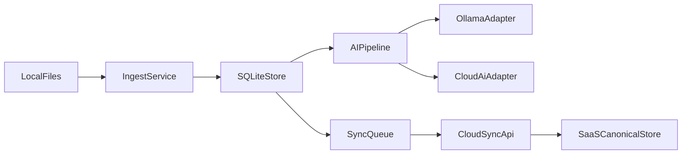

# Desktop-First MVP Architecture

This blueprint prioritizes the desktop media client while preserving data-model and service reuse for the SaaS web platform and future mobile clients.

## Goals

1. Deliver local-first media management on desktop.
2. Support local AI inference via Ollama with cloud fallback adapters.
3. Preserve shared domain contracts and sync protocol for SaaS reuse.
4. Keep cloud schemas compatible with desktop data model evolution.

## High-Level Flow

## Core Modules

- `IngestService`
  - watches selected folders
  - computes checksum identity
  - records source metadata and import events
- `SQLiteStore`
  - stores canonical local record copy
  - persists operation log for sync and replay
- `AIPipeline`
  - enriches records with labels and captions
  - writes derived metadata separately from original EXIF/source metadata
- `SyncQueue`
  - emits versioned sync operations
  - retries with backoff and conflict capture

## Data Model Rules

- Media identity is immutable (`mediaId` + `checksum`).
- Source metadata and derived AI metadata are distinct.
- Cloud sync uses operation log semantics, not direct row mirroring.
- Contract changes are additive where possible and versioned.

## AI Provider Strategy

- Primary local adapter: Ollama.
- Optional cloud adapters: OpenAI / Azure OpenAI / custom.
- All providers implement the same `AiProviderAdapter` contract from `@emk/shared-contracts`.
- Provider-specific response payloads can be stored in `raw` metadata while normalized fields remain stable.

## SaaS Reuse Guarantees

- Desktop writes to shared contract types first.
- Sync API accepts shared operation contracts and maps to cloud storage.
- Media web reads canonical cloud entities that are compatible with desktop-origin data.
- Future mobile clients consume the same contract package to avoid divergent schemas.
