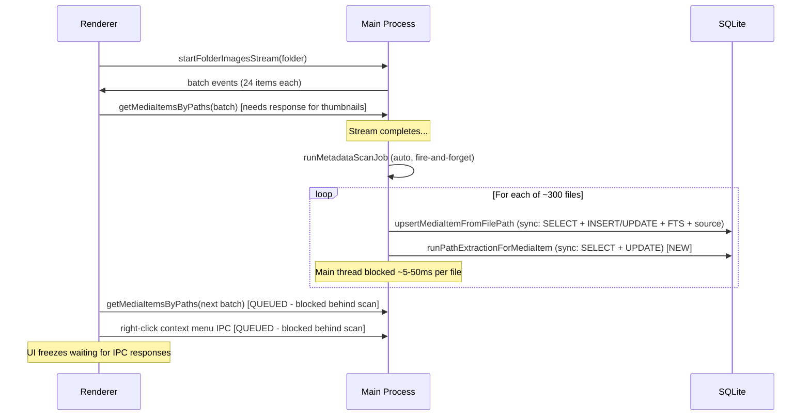

# Desktop Folder Select Performance Fix

## Root Cause Analysis

The performance regression is caused by **main-process thread starvation**. When you select a folder, two things compete for the single Electron main thread:

### The Contention Pattern




### Specific Bottlenecks Found

**1. Auto metadata scan blocks main thread (PRIMARY CAUSE)**

In [metadata-scan-handlers.ts](apps/desktop-media/electron/ipc/metadata-scan-handlers.ts), the scan loop at line 187 has **no deliberate event-loop yields** between items. Each iteration does:

- `await upsertMediaItemFromFilePath(...)` -- yields only during `fs.readFile`/ExifReader (async I/O), then runs ~7 synchronous DB statements in a single turn
- `runPathExtractionForMediaItem(...)` -- **2 additional synchronous DB statements** (SELECT + UPDATE) with no yield afterward [NEW CODE]
- Progress emission and bookkeeping

For "unchanged" items (re-selecting a previously scanned folder), the upsert returns quickly after 1 SELECT, but **path extraction still runs its 2 DB ops** every time (it has no "already done" short-circuit).

For a 300-file folder, these synchronous bursts monopolize the main thread, causing all `ipcMain.handle` responses (including `getMediaItemsByPaths` for thumbnail metadata and `readFolderChildren` for context menus) to queue behind the scan.

**2. `runPathExtractionForMediaItem` runs unconditionally for non-failed items**

At [metadata-scan-handlers.ts:224-236](apps/desktop-media/electron/ipc/metadata-scan-handlers.ts), path extraction runs for **every** item regardless of whether it was "unchanged" and already has `path_extraction_at` set. This means even re-visiting a folder with no file changes triggers 2 extra DB calls per file.

**3. No event-loop yield in the scan loop**

There is no `await new Promise(r => setTimeout(r, 0))` or similar yield between scan items. The only yield comes from the `await` on `upsertMediaItemFromFilePath` (which is only async when doing file I/O for changed/new files). For "unchanged" items, the entire loop body is synchronous, meaning the event loop never gets a chance to process pending IPC responses.

**4. `getMediaItemsByPaths` has a correlated subquery**

In [media-item-metadata.ts](apps/desktop-media/electron/db/media-item-metadata.ts), the `source_count` subquery `(SELECT COUNT(*) FROM media_item_sources ...)` executes **per row**. This is a minor contributor but adds latency to each metadata batch fetch, compounding with the blocked event loop.

**5. `getFolderAiCoverage` fires on folder selection**

The `DesktopFolderAiPipelineStrip` component calls `getFolderAiCoverage` via IPC when the selected folder changes. This runs a heavy aggregation query with 2 `EXISTS` subqueries per row against `media_embeddings`. If the main thread is already busy with the scan, this IPC call queues up too.

### Secondary Contributor: Renderer-side re-renders

The `use-filtered-media-items.ts` hook runs several `useMemo` passes (including `imageEditSuggestionItems` which parses JSON per item) on every `mediaMetadataByItemId` change. Each metadata batch merge triggers these recomputations over the full item list. This is a renderer-side cost, not directly related to main-thread blocking, but contributes to perceived slowness.

---

## Proposed Fixes (ordered by impact)

### Fix 1: Add event-loop yields in the metadata scan loop

Insert a periodic `await` yield in the scan loop to allow pending IPC handles to process. This is the highest-impact fix.

In [metadata-scan-handlers.ts](apps/desktop-media/electron/ipc/metadata-scan-handlers.ts), after each item (or every N items), add:

```typescript
if (scanningProcessed % 5 === 0) {
  await new Promise<void>((resolve) => setTimeout(resolve, 0));
}
```

This lets queued `getMediaItemsByPaths` and other IPC handlers run between scan batches.

### Fix 2: Skip path extraction for unchanged items that already have it

In [metadata-scan-handlers.ts](apps/desktop-media/electron/ipc/metadata-scan-handlers.ts) line 224, add a guard:

```typescript
if (pathExtractionEnabled && upsert.mediaItemId && upsert.status !== "failed" && upsert.status !== "unchanged") {
```

Or alternatively, check `path_extraction_at` inside `runPathExtractionForMediaItem` and return early if already populated. This eliminates 2 unnecessary synchronous DB calls per unchanged file.

### Fix 3: Remove the correlated `source_count` subquery

In [media-item-metadata.ts](apps/desktop-media/electron/db/media-item-metadata.ts), replace the correlated `(SELECT COUNT(*) FROM media_item_sources ...)` with a LEFT JOIN + GROUP BY, or remove it if `source_count` is not actively used in the grid display. This reduces per-row SQL cost in `getMediaItemsByPaths`.

### Fix 4 (optional): Lower `autoMetadataScanOnSelectMaxFiles` or defer scan start

The default threshold of 300 in [ipc.ts](apps/desktop-media/src/shared/ipc.ts) line 219 triggers auto-scan for most folders. Consider:

- Lowering the default (e.g., to 100)
- Adding a short delay (e.g., 500ms) before starting the scan to allow the initial metadata batches to complete first
- Making the scan start only after the stream's metadata merge completes

### Fix 5 (optional): Debounce/batch `mediaMetadataByItemId` updates

In [use-folder-metadata-merge.ts](apps/desktop-media/src/renderer/hooks/use-folder-metadata-merge.ts), the `{ ...s.mediaMetadataByItemId, ...metadata }` spread creates a new object on each batch, triggering all downstream `useMemo` recomputations. Consider accumulating merges and flushing once, or using Immer's draft mutation (which is already available via the store middleware) to reduce reference changes.