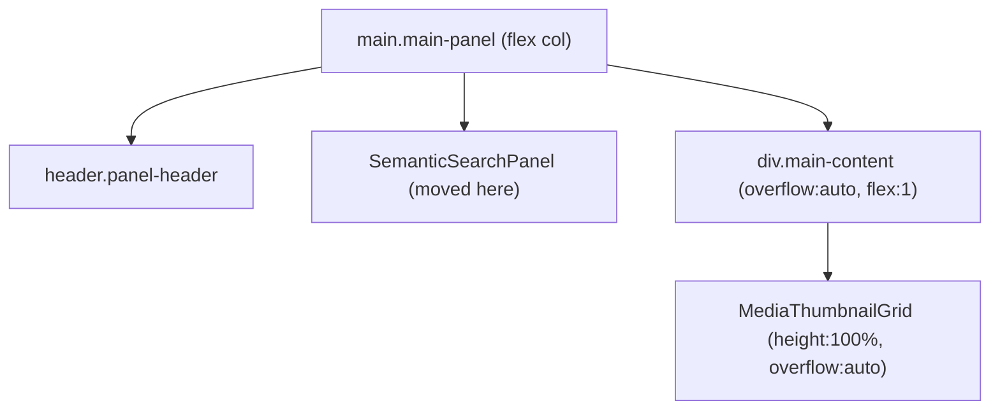

# AI Image Search Enhancements

## Root cause of double scrollbar

`MediaThumbnailGrid` uses `overflow: "auto"` and `height: "100%"`, meaning it fills `.main-content`'s full height. When `SemanticSearchPanel` is rendered **inside** `.main-content` as a flow sibling, the combined height (panel + grid at 100%) exceeds `.main-content`, triggering a second scrollbar. The fix: move the panel **outside** `.main-content`.

## Architecture




---

## Changes by file

### 1. `[SemanticSearchPanel.tsx](apps/desktop-media/src/renderer/components/SemanticSearchPanel.tsx)`

- Remove `<div className="analysis-summary">{semanticCapabilityLabel}</div>` and its store selector
- Input: add `padding: "4px 12px"` and `fontSize: 16` to the `<input>` inline style
- **Scope radio group**: add local `scope` state typed `"global" | "selected" | "recursive"`, read `selectedFolder` from store; render a `fieldset` / `<label><input type="radio">` group in the same row as buttons (only "Selected folder" and "Sub-folders" options disabled when `selectedFolder` is null)
- **Person tag multi-select**: load tags with `useEffect(() => window.desktopApi.listPersonTags())` on mount; render pill/chip buttons in a flex-wrap row, toggling a `Set<string>` of selected tag IDs (AND semantics)
- Expose scope and selectedTagIds via store setters (see below), or pass updated `onSearch` signature

> Scope and selected tag IDs go into the store so `handleSemanticSearch` in App.tsx can read them without prop drilling.

### 2. `[packages/media-store/src/slices/semantic-search.ts](packages/media-store/src/slices/semantic-search.ts)`

Add to `SemanticSearchSlice`:

```ts
semanticSearchScope: "global" | "selected" | "recursive";
semanticPersonTagIds: string[];
setSemanticSearchScope: (scope: ...) => void;
setSemanticPersonTagIds: (ids: string[]) => void;
```

Initial values: `"global"` and `[]`.

### 3. `[App.tsx](apps/desktop-media/src/renderer/App.tsx)`

- Move `<SemanticSearchPanel onSearch={handleSemanticSearch} />` from inside `<div className="main-content">` to a sibling directly inside `<main className="main-panel">`, between the `<header>` and `.main-content`
- In `handleSemanticSearch`: read `semanticSearchScope`, `semanticPersonTagIds`, and `selectedFolder` from store; build the new request params accordingly
- The IPC call becomes: `window.desktopApi.semanticSearchPhotos({ query, limit: 30, folderPath, recursive, personTagIds })`

### 4. `[styles.css](apps/desktop-media/src/renderer/styles.css)`

- Add `.semantic-search-panel .analysis-list { max-height: none; overflow: visible; }` to prevent the inner panel from having its own constrained scroll area now that it is outside `.main-content`
- Add `.semantic-search-scope` styles for the radio group row and `.semantic-person-tag-chip` for the pill buttons

### 5. `[apps/desktop-media/src/shared/ipc.ts](apps/desktop-media/src/shared/ipc.ts)`

Extend `semanticSearchPhotos` request type:

```ts
semanticSearchPhotos: (request: {
  query: string;
  limit?: number;
  folderPath?: string;
  recursive?: boolean;
  personTagIds?: string[];
}) => Promise<...>
```

### 6. `[electron/ipc/semantic-search-handlers.ts](apps/desktop-media/electron/ipc/semantic-search-handlers.ts)`

- Extract `folderPath`, `recursive`, `personTagIds` from `request`
- Pass them into `filters: SemanticFilters`

### 7. `[electron/db/semantic-search.ts](apps/desktop-media/electron/db/semantic-search.ts)`

Extend `SemanticFilters`:

```ts
export interface SemanticFilters {
  // existing...
  folderPath?: string;
  recursive?: boolean;
  personTagIds?: string[];
}
```

In `searchByVector`:

- **Folder filter (recursive)**: add `AND mi.source_path LIKE ?` with pattern `folderPath + sep + '%'`
- **Folder filter (non-recursive)**: same SQL pattern but additionally post-filter rows in JS by `path.dirname(row.source_path) === folderPath`
- **Person tag filter (AND semantics)**: for each tag ID in `personTagIds`, add an EXISTS subquery:

```sql
AND EXISTS (
  SELECT 1 FROM media_face_instances fi
  WHERE fi.media_item_id = mi.id
    AND fi.library_id = ?
    AND fi.tag_id = ?
)
```

