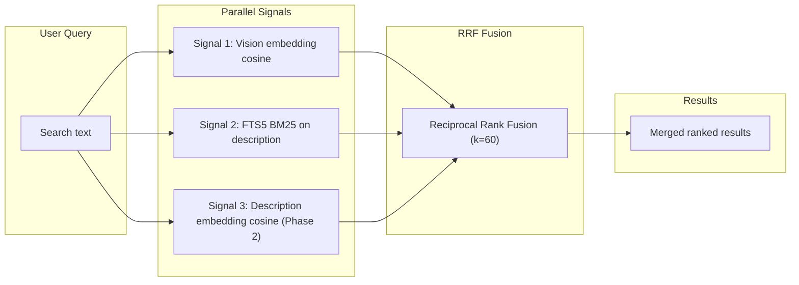
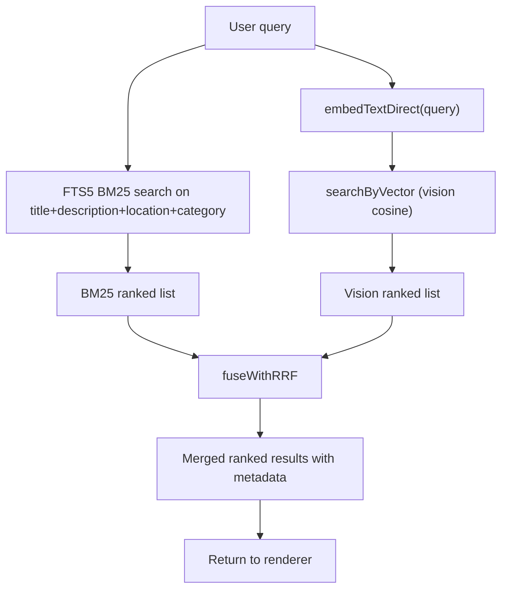
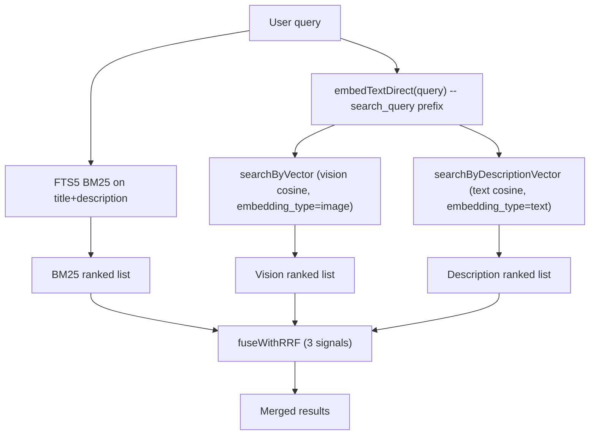

# AI Search Improvements Plan

## Ideal Future User Experience

The user types a search query in any language. The system:

1. Detects non-English text and translates it to English (via Qwen 2.5:3b or similar lightweight model).
2. Analyzes the translated prompt to identify user intent, and automatically:
  - Sets standard DB filters (location, person(s) tagged in image or similar faces, people count, age range, etc.)
  - Prepares an optimized search prompt for VLM embedding
  - Identifies key search terms (e.g., "lady", "piano", "white dress") and runs a keyword search of AI photo descriptions (BM25/FTS5) to combine with semantic embedding search
3. Builds the final search embedding and runs a hybrid search fusing multiple signals.
4. Identifies person names in the query and matches them against person-tag aliases (a person tag may have multiple aliases: formal name, short name, nickname). This is the last phase -- not top priority now.

**Phasing priorities:**

- Phase 1 (immediate): Leverage existing AI image descriptions in search via FTS5 + RRF
- Phase 2 (next): Add description text embeddings as a complementary semantic signal; improve the AI analysis prompt for richer descriptions
- Phase 3 (future): LLM-based query understanding for translation, filter extraction, person name detection
- Phase 4 (future): Person tag aliases and automatic person filter from search text

**Design principle:** Since some images have VLM embeddings but not yet AI descriptions (and vice versa), the hybrid search must gracefully handle partial data -- an image only needs to appear in one signal's ranked list to be a candidate, and RRF naturally ranks items higher when they appear across multiple lists.

---

## Current State Analysis

The desktop-media semantic search pipeline works as follows:

1. User query -> `embedTextDirect(query)` via Nomic text ONNX (768-dim)
2. All image vision embeddings (Nomic vision ONNX, 768-dim) loaded from `media_embeddings` table
3. Brute-force cosine similarity in JS with chunked yields and in-memory `Float32Array` cache
4. Score-spread-based cutoff, return top-N
5. Optional pre-filters: folder path, person tags (confirmed + unconfirmed suggestions)

**Key gap:** AI image descriptions (title + description from Qwen 3.5 in `media_items.ai_metadata`) are generated and stored but **never used in search**. There is no FTS index, no BM25 ranking, and no text embedding of descriptions.

**Root cause of the ranking problem:** Cross-modal (vision<->text) cosine similarity captures "vibes" but struggles with compositional queries like "lady in white dress near piano" because the vision embedding encodes the image holistically. An image with just a piano may score similarly to one with a lady, piano, AND white dress. Adding keyword match on the AI description would naturally boost results that mention ALL query terms.

---

## Assessment of Gemini's Recommendations

### LanceDB -- NOT recommended (disagree with Gemini)

1. **SQLite FTS5 is built-in** and handled natively by `better-sqlite3`. No new dependency needed for BM25 keyword search.
2. **Brute-force vector scan is adequate at current scale.** With ~50k images, 768-dim cached Float32Arrays, the JS cosine loop takes ~50-100ms. LanceDB's IVF-PQ only matters at 500k+.
3. **Dual-store consistency problems.** Authoritative metadata lives in SQLite (`media_items`). Adding LanceDB creates a sync burden between two stores.
4. **Electron packaging complexity.** LanceDB uses Rust native bindings. Packaging across Windows/macOS/Linux adds significant build complexity.
5. **RRF is storage-agnostic.** The fusion algorithm is ~30 lines of code operating on ranked lists. It does not require LanceDB.

**Verdict:** Stay with SQLite. Add FTS5 for keyword search. Implement RRF in code. Revisit vector indexing (sqlite-vec with proper ANN, or LanceDB) only if scale demands it (100k+ images with measurable latency).

### Nomic-only embeddings -- AGREE with Gemini

No need for `all-MiniLM`. The existing Nomic text v1.5 model should also embed descriptions. This keeps everything in the same latent space and avoids adding a new model.

### Keyword extraction -- PARTIALLY agree

For FTS5/BM25, **no extraction is needed** -- FTS5 tokenizes queries internally. However, for Phase 3 (query understanding), a lightweight LLM call (Qwen 2.5:3b) is appropriate for structured decomposition (extract filters, translate, identify person names).

---

## Architecture: Reciprocal Rank Fusion (RRF)

The core improvement is fusing multiple ranked signals via RRF:

```
RRF_score(item) = SUM over signals S of: 1 / (k + rank_S(item))
```

where `k` is typically 60. Items appearing in multiple ranked lists get boosted.




For "lady in white dress near piano":

- **Vision search** might rank an image with just a piano at #5 and the full scene at #8
- **BM25 on description** would rank the full scene (mentioning "lady", "dress", "piano") at #1
- **RRF fusion** boosts the full scene because it appears in both lists, moving it to #1-3

---

## Phase 1: FTS5 Hybrid Search (highest impact, lowest effort)

### User-visible impact

This is immediately visible to users. When searching, results improve because RRF fusion combines two signals (vision embedding similarity + keyword match on AI description). Any image that already has an AI description (the existing 10K+ images) benefits immediately -- no re-analysis needed. The FTS5 table is backfilled from existing `ai_metadata` during the database migration. No UI changes required; the search input and result display remain the same, but ranking quality improves.

### Files to modify/create

- [client.ts](apps/desktop-media/electron/db/client.ts) -- Add migration `013_fts5_descriptions` creating an FTS5 virtual table with backfill
- [media-analysis.ts](apps/desktop-media/electron/db/media-analysis.ts) -- Populate FTS5 in `upsertPhotoAnalysisResult` so new analyses are indexed
- New file `apps/desktop-media/electron/db/keyword-search.ts` -- `searchByKeyword(query, filters, limit)` returning BM25-ranked results
- New file `apps/desktop-media/electron/db/search-fusion.ts` -- `fuseWithRRF(rankedLists, k, limit)` implementing RRF
- [semantic-search-handlers.ts](apps/desktop-media/electron/ipc/semantic-search-handlers.ts) -- Wire hybrid search: run `searchByVector` + `searchByKeyword` in parallel, fuse with RRF
- [semantic-search.ts](apps/desktop-media/electron/db/semantic-search.ts) -- Extend `SemanticSearchRow` to carry all metadata needed by the IPC response (so RRF can merge and return full rows)

### FTS5 schema

```sql
-- Migration 013_fts5_descriptions
CREATE VIRTUAL TABLE IF NOT EXISTS media_items_fts USING fts5(
  media_item_id UNINDEXED,
  library_id UNINDEXED,
  title,
  description,
  location,
  category,
  content='',
  tokenize='porter unicode61'
);

-- Backfill from existing ai_metadata
INSERT INTO media_items_fts (media_item_id, library_id, title, description, location, category)
SELECT mi.id, mi.library_id,
  json_extract(mi.ai_metadata, '$.ai.title'),
  json_extract(mi.ai_metadata, '$.ai.description'),
  COALESCE(mi.location_name, ''),
  json_extract(mi.ai_metadata, '$.ai.image_category')
FROM media_items mi
WHERE mi.ai_metadata IS NOT NULL
  AND mi.photo_analysis_processed_at IS NOT NULL
  AND mi.deleted_at IS NULL;
```

### RRF implementation (core logic)

```typescript
interface RankedItem { mediaItemId: string; rank: number }
interface FusedResult { mediaItemId: string; rrfScore: number }

function fuseWithRRF(
  rankedLists: RankedItem[][],
  k = 60,
  limit = 50,
): FusedResult[] {
  const scores = new Map<string, number>();
  for (const list of rankedLists) {
    for (const item of list) {
      const prev = scores.get(item.mediaItemId) ?? 0;
      scores.set(item.mediaItemId, prev + 1 / (k + item.rank));
    }
  }
  return [...scores.entries()]
    .map(([mediaItemId, rrfScore]) => ({ mediaItemId, rrfScore }))
    .sort((a, b) => b.rrfScore - a.rrfScore)
    .slice(0, limit);
}
```

### Key design decisions

- FTS5 uses `porter unicode61` tokenizer for stemming + Unicode support
- Contentless FTS5 table (manual insert/delete) to avoid data duplication
- FTS5 table populated on analysis completion AND via backfill in migration
- Both searches run in parallel (vector is async with yields; FTS5 is sync and instant)
- RRF with k=60 (standard parameter) fuses the two ranked lists
- Images with only vision embedding or only FTS5 entry still participate (RRF handles partial coverage gracefully)

### Search handler flow (updated)




---

## Phase 2: Description Text Embeddings + Improved AI Prompt

### AI Description Prompt Analysis

The current prompt in [photo-analysis-prompt.ts](apps/desktop-media/src/shared/photo-analysis-prompt.ts) requests:

```
"title": "short image title (max 50 symbols)",
"description": "image description (max 500 symbols)",
```

Combined with the rule `"Keep title and description concise."`, this produces short descriptions (~2-3 sentences) that are user-facing but lack the detail needed for effective search. For example, a description might say "A woman playing piano in a living room" but omit details like "white dress", "grand piano", "hardwood floor", "evening light through window" that a user might search for.

**Proposed prompt change:**

- Increase description limit from 500 to 1500 symbols
- Change the instruction to ask for a rich, descriptive caption that covers: key subjects, their attributes (clothing, colors, pose), objects in the scene, setting/environment, spatial relationships, lighting, mood
- Remove the "keep description concise" rule; replace with guidance to be detailed and specific
- Title stays short (max 50 symbols) as it serves a different purpose (quick identification)

This is safe because:

- Nomic text v1.5 has an 8192-token context window; 1500 chars (~400 tokens) is well within limits
- Qwen 3.5:9b can comfortably produce 1500 chars of output (well within its ~4K output budget)
- Longer descriptions improve BOTH FTS5 keyword matching AND description embedding quality
- Existing 500-char descriptions still work -- they just have less keyword coverage

**Impact on existing images:** The 10K+ already-analyzed images keep their shorter descriptions. They still benefit from Phase 1 FTS5 search. When re-analyzed (via "override existing" mode), they get the improved longer descriptions. No forced re-analysis is needed.

### Description Text Embeddings

Adds a third search signal: embed the AI description with Nomic text model and compare against the query text embedding.

**Why this helps beyond FTS5:** FTS5 matches exact/stemmed words. Description embedding captures semantic similarity (e.g., "automobile" matches "car", "sunset" matches "golden hour"). Together with vision embedding and BM25, this creates a robust 3-signal RRF fusion.

### How embeddings are generated

**For new images (during AI analysis pipeline):**

In [photo-analysis-handlers.ts](apps/desktop-media/electron/ipc/photo-analysis-handlers.ts), after `upsertPhotoAnalysisResult` succeeds (line ~395) and returns a `mediaId`, immediately generate a description embedding:

```typescript
const mediaId = upsertPhotoAnalysisResult(photo.path, resultWithDecision);
if (mediaId && result.description) {
  const captionText = buildCaptionText(result);
  if (captionText) {
    const descVector = await embedTextForDocument(captionText);
    vectorStore.upsertEmbedding({
      mediaItemId: mediaId,
      embeddingType: "text",
      embeddingSource: "ai_metadata",
      modelVersion: MULTIMODAL_EMBED_MODEL,
      vector: descVector,
    });
  }
}
```

This adds ~5-10ms per image (Nomic text ONNX is very fast for short text), negligible compared to the ~2-5s Qwen analysis.

**For existing 10K+ images (backfill):**

Add a new IPC channel `indexDescriptionEmbeddings` that:

1. Queries all `media_items` that have `ai_metadata` with a valid description but no corresponding `embedding_type = 'text'` row in `media_embeddings`
2. For each, extracts title+description via `buildCaptionText()`, embeds with `embedTextForDocument()`, and stores
3. Reuses the existing progress-reporting infrastructure (same pattern as semantic index job)
4. At ~5-10ms per text embedding, 10K images takes ~50-100 seconds total

**UI trigger for backfill:** Add a button/action in the same area as the existing "Index semantic embeddings" action. Alternatively, piggyback on the existing semantic index flow: when indexing a folder, also generate description embeddings for images that have AI descriptions but lack them. Either approach works; the separate action is cleaner and gives the user explicit control.

### Nomic text prefix convention

The existing `embedTextDirect()` uses `search_query:` prefix (correct for user queries). For indexing document text (descriptions), Nomic v1.5 uses the `search_document:` prefix. Add a new function:

```typescript
// In nomic-vision-embedder.ts
export async function embedTextForDocument(text: string, signal?: AbortSignal): Promise<number[]> {
  if (signal?.aborted) throw new Error("Aborted");
  const pipe = await getTextPipeline();
  const output = await pipe(`search_document: ${text}`, { pooling: "mean" });
  return normalizeVector(Array.from(output.data));
}
```

### Files to modify/create

- [photo-analysis-prompt.ts](apps/desktop-media/src/shared/photo-analysis-prompt.ts) -- Increase description to 1500 symbols, add detail guidance
- [nomic-vision-embedder.ts](apps/desktop-media/electron/nomic-vision-embedder.ts) -- Add `embedTextForDocument()` with `search_document:` prefix
- [photo-analysis-handlers.ts](apps/desktop-media/electron/ipc/photo-analysis-handlers.ts) -- After successful analysis, embed description and store
- [semantic-search-handlers.ts](apps/desktop-media/electron/ipc/semantic-search-handlers.ts) -- Add `indexDescriptionEmbeddings` IPC handler for backfill; add description vector search as 3rd RRF signal
- [semantic-search.ts](apps/desktop-media/electron/db/semantic-search.ts) -- Add `searchByDescriptionVector()` searching `embedding_type = 'text'`
- [search-fusion.ts](apps/desktop-media/electron/db/search-fusion.ts) -- Already supports N signals (no change needed)
- [media-analysis.ts](apps/desktop-media/electron/db/media-analysis.ts) -- May need `buildCaptionText` refinements
- [ipc.ts](apps/desktop-media/src/shared/ipc.ts) -- Add IPC channel for description embedding index

### Search handler flow (Phase 2 complete)




---

## Phase 3: Query Understanding via LLM (future -- high-level only)

Adds intelligent query decomposition using Qwen 2.5:3b before search. Capabilities: non-English translation, structured filter extraction (location, people count, age range, category), separation of semantic intent from filterable attributes, person name detection. Falls back gracefully to raw query if Ollama is unavailable or times out. Does not depend on Phases 1-2 architecturally, but benefits greatly from having FTS5 and description embeddings in place. Will be detailed after Phases 1-2 are complete.

## Phase 4: Person Tag Aliases (future -- high-level only)

Adds `person_tag_aliases` table so each person tag can have multiple names (formal, short, nickname). Enables Phase 3 query understanding to match detected names against aliases and auto-apply person filters. Does not depend on Phases 1-2. Will be detailed after Phases 1-2 are complete.

---

## What NOT to change

- **Vector storage format:** Keep JSON in SQLite for now. The brute-force scan with Float32Array caching is adequate at current scale.
- **Embedding model:** Keep Nomic v1.5 (vision + text). No new models needed.
- **sqlite-vec:** Keep as optional. Not needed for this feature since FTS5 handles keyword search natively.
- **Web-media search:** These changes are desktop-only. Web-media uses Supabase and has its own search path.

