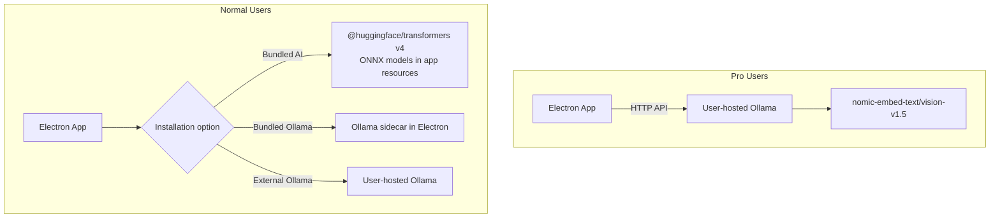

# Contextual Image Search via Semantic Embeddings

## Embedding Model Recommendation

### Current setup

You already use `**DC1LEX/nomic-embed-text-v1.5-multimodal**` via Ollama. This is a community-packaged combination of `nomic-embed-text-v1.5` (text) and `nomic-embed-vision-v1.5` (image) that share the **same 768-dim embedding space**, enabling text-to-image similarity search.

### Alternatives evaluated

| Model                                      | Pros                                                                                                                                                   | Cons                                                                                                     |
| ------------------------------------------ | ------------------------------------------------------------------------------------------------------------------------------------------------------ | -------------------------------------------------------------------------------------------------------- |
| **nomic-embed-text/vision-v1.5 (current)** | Shared text+image space, 768-dim with Matryoshka support (truncate to 256/512 for speed), Apache 2.0, ~274MB, works in Ollama AND Transformers.js ONNX | Community Ollama manifest can be fragile                                                                 |
| **OpenAI CLIP ViT-L/14**                   | Mature baseline, widely available                                                                                                                      | Outperformed by nomic on text benchmarks, no Matryoshka, heavier                                         |
| **Google SigLIP**                          | Better fine-grained scene/product search than CLIP, compact variants exist                                                                             | No Ollama support, Transformers.js support just landed (SigLIP2/naflex Feb 2026), less community tooling |
| **Nomic Embed Multimodal 3B/7B**           | State-of-the-art for document/chart retrieval                                                                                                          | Far too large for desktop (3B+), overkill for photo search                                               |

### Recommendation: Keep nomic-embed-text/vision-v1.5

**Rationale:**

- Already integrated and working
- Shared text-image embedding space is exactly what contextual photo search needs
- Matryoshka support lets you trade off quality vs speed (use 256-dim for faster search, 768-dim for best quality)
- Both models now have ONNX weights on Hugging Face and are supported by **Transformers.js v4** (released Feb 2026) -- this is the key for your future bundling story
- Apache 2.0 license allows commercial distribution

### Future distribution strategy (no code changes now)

- **Bundled AI (recommended default for normal users):** Use `@huggingface/transformers` v4 in the Electron main process (Node.js). It runs ONNX models natively via `onnxruntime-node` under the hood. Ship the quantized ONNX weights (~100-150MB) inside `app.asar.unpacked/models/`. No Python, no Ollama needed. This is the cleanest path -- the library handles tokenization, preprocessing, and inference in pure JS/ONNX.
- **Bundled Ollama:** Package Ollama binary as an Electron sidecar (spawn on app start). Heavier but gives access to all Ollama models.
- **External Ollama:** Current behavior, kept as-is for pro users.

The existing `EmbeddingProviderAdapter` interface in `@emk/shared-contracts` already abstracts the embedding backend, so adding a `TransformersJsEmbeddingAdapter` alongside the existing `OllamaEmbeddingAdapter` would be straightforward when the time comes.

---

## UI Changes: Simplify SemanticSearchPanel

Strip the panel down to just a search prompt input and a Search button. Remove City, Country, People (min/max), and Age range fields. Keep the Index Folder and Cancel Index buttons (needed for embedding indexing).

### Files to change

**1. [SemanticSearchPanel.tsx](apps/desktop-media/src/renderer/components/SemanticSearchPanel.tsx)** -- the main widget

Remove:

- All local state for `city`, `country`, `peopleMin`, `peopleMax`, `ageMin`, `ageMax`
- The filter input fields (lines 78-115)
- The `onSearch` prop's filter parameter

Simplified component will have:

- A text input for the query (bound to `semanticQuery` in the store)
- A "Search" button that calls `onSearch()` with no filters
- A "Clear" button to reset results
- Index Folder / Cancel Index buttons (kept as-is)

**2. [App.tsx](apps/desktop-media/src/renderer/App.tsx)** -- the search handler

Simplify `handleSemanticSearch` (lines 378-406):

- Remove the `filters` parameter
- Call `window.desktopApi.semanticSearchPhotos({ query, limit: 100 })` without filters

**3. [semantic-search-handlers.ts](apps/desktop-media/electron/ipc/semantic-search-handlers.ts)** -- the IPC handler

Simplify the `semanticSearchPhotos` handler (lines 187-224):

- Remove the `filters` field from the request type
- Call `searchByVector(queryVector, {}, request.limit ?? 30)` with empty filters

**4. [semantic-search.ts](apps/desktop-media/electron/db/semantic-search.ts)** -- the DB layer

- Keep `SemanticFilters` interface and the filter logic in `searchByVector` intact for now (will be reused when metadata filtering is re-added later)
- No changes needed here -- passing `{}` as filters means no filters applied

**5. [types.ts](packages/media-store/src/types.ts)** and [semantic-search.ts](packages/media-store/src/slices/semantic-search.ts) -- store types

- Keep `SemanticSearchFilters` type for future use, but no longer used in the UI for now

### Results display

The existing `MediaThumbnailGrid` rendering of `semanticResults` in `App.tsx` (line 679+) already shows thumbnails sorted by similarity score. No changes needed -- it already displays results correctly with title showing `filename (score 0.xxx)`.