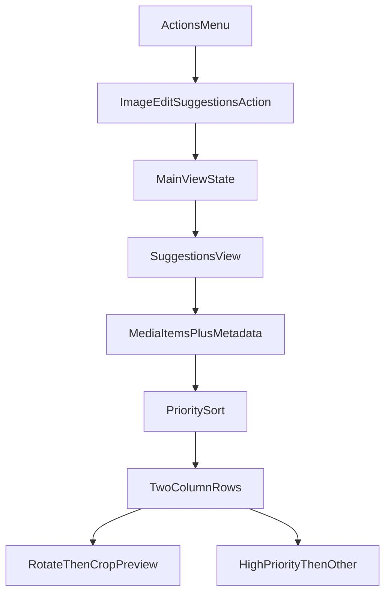

# Implement Image Edit Suggestions View

## Scope And Entry Point

- Extend the existing three-dots actions menu in `[App.tsx](C:/EMK-Dev/emk-website/apps/desktop-media/src/renderer/App.tsx)` with a new action label `Image edit suggestions`.
- Clicking it switches the main content area (right pane) from current grid/list to a dedicated suggestions view, without changing sidebar structure.
- Use your selected scope: **show only photos that have at least one AI edit suggestion**.

## Data Model And Ordering

- Reuse already hydrated folder items (`mediaItems`) and metadata map (`mediaMetadataByItemId`) from `[App.tsx](C:/EMK-Dev/emk-website/apps/desktop-media/src/renderer/App.tsx)`.
- Read `edit_suggestions` via `getAdditionalTopLevelFields(...)` (already used in viewer info panel) and normalize per-photo suggestion lists.
- Derive row priority score per photo (highest suggestion priority found in that photo), then sort rows: `high` first, then `medium`, then `low`/unknown.
- Within each photo, split displayed suggestions into two sections:
  - `High priority suggestions`
  - `Other improvements`

## New UI Component

- Add a focused renderer component, e.g. `[DesktopImageEditSuggestionsView.tsx](C:/EMK-Dev/emk-website/apps/desktop-media/src/renderer/components/DesktopImageEditSuggestionsView.tsx)`, responsible for:
  - One row per photo (two-column layout):
    - Left: original image
    - Right: preview + suggestions sections
  - If suggestion includes rotate/crop:
    - Render preview image produced by applying transform pipeline: **rotate first, then crop**
    - Show `Apply changes` CTA button as placeholder only (no write/edit behavior)
  - If no rotate/crop suggestion exists:
    - Show “No visual edit preview” state and still render textual suggestions.

## Non-Destructive Preview Logic

- Implement lightweight preview generation in renderer (canvas-based), no file writes and no metadata mutation:
  - Load source image URL
  - Apply supported rotate angle (90/180/270)
  - Apply relative crop box against rotated frame
  - Export preview as data URL/object URL for display
- Keep unsupported suggestion types (exposure, denoise, etc.) as textual recommendations only.
- Add safe guards for invalid crop bounds and failed preview generation (fallback message).

## App Integration

- In `[App.tsx](C:/EMK-Dev/emk-website/apps/desktop-media/src/renderer/App.tsx)`:
  - Add local view-state discriminator for main pane (existing media view vs suggestions view).
  - Add menu row/button for `Image edit suggestions` in `.desktop-actions-menu`.
  - Render new component in `main-content` when suggestions mode is active.
  - Reset suggestions mode appropriately when folder changes (to avoid stale rows).

## Styling

- Extend `[styles.css](C:/EMK-Dev/emk-website/apps/desktop-media/src/renderer/styles.css)` with scoped classes for:
  - Suggestions header/empty state
  - Two-column row layout and responsive behavior
  - Preview container and suggestion section blocks
  - Priority chips/list styling (`high` visually emphasized)

## UX Improvements (small, low risk)

- Add top summary line in suggestions view: total suggested photos + count of high-priority photos.
- Add `Back to photos` action in the suggestions view header for quick return.
- Keep placeholder CTA visible but disabled only when no rotate/crop preview exists.

## Validation

- Run lint diagnostics on edited files and fix introduced issues.
- Manual behavior check:
  - Menu action opens suggestions view
  - Rows are high-priority-first
  - Rotate/crop preview appears only when available
  - Original images remain unchanged

