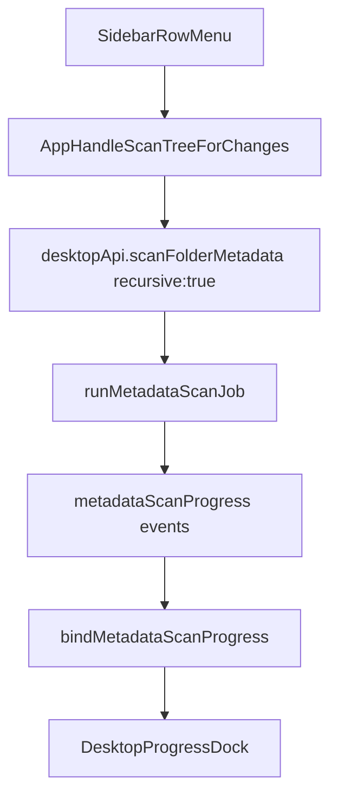

# Desktop-media folder-row actions plan

## Scope and outcomes

- Add a row-level `More` icon/menu in the left folder tree for both library roots and nested folders.
- Implement row actions:
  - `Remove (does not delete)` only for top-level libraries.
  - `Scan tree for changes` to run recursive metadata scan for the clicked folder and show one bottom progress bar with currently scanned folder name.
  - `Face detection` and `Image AI analysis` using the same menu section/component currently used by header `More` menu.
- Rename UI label from `Photo AI analysis` to `Image AI analysis` in desktop-media UI/tests.
- Hide `Thinking` checkbox in both menus while preserving underlying thinking-state logic.
- Add E2E test for removing a library and harden E2E cleanup so temp `emk-e2e-*` libraries do not persist in app state.

## Implementation steps

1. **Introduce reusable analysis menu section (shared by header menu and folder-row menu)**
  - Extract face/image analysis rows + option submenus from `[C:/EMK-Dev/emk-website/apps/desktop-media/src/renderer/components/DesktopActionsMenu.tsx](C:/EMK-Dev/emk-website/apps/desktop-media/src/renderer/components/DesktopActionsMenu.tsx)` into a reusable component (new file under `components/`, e.g. `FolderAnalysisMenuSection.tsx`).
  - Keep existing behavior for include-subfolders/override/model/play-pause actions.
  - Remove visible `Thinking` checkbox from this shared section, but keep existing store fields/logic (`aiThinkingEnabled`, model support checks, request `think` value) untouched in app state and request builders.
2. **Add folder-row More menu in sidebar tree**
  - Extend `[C:/EMK-Dev/emk-website/apps/desktop-media/src/renderer/components/SidebarTree.tsx](C:/EMK-Dev/emk-website/apps/desktop-media/src/renderer/components/SidebarTree.tsx)` row model to support:
    - hover-only `More` icon on the right side of each row label,
    - row popover open/close state,
    - action callbacks with row context (`folderPath`, `isLibraryRoot`).
  - Add a lightweight popover/menu container styled consistently with existing desktop menu styles in `[C:/EMK-Dev/emk-website/apps/desktop-media/src/renderer/styles.css](C:/EMK-Dev/emk-website/apps/desktop-media/src/renderer/styles.css)`.
  - Wire menu items:
    - `Remove (does not delete)` only when `level === 0`/root path,
    - `Scan tree for changes`,
    - shared analysis section for face/image AI.
3. **Wire actions in app state/handlers**
  - In `[C:/EMK-Dev/emk-website/apps/desktop-media/src/renderer/App.tsx](C:/EMK-Dev/emk-website/apps/desktop-media/src/renderer/App.tsx)`:
    - add `handleRemoveLibrary(rootPath)` that updates store by removing root and pruning related state (`selectedFolder` if within removed root, `expandedFolders`, `childrenByPath`, `folderAnalysisByPath` under removed root).
    - add `handleScanTreeForChanges(folderPath)` to call `window.desktopApi.scanFolderMetadata({ folderPath, recursive: true })`, set metadata panel visible, and expand progress dock.
    - add folder-target variants for analysis actions so row menus can run against clicked folder (not only currently selected folder), while preserving existing header-menu behavior.
  - Add a store action in `[C:/EMK-Dev/emk-website/apps/desktop-media/src/renderer/stores/desktop-slice.ts](C:/EMK-Dev/emk-website/apps/desktop-media/src/renderer/stores/desktop-slice.ts)` for removing a library root cleanly (or perform equivalent immutable update from `App.tsx` if preferred).
  - Settings persistence already subscribes to `libraryRoots` changes in `[C:/EMK-Dev/emk-website/apps/desktop-media/src/renderer/hooks/useDesktopIpcBindings.ts](C:/EMK-Dev/emk-website/apps/desktop-media/src/renderer/hooks/useDesktopIpcBindings.ts)`, so removal will persist automatically.
4. **Show currently scanned sub-folder during recursive metadata scan**
  - Extend metadata scan progress contract in `[C:/EMK-Dev/emk-website/apps/desktop-media/src/shared/ipc.ts](C:/EMK-Dev/emk-website/apps/desktop-media/src/shared/ipc.ts)` so metadata `item-updated` (or phase event) carries `currentFolderPath`.
  - Emit that field from `[C:/EMK-Dev/emk-website/apps/desktop-media/electron/ipc/metadata-scan-handlers.ts](C:/EMK-Dev/emk-website/apps/desktop-media/electron/ipc/metadata-scan-handlers.ts)` as each item/folder is processed.
  - Consume it in `[C:/EMK-Dev/emk-website/apps/desktop-media/src/renderer/hooks/ipc-progress-binders.ts](C:/EMK-Dev/emk-website/apps/desktop-media/src/renderer/hooks/ipc-progress-binders.ts)` to keep `metadataCurrentFolderPath` updated.
  - Existing title rendering in `[C:/EMK-Dev/emk-website/apps/desktop-media/src/renderer/components/DesktopProgressDock.tsx](C:/EMK-Dev/emk-website/apps/desktop-media/src/renderer/components/DesktopProgressDock.tsx)` and `[C:/EMK-Dev/emk-website/apps/desktop-media/src/renderer/hooks/use-eta-tracking.ts](C:/EMK-Dev/emk-website/apps/desktop-media/src/renderer/hooks/use-eta-tracking.ts)` will then display the currently scanned folder name above the single metadata progress bar.
5. **Rename UI label text**
  - Update desktop UI text constant in `[C:/EMK-Dev/emk-website/apps/desktop-media/src/renderer/lib/ui-text.ts](C:/EMK-Dev/emk-website/apps/desktop-media/src/renderer/lib/ui-text.ts)`: `photoAIAnalysis` value -> `Image AI analysis`.
  - Update any desktop E2E assertions expecting old text (notably `[C:/EMK-Dev/emk-website/apps/desktop-media/tests/e2e/analysis-trigger.spec.ts](C:/EMK-Dev/emk-website/apps/desktop-media/tests/e2e/analysis-trigger.spec.ts)`).
6. **E2E: remove library + prevent app-state pollution**
  - Add a folder-tree E2E in `[C:/EMK-Dev/emk-website/apps/desktop-media/tests/e2e/folder-browsing.spec.ts](C:/EMK-Dev/emk-website/apps/desktop-media/tests/e2e/folder-browsing.spec.ts)`:
    - add library,
    - open row `More`,
    - click `Remove (does not delete)`,
    - assert root disappears from sidebar and placeholder state returns.
  - Isolate test app state by launching Electron with a temporary per-run/per-test `userData` directory via fixture updates in `[C:/EMK-Dev/emk-website/apps/desktop-media/tests/e2e/fixtures/app-fixture.ts](C:/EMK-Dev/emk-website/apps/desktop-media/tests/e2e/fixtures/app-fixture.ts)` plus a small main-process hook in `[C:/EMK-Dev/emk-website/apps/desktop-media/electron/main.ts](C:/EMK-Dev/emk-website/apps/desktop-media/electron/main.ts)` to honor an env override before `app.whenReady()`.
  - Keep filesystem temp-folder cleanup in `[C:/EMK-Dev/emk-website/apps/desktop-media/tests/e2e/fixtures/test-images.ts](C:/EMK-Dev/emk-website/apps/desktop-media/tests/e2e/fixtures/test-images.ts)`, and move to safer per-test cleanup patterns where practical.

## Data flow (new row scan path)

## Verification

- Run desktop-media unit/type checks and lint for touched files.
- Run targeted E2E specs:
  - folder browsing (including new remove-library test),
  - analysis-trigger (updated renamed label).
- Validate manual UX:
  - row `More` appears only on hover,
  - remove only shown for root rows,
  - recursive scan shows one metadata progress bar + live folder name,
  - header and row menus both show `Image AI analysis` and no `Thinking` checkbox.

