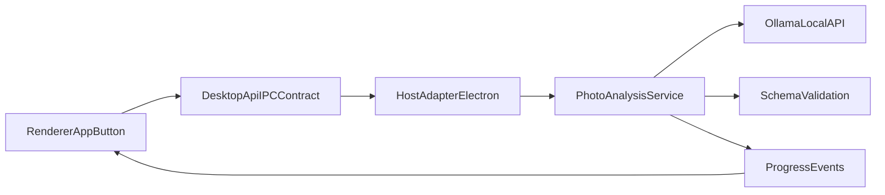

# Desktop Ollama Photo Analysis MVP

## Scope Confirmed

- Target app: Electron desktop only (`apps/desktop-media`), reusing ideas from existing web media AI flow.
- Ollama runtime: external/preinstalled service at `http://localhost:11434`.
- Persistence for MVP: in-memory only (results shown in UI, not saved).

## Model Recommendations (Current Ollama, 16-32 GB RAM)

- **Primary default (balanced quality/speed):** `qwen3-vl:8b` (~6.1 GB model size).
- **Fallback for weaker machines:** `qwen3-vl:4b` (~~3.3 GB) or `qwen2.5vl:3b` (~~3.2 GB).
- **Higher quality on 32 GB + stronger GPU:** `qwen3-vl:30b` (~~20 GB) or `qwen2.5vl:32b` (~~21 GB).
- **Alternative family:** `gemma3:12b` (~~8.1 GB) and `llama3.2-vision:11b` (~~7.8 GB).
- **Do not use for local desktop baseline:** cloud-only tags (e.g. `qwen3-vl:235b-cloud`) and very large 70B+/90B+ models.

## Architecture (Desktop-first, Tauri-ready)

- Add a runtime-agnostic **AI service contract** in desktop shared layer (request DTO + strict output schema + status/error shape).
- Keep renderer UI unaware of Electron internals by extending the existing `window.desktopApi`/IPC surface.
- Implement Ollama client call in Electron main process (or main-owned service module) using local HTTP API.
- Enforce deterministic response format using:
  - static prompt template,
  - strict JSON schema validator (reject/repair on invalid JSON),
  - model + prompt version included in response metadata.
- Process selected-folder images in bounded concurrency batches; stream progress back to renderer for responsive UI.

## Concrete Integration Points

- Extend IPC contract in `[c:\EMK-Dev\emk-website\apps\desktop-media\src\shared\ipc.ts](c:\EMK-Dev\emk-website\apps\desktop-media\src\shared\ipc.ts)` with channels/types for:
  - analyze selected folder,
  - progress updates,
  - cancel operation.
- Wire bridge methods in `[c:\EMK-Dev\emk-website\apps\desktop-media\electron\preload.ts](c:\EMK-Dev\emk-website\apps\desktop-media\electron\preload.ts)`.
- Register handlers in `[c:\EMK-Dev\emk-website\apps\desktop-media\electron\main.ts](c:\EMK-Dev\emk-website\apps\desktop-media\electron\main.ts)` and delegate to a new analysis module.
- Add `Analyze photos` action and progress/result panel in `[c:\EMK-Dev\emk-website\apps\desktop-media\src\renderer\App.tsx](c:\EMK-Dev\emk-website\apps\desktop-media\src\renderer\App.tsx)`.
- Reuse schema/prompt design approach from existing web action in `[c:\EMK-Dev\emk-website\app\[locale]\media\actions\analyze-photo-ai.ts](c:\EMK-Dev\emk-website\app\[locale]\media\actions\analyze-photo-ai.ts)`, but replace Gemini call with Ollama local call.

## MVP Behavior

- User selects folder, clicks `Analyze photos`.
- App analyzes image files already returned by `listFolderImages` and sends one image at a time (or low concurrency) with static prompt.
- Output is parsed to predefined JSON shape, e.g.:
  - `summary`,
  - `categories[]`,
  - `objects[]` (`label`, optional `confidence`),
  - `peopleDetected` boolean,
  - `safetyFlags[]` (optional),
  - `modelInfo` (`model`, `promptVersion`, `timestamp`).
- UI displays per-image status: pending/running/success/failed; failed items show actionable error (Ollama unavailable, invalid JSON, timeout).

## Future-proofing for Face/PDF and Tauri

- Introduce provider abstraction now:
  - `VisionAnalysisProvider` (Ollama vision),
  - `FacePipelineProvider` (later local detector/recognizer),
  - `DocumentExtractionProvider` (later OCR/PDF).
- Keep host boundary minimal and pure-data so Tauri can implement same contract through commands/events.
- Add model registry config (later configurable in settings) but start with static model + static prompt constants in one place.

## Alternatives and Trade-offs

- **Alternative A (fastest MVP):** single IPC call returns all results at end; simplest but no progress/cancel.
- **Alternative B (recommended):** background job + progress events; slightly more code, much better UX and scales to face/PDF.
- **Alternative C (reuse web pipeline directly):** route through Next server actions; less local/offline and weaker fit for desktop local-model requirement.

## Validation Plan

- Functional: analyze folder with 5-20 mixed images; verify JSON parse success rate and UI progress.
- Failure paths: Ollama stopped, invalid model tag, malformed model output, oversized image/timeouts.
- Performance baseline: report total elapsed time and avg/image for 4B/8B model on CPU-only vs GPU-enabled devices.
- Compatibility: verify on Windows with external Ollama and optional NVIDIA/AMD GPU support.

