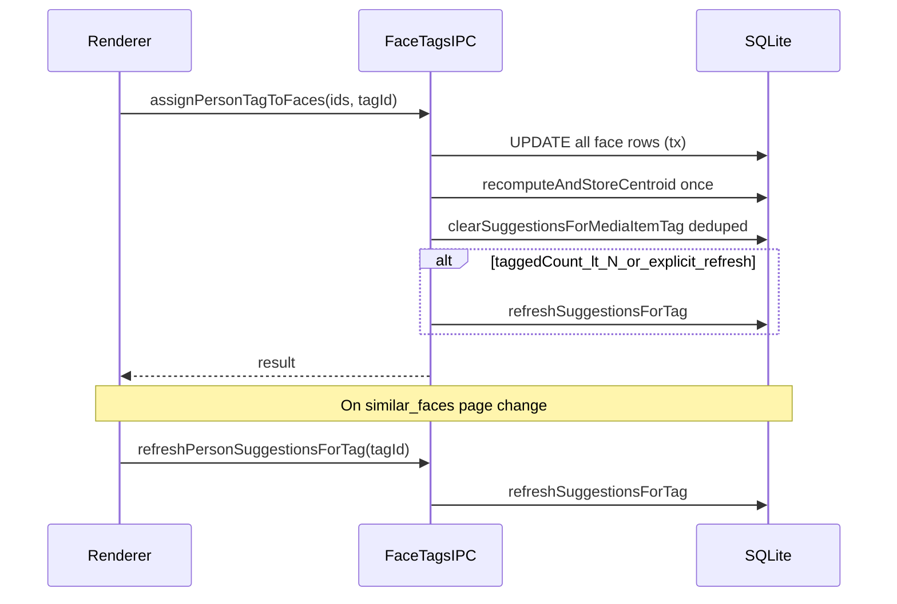

# Desktop-media People section improvements

## Root cause: slow “check” on a row

Confirming a row calls `[assignPersonTagToFace](apps/desktop-media/electron/ipc/face-tags-handlers.ts)` **once per face** in a loop (`[DesktopFaceClusterGrid](apps/desktop-media/src/renderer/components/DesktopFaceClusterGrid.tsx)`, `[DesktopPeopleWorkspace](apps/desktop-media/src/renderer/components/DesktopPeopleWorkspace.tsx)`). Each IPC invocation does **all** of:

1. `[recomputeAndStoreCentroid](apps/desktop-media/electron/db/face-embeddings.ts)` — recomputes mean embedding over **all** faces tagged for that person (O(number of tagged faces)).
2. `[refreshSuggestionsForTag](apps/desktop-media/electron/db/person-suggestions.ts)` — scans up to **50,000** untagged faces with embeddings and recomputes `media_item_person_suggestions` for that tag.

So a 5-face row can mean **5× (centroid + 50k-face scan)** — 5–7 seconds is plausible. With **thousands** of similar faces in the UI, running a full suggestion refresh after **every** row is disproportionately costly while the user is still paging through **already loaded** thumbnails.

**Batch assign (keep):** Add `**assignPersonTagToFaces(faceInstanceIds: string[], tagId: string)`** (single IPC): one DB transaction updating all instances, then **one** `recomputeAndStoreCentroid`, batched `clearSuggestionsForMediaItemTag` for affected `media_item_id`s (dedupe). Centroid must stay correct for search/thumbs filtering.

**Defer `refreshSuggestionsForTag` (new product rule):**

- **Do not** run a full `refreshSuggestionsForTag` after every row confirm while the user is reviewing the paginated similar-face grid.
- **Do** run it when the user **changes page** of similar-face row-thumbs (Tagged faces tab pagination), so background suggestion data catches up before they see a new set of candidates.
- **Also** run it when the person still has **few** confirmed tags (centroid not yet solid), e.g. tagged face count for that person **< N** (concrete N tunable in code, e.g. 10–20): after batch assign, call `refreshSuggestionsForTag` once so early clustering/suggestions improve quickly.
- After assign, still run **lightweight** `clearSuggestionsForMediaItemTag` for touched media items so stale suggestion rows for those items disappear without scanning all untagged faces.

**UX:** While the batch-assign IPC is in flight, show a **spinner** (and disable the row Check / row controls) so the user gets immediate feedback — applies to Tagged faces row confirm and Untagged cluster row confirm where applicable.

**Optional later:** Background `refreshSuggestionsForTag` on a short debounce after last assign if you want suggestions to update without a page change (not in the initial scope unless desired).

---

## 1. Untagged faces tab

**Cluster list (10 groups per page)**  
Today `[getFaceClusterSummaries](apps/desktop-media/electron/face-clustering.ts)` returns every cluster in one query; `[getFaceClusters](apps/desktop-media/electron/ipc/face-embedding-handlers.ts)` maps them for the renderer.

- Add `**getFaceClusterSummariesPage({ offset, limit })`** returning `{ clusters: FaceClusterSummary[]; totalCount: number }` (SQL `COUNT(*)` + paged `ORDER BY member_count DESC` with `LIMIT/OFFSET`), or equivalent two-query pattern.
- Extend IPC (`getFaceClusters` payload or new channel) and `[preload](apps/desktop-media/electron/preload.ts)` / `[ipc.ts](apps/desktop-media/src/shared/ipc.ts)` types.
- In `[DesktopFaceClusterGrid.tsx](apps/desktop-media/src/renderer/components/DesktopFaceClusterGrid.tsx)`: page state, fetch only current page, run `**suggestPersonTagsForClusters`** only for **visible** cluster IDs (reduces work vs suggesting for all clusters on load).

**Selected cluster thumbnails (pagination, 5×5 = 25 per page)**  
Replace “Load more faces” with page controls:

- Reuse existing `[listClusterFaceIds](apps/desktop-media/src/shared/ipc.ts)` with `offset` / `limit` (already supported in main; default chunk size differs today).
- Constants: `**FACE_GRID_COLS = 5`**, `**FACE_GRID_ROWS = 5`**, `pageSize = 25`; load `offset = (page - 1) * 25`.
- Extract a small shared presentational helper (e.g. `FaceThumbPaginationBar` or reuse a generic pagination bar) used here and in the Tagged tab.

**File size:** `DesktopFaceClusterGrid.tsx` is ~880 lines — extract new pagination UI and cluster-page state into focused files under `components/people/` (or similar) per [decomposition rules](.cursor/rules/code-decomposition.mdc).

---

## 2. Tagged faces tab

**Remove the 120 cap and align with settings**  
`[DesktopPeopleWorkspace.loadMatches](apps/desktop-media/src/renderer/components/DesktopPeopleWorkspace.tsx)` uses `limit: 120` while `[findMatchesForPerson](apps/desktop-media/electron/db/face-embeddings.ts)` defaults threshold **0.6**; sidebar suggestions use `[getFaceRecognitionSimilarityThreshold](apps/desktop-media/electron/face-recognition-threshold.ts)`. Pass the **same threshold** into `findPersonMatches` so “similar” matches the rest of the app.

**Load full result set once, paginate in UI**  
For the **classic cosine** path, `[searchWithClassicCosine](apps/desktop-media/electron/db/face-embeddings.ts)` already loads all candidate rows then sorts — raising `limit` to a large cap (e.g. 100k) or `**limit: 0` meaning “no slice”** is mostly a **single** extra cost vs loading 120. Expose that via IPC and use **one** invoke when the user selects a person.

For the **sqlite-vec** path, similarity search uses KNN `ORDER BY distance LIMIT ?`; document in code that a very large `limit` is “top-K neighbors then threshold filter”. If K is too small, some above-threshold faces could be missed (pre-existing approximation). Mitigation options if needed later: raise K or fall back to classic scan when count is huge.

**UX: same 5×5 pagination as Untagged**  
Replace “Show all” / preview rows in `[DesktopPeopleWorkspace](apps/desktop-media/src/renderer/components/DesktopPeopleWorkspace.tsx)` with the **same** pagination component as the untagged cluster grid (25 faces per page, prev/next or page numbers).

**Tagged faces section in `[PeopleFaceWorkspace](packages/media-viewer/src/people-face-workspace.tsx)`**  
It still uses “Show all” for 20 thumbs. Either:

- Add optional props for paginated tagged grid (page size 25, same controls), **or**
- Keep desktop-only: pass `taggedFaces` as the full list and render a **desktop-only** paginated wrapper around the same thumb layout (avoids changing web-media if unused).

Prefer extending `PeopleFaceWorkspace` only if web-media also needs parity; otherwise keep pagination in desktop wrappers to satisfy “reuse” via a **shared small component** (pagination bar + slice logic) in `@emk/media-viewer` or `apps/desktop-media` only.

**“Generate embeddings” — product copy**  
`[reprocessFaceCropsAndEmbeddings](apps/desktop-media/electron/ipc/face-embedding-handlers.ts)` runs `[getFacesNeedingEmbeddings](apps/desktop-media/electron/db/face-embeddings.ts)`: faces with landmarks but **missing or failed** face embeddings; it runs the ArcFace pipeline and `**upsertFaceEmbedding`**. It does **not** call `recomputeAndStoreCentroid`.

Add concise **tooltip / `title` / helper text** on the button stating that.

**Manual centroid recompute (optional UX)**  
Expose a small IPC e.g. `recomputePersonCentroid(tagId)` wrapping `getEmbeddingModelInfo` + `recomputeAndStoreCentroid`, preload + `desktopApi`, and a secondary control in the Tagged faces header (“Recalculate person face profile” or similar) that refreshes matches after success. This gives an explicit recovery knob without running it on every row assign.

---

## 3. People tab: grid + counts + SQLite groups

**Grid columns: Name | Tagged faces | Similar faces | Groups**

- **Name / Tagged faces:** Extend `[listPersonTagsWithFaceCounts](apps/desktop-media/electron/db/face-tags.ts)` (and `DesktopPersonTagWithFaceCount` in `[ipc.ts](apps/desktop-media/src/shared/ipc.ts)`) — tagged count already exists as `taggedFaceCount`.
- **Similar faces count:** Maintain a durable count aligned with `**findMatchesForPerson`** (same threshold, untagged instances). Practical approach:
  - Add columns on `**person_centroids`** (or a small side table) e.g. `similar_untagged_face_count`, `similar_counts_updated_at`, updated whenever `refreshSuggestionsForTag` runs (same loop already scans untagged faces — increment a counter whenever `sim >= threshold`, counting **face instances**, not deduped by media item). Also update from `refreshAllSuggestions` / batch assign path.
  - Because suggestion refresh is **deferred** relative to row confirms, either: (a) update this count on the same triggers as `refreshSuggestionsForTag` (page change + early-tag phase), or (b) run a lighter `countSimilarFacesForPerson` when opening the People tab — keep count and UI consistent.
  - Return `similarFaceCount` from `listPersonTagsWithFaceCounts` via `LEFT JOIN` on that storage.
- **Groups (SQLite):** Add migration in `[electron/db/client.ts](apps/desktop-media/electron/db/client.ts)` (or existing migration pattern):
  - `person_groups` (`id`, `library_id`, `name`, `created_at`, unique `(library_id, name)`).
  - `person_tag_groups` (`tag_id`, `group_id`, `library_id`, PK `(tag_id, group_id)`), FKs to `media_tags` (person) and `person_groups`.
  - IPC: `listPersonGroups`, `createPersonGroup`, `setPersonTagGroups(tagId, groupIds[])`, `listGroupsForTag` / include group labels in list payload.
  - `[DesktopPeopleTagsListTab](apps/desktop-media/src/renderer/components/DesktopPeopleTagsListTab.tsx)`: table or CSS grid with editable group multi-select (chips + “add group”); keep under 300 lines by extracting `PeopleGroupsCell` / `PeopleGridTable`.

---

## Testing (per [testing-standards.mdc](.cursor/rules/testing-standards.mdc))

- Unit tests for `**assignPersonTagToFaces`** (happy path: N faces, one centroid update; assert when `refreshSuggestionsForTag` is skipped vs invoked based on tagged count and/or an explicit “refresh suggestions” flag from page-change IPC).
- Unit test for `**getFaceClusterSummariesPage`** total/offset invariants.
- Optional: Vitest for a tiny pagination helper (page count, clamp).

---

## Conceptual flow after batch fix

---

## Future (no implementation now): centroid quality with many tagged faces

**Current behavior:** The stored person centroid is a **mean** over **all** face embeddings tagged for that person. As the user confirms hundreds or thousands of faces (including small, blurry, or odd-angle crops), the mean can drift toward “average of everything,” which sometimes **hurts** match precision compared to a tight core of high-quality frontal faces.

**How commercial apps tend to behave (high level):** Public details vary; typical engineering patterns include **outlier rejection** (trimmed mean, geometric median, or RANSAC-style in embedding space), **weighting** by detection confidence, face size, sharpness, or pitch/yaw, using only **recent** or **user-verified primary** photos as the identity prototype, or training a **separate identity embedding** (not a literal average). None of that is required for this milestone.

**If improved later:** Consider (1) weighted average using existing `confidence` and bbox area, (2) keep the top-M embeddings by quality score and mean only those, (3) periodic “recompute from starred / key faces only” user control, or (4) store multiple prototypes per person. Start with metrics in dev builds (centroid drift when adding low-quality faces) before picking an algorithm.

