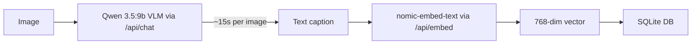
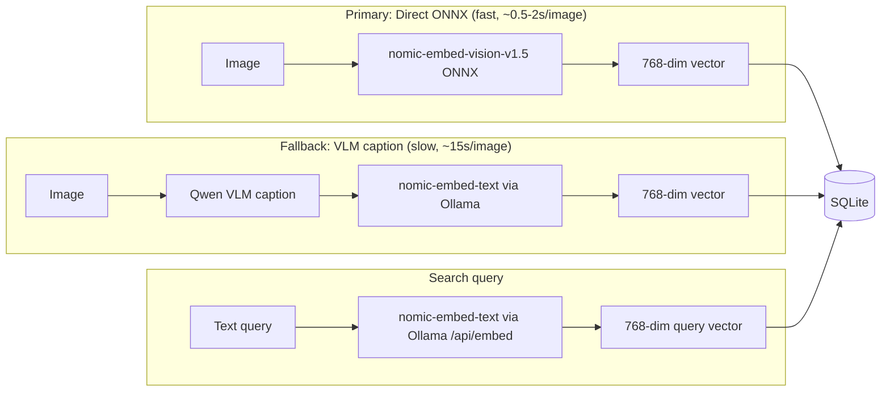

# Direct Image Embedding via nomic-embed-vision-v1.5

## Problem

The current "Index images for AI search" pipeline is:

This is slow (~15s/image) because Qwen VLM inference dominates. The comment in [semantic-embeddings.ts](apps/desktop-media/electron/semantic-embeddings.ts) says *"Ollama's /api/embed does not support image inputs (as of 2026)"*.

## Assessment of Gemini's claims

### "Ollama /api/embed does not support image inputs" -- TRUE (as of March 2026)

- GitHub issue [#5304](https://github.com/ollama/ollama/issues/5304) (65 upvotes, opened Jun 2024) is **still open**.
- The closest PR [#10728](https://github.com/ollama/ollama/pull/10728) (May 2025) is **still open and unmerged**, and a commenter reported that different images produce nearly identical vectors -- the implementation is broken for vision models like LLaVA because Ollama extracts embeddings from the language tower, not the vision tower.
- The Ollama maintainer said image embedding should be built on top of PR #8301, which has not merged either.
- **Conclusion: Ollama cannot produce correct image embeddings via /api/embed today. No workaround within Ollama exists.**

### "Use DC1LEX/nomic-embed-text-v1.5-multimodal" -- NOT a solution

The model constant `DC1LEX/nomic-embed-text-v1.5-multimodal` already in the code is a **text-only** model with nomic-bert architecture. It does not contain a vision encoder. It cannot embed images directly -- it can only embed text (the caption). The "multimodal" in the name refers to the shared embedding space, not to image input capability.

### "Use Transformers.js / ONNX in Electron" -- VIABLE (recommended primary method)

- **nomic-embed-vision-v1.5** is a dedicated vision encoder on [HuggingFace](https://huggingface.co/nomic-ai/nomic-embed-vision-v1.5) with **official ONNX weights** (quantized variants from 95MB to 375MB).
- It produces **768-dim vectors aligned to the same embedding space** as nomic-embed-text-v1.5. Text query vectors from Ollama's `/api/embed` with nomic-embed-text are directly comparable to image vectors from nomic-embed-vision via cosine similarity -- no conversion needed.
- **@huggingface/transformers** (Transformers.js v3) supports `image-feature-extraction` pipeline and runs in Node.js/Electron via ONNX Runtime.
- The codebase already uses ONNX Runtime (Python) for the retinaface sidecar, and `better-sqlite3` native modules, so native module bundling in Electron is already solved.

## Target architecture

Both paths produce vectors in the **same 768-dim embedding space**, so search works identically regardless of which method indexed a given image.

## Implementation plan

### 1. Add `@huggingface/transformers` and create vision embedding module

- Add `@huggingface/transformers` dependency to [apps/desktop-media/package.json](apps/desktop-media/package.json).
- Create a new module `apps/desktop-media/electron/nomic-vision-embedder.ts` that:
  - Loads `nomic-ai/nomic-embed-vision-v1.5` via the `image-feature-extraction` pipeline (quantized `model_quantized.onnx` ~95MB, or `model_int8.onnx` for better quality/size tradeoff).
  - Implements lazy model loading (load once on first use, keep in memory).
  - Exposes `embedImageDirect(imagePath: string, signal?: AbortSignal): Promise<number[]>` that reads the image, runs inference, and returns a normalized 768-dim vector.
  - Handles model download/caching (Transformers.js caches models automatically in `~/.cache/huggingface`).
  - Exposes `probeVisionEmbeddingReady(): Promise<boolean>` to check if the ONNX model is available.

### 2. Update the semantic index handler to prefer direct embedding

- In [semantic-search-handlers.ts](apps/desktop-media/electron/ipc/semantic-search-handlers.ts), the indexing loop (lines 140-168) currently does: `getExistingCaption() || describeImageForEmbedding() -> embedText()`.
- Change to: try `embedImageDirect()` first. If it fails (model not downloaded, ONNX error), fall back to the existing VLM caption pipeline.
- Update `embeddingSource` to `"direct_vision"` for the primary path (vs `"generated_caption"` / `"ai_metadata"` for fallback).
- The `model_version` stored in DB should remain `MULTIMODAL_EMBED_MODEL` (or a new constant like `NOMIC_VISION_MODEL`) since both text and vision models share the same embedding space. Using a separate model version string is cleaner for tracking but means re-indexing; keeping the same is fine since vectors are compatible.

### 3. Update the embedding status probe

- In [semantic-embeddings.ts](apps/desktop-media/electron/semantic-embeddings.ts), `probeMultimodalEmbeddingSupport()` currently checks text embedding + Qwen vision model. Add a check for the ONNX vision model readiness.
- Update the status reported to the renderer to include `visionOnnxReady: boolean` so the UI can show which embedding method is active.

### 4. Update the embedding provider adapter

- In [ollama-embedding-adapter.ts](apps/desktop-media/electron/adapters/ollama-embedding-adapter.ts), the `embed()` method for `inputType === "image"` currently calls `embedImageViaDescription()`. Change it to try `embedImageDirect()` first, with `embedImageViaDescription()` as fallback.

### 5. Electron/Vite build config

- [vite.main.config.ts](apps/desktop-media/vite.main.config.ts) may need `@huggingface/transformers` and `onnxruntime-node` added to the `external` list so they are not bundled by Vite but loaded at runtime from `node_modules`.
- The Electron rebuild step may need to include `onnxruntime-node` native bindings (similar to how `better-sqlite3` is already handled).

### 6. Keep existing caption path as explicit fallback

- The existing `embedImageViaDescription()` and `describeImageForEmbedding()` functions in [semantic-embeddings.ts](apps/desktop-media/electron/semantic-embeddings.ts) remain untouched as the fallback path.
- Consider adding a user-visible setting or auto-detection: if ONNX vision model is available, use direct path; otherwise fall back to VLM caption path with a warning in the UI.

## Key risks and mitigations

- **ONNX native module in Electron packaging**: `onnxruntime-node` has known issues in packaged Electron apps (needs to be excluded from asar). The codebase already handles native modules (`better-sqlite3`, `@electron/rebuild`), so the pattern is established.
- **Model download size**: The quantized ONNX model is ~95-180MB. First-run will need to download it. Transformers.js caches it automatically. Consider showing a download progress indicator.
- **Vector compatibility**: Both nomic-embed-text-v1.5 and nomic-embed-vision-v1.5 produce 768-dim vectors in the same space (confirmed by Nomic's documentation). Text queries embedded via Ollama will correctly match image vectors from ONNX. No DB schema changes needed.

