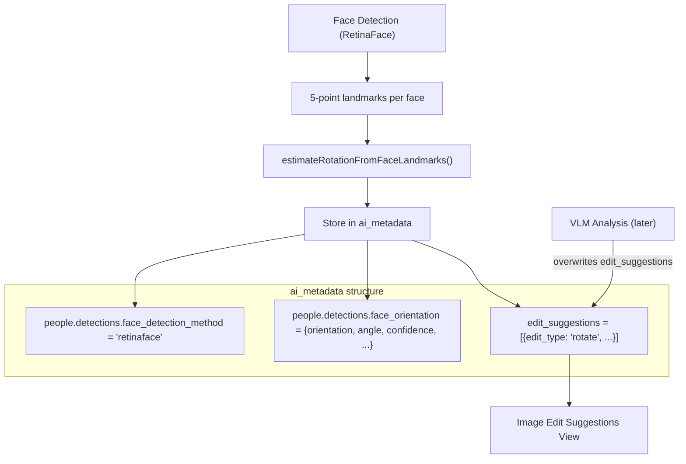

# Store Face Orientation and Generate Early Rotation Suggestions

## RetinaFace Feature Summary (for reference)

RetinaFace (as used in this codebase) detects the following per face:

- **Bounding box** (`bbox_xyxy`): `[x1, y1, x2, y2]` pixel coordinates
- **Confidence score** (`score`): 0 to 1
- **5-point facial landmarks** (`landmarks_5`): pixel coordinates for:
  - `[0]` Left eye
  - `[1]` Right eye
  - `[2]` Nose tip
  - `[3]` Left mouth corner
  - `[4]` Right mouth corner

RetinaFace does **not** detect age, gender, expression, head pose angles, or other attributes -- those require separate models.

## Changes

### 1. Add `'retinaface'` to `FaceDetectionMethod` type

In `[app/types/media-metadata.ts](app/types/media-metadata.ts)` (line 98):

```typescript
// Before:
export type FaceDetectionMethod = 'mediapipe' | 'azure-face' | 'google-vision' | 'unknown';

// After:
export type FaceDetectionMethod = 'mediapipe' | 'azure-face' | 'google-vision' | 'retinaface' | 'unknown';
```

### 2. Add `face_orientation` field to `MediaPeopleDetectionsMetadata`

In `[app/types/media-metadata.ts](app/types/media-metadata.ts)` (lines 160-164), add a new optional field:

```typescript
export interface FaceOrientationMetadata {
  orientation: 'upright' | 'rotated_90_cw' | 'rotated_180' | 'rotated_270_cw';
  correction_angle_clockwise: 0 | 90 | 180 | 270;
  confidence: number;
  face_count: number;
}

export interface MediaPeopleDetectionsMetadata {
  face_detection_method?: FaceDetectionMethod | null;
  image_size_for_bounding_boxes?: ImageSizeForBoundingBoxes | null;
  people_bounding_boxes?: BeingBoundingBox[] | null;
  face_orientation?: FaceOrientationMetadata | null;  // NEW
}
```

### 3. Fix `face_detection_method` from `"unknown"` to `"retinaface"`

In `[apps/desktop-media/electron/db/media-analysis.ts](apps/desktop-media/electron/db/media-analysis.ts)`, two locations:

- **Line 300** in `upsertFaceDetectionResult`: change `face_detection_method: "unknown"` to `face_detection_method: "retinaface"`
- **Line 463** in `upsertRotationPipelineFaces`: same change

### 4. Compute face orientation during `upsertFaceDetectionResult`

In `[apps/desktop-media/electron/db/media-analysis.ts](apps/desktop-media/electron/db/media-analysis.ts)`, within `upsertFaceDetectionResult`:

- Import `estimateRotationFromFaceLandmarks` from `@emk/shared-contracts`
- After building `nextAiMetadata`, compute orientation from `result.faces` landmarks using `estimateRotationFromFaceLandmarks`
- Include computed `face_orientation` in the `people.detections` section of the metadata

### 5. Generate `edit_suggestions` for rotation based on face orientation

Still in `upsertFaceDetectionResult`, after computing orientation:

- If `correctionAngleClockwise !== 0` (face is not upright), add `edit_suggestions` as a top-level extra field on the merged metadata object
- Use the same suggestion structure as `[photo-analysis-pipeline.ts](apps/desktop-media/electron/photo-analysis-pipeline.ts)` line 338-348:

```typescript
edit_suggestions: [{
  edit_type: "rotate",
  priority: "high",
  reason: "Face-landmark orientation detected during face detection.",
  confidence: null,
  auto_apply_safe: true,
  rotation: { angle_degrees_clockwise: correctionAngle },
}]
```

- This is stored in `ai_metadata` and immediately visible in the "Image Edit Suggestions View" via the existing `getAdditionalTopLevelFields` reader
- When VLM analysis runs later, its `edit_suggestions` will overwrite these (correct behavior)

### 6. Apply same logic to `upsertRotationPipelineFaces`

The same face orientation computation and `edit_suggestions` generation should apply to `upsertRotationPipelineFaces` (line ~399), which stores faces found during the rotation verification pipeline.

### Data Flow




### What stays unchanged (safety)

- `detectFacesNative` in `retinaface-detector.ts` -- untouched, still returns same `FaceDetectionOutput`
- `FaceDetectionOutput` / `FaceDetectionBox` interfaces in `ipc.ts` -- untouched
- Bounding box computation and storage -- untouched
- `media_face_instances` table writes (bbox, landmarks) -- untouched
- Rotation heuristics in `shared-contracts` -- reused as-is
- `image-edit-suggestions-view.tsx` UI -- no changes needed (already reads `edit_suggestions` from extras)
- `use-filtered-media-items.ts` -- no changes needed (already parses rotation from `edit_suggestions`)
