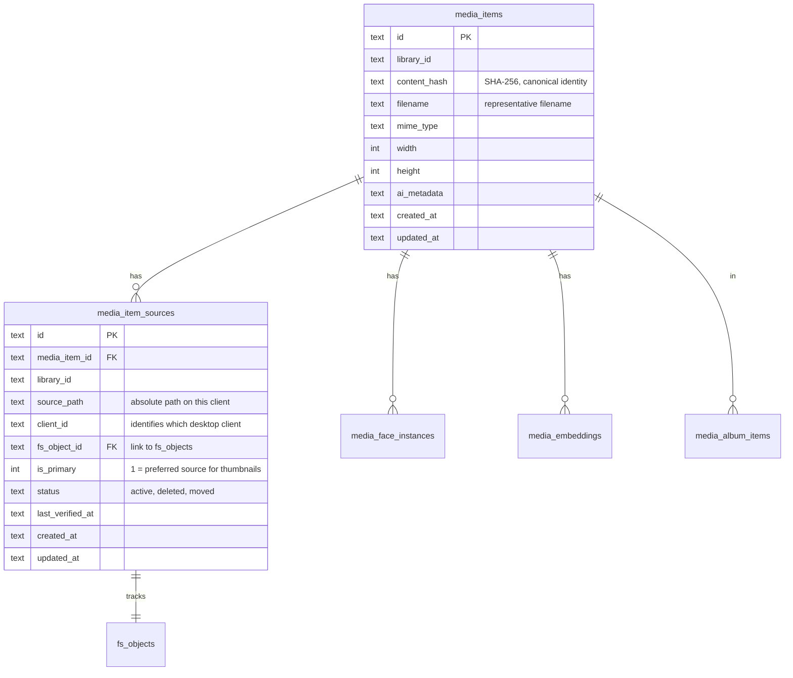
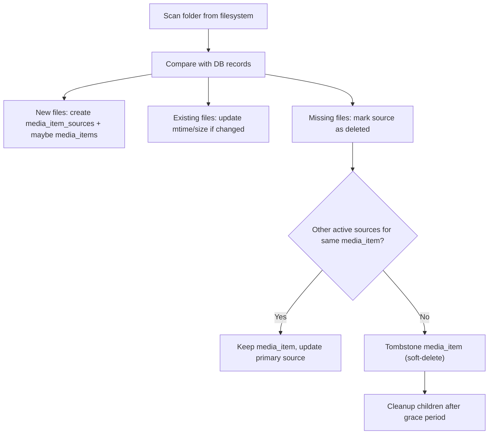
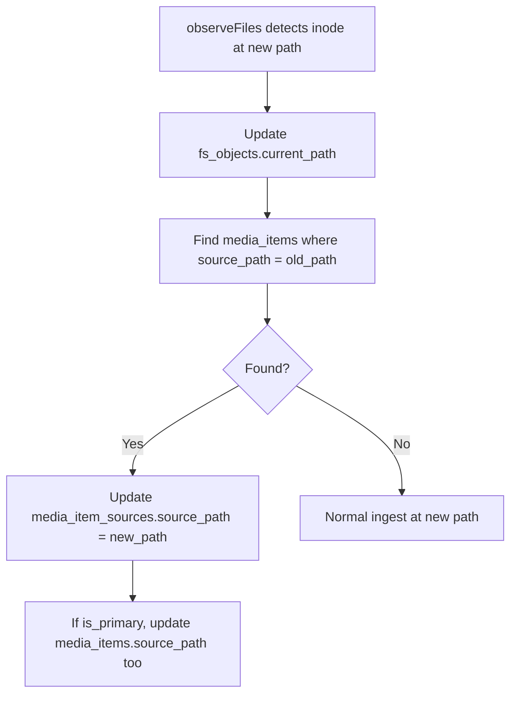

# File Identity, Duplicate Management, and Deletion Handling

## Current State Assessment

The app has two disconnected layers for tracking files:

- `**fs_objects**` — low-level filesystem identity (inode, path, SHA-256 hash, soft-delete via `deleted_at`). Updated during metadata scan.
- `**media_items**` — media catalog (metadata, AI analysis, faces, embeddings). Keyed by `(library_id, source_path)`. Never deleted or updated on file move/removal.

These two layers are linked only by matching paths (`fs_objects.current_path` = `media_items.source_path`). There is no `fs_object_id` column in `media_items` and no cascade logic.

**Key gaps today:**

- Deleted files leave orphaned `media_items`, `media_face_instances`, `media_embeddings` rows
- Moved/renamed files create a new `media_items` row at the new path; old row becomes an orphan
- `duplicate_group_id` is written but never consumed by UI or any dedup logic
- No concept of a "canonical media item" across duplicate files

---

## 1. Duplicate File Management

### 1A. Core Identity Model — Content-Addressable Media Identity

**Recommendation: one `media_items` row per unique content (SHA-256), with a separate path-tracking table.**

This is the approach used by Apple Photos, Lightroom, digiKam, and Immich: the media catalog tracks *content*, not *file locations*. File paths are an attribute of a content record, not the identity.




**Why this model:**

- All AI metadata, face instances, embeddings, tags, and album membership attach to one `media_items` row per unique image, regardless of how many copies exist on disk or across clients.
- When a duplicate is found, no data migration is needed — both paths map to the same `media_items.id`.
- For multi-client: each client contributes `media_item_sources` rows with its own `client_id`. The same `content_hash` links them.

**Alternative considered:** Keep `media_items` keyed by path and add a `duplicate_group_id` grouping layer. This is simpler short-term but requires grouping queries everywhere downstream (faces, embeddings, search results) and makes multi-client sync harder because the same content gets different IDs on different clients.

### 1B. Migration Path from Current Schema

Since the current `media_items` is keyed by `(library_id, source_path)` with significant data (AI metadata, face instances, embeddings), a phased migration is recommended:

**Phase 1 — Add `media_item_sources` table, bridge existing data:**

1. Create `media_item_sources` table (schema above).
2. For each existing `media_items` row, insert one `media_item_sources` row where `source_path = media_items.source_path`, `is_primary = 1`, `status = 'active'`.
3. Add `content_hash` column to `media_items` (populated from `checksum_sha256`).
4. Keep `source_path` on `media_items` as a denormalized "primary source path" for backward compatibility.

**Phase 2 — Merge duplicates:**

1. When a new file is observed with a `strong_hash` matching an existing `media_items.content_hash`, instead of creating a new `media_items` row, add a `media_item_sources` entry pointing to the existing `media_items.id`.
2. Update `upsertMediaItemFromFilePath` in [media-item-metadata.ts](apps/desktop-media/electron/db/media-item-metadata.ts) to do hash-first lookup before path-based lookup.
3. Update UI to show duplicate indicator (count of sources).

**Phase 3 — Multi-client:**

1. Each desktop client gets a stable `client_id` (generated once and stored in settings).
2. During sync push, `media_item_sources` entries include `client_id`.
3. The cloud merge logic uses `content_hash` to unify records from different clients.

### 1C. Dedup Logic During Ingest

The dedup check should happen in `upsertMediaItemFromFilePath` ([media-item-metadata.ts](apps/desktop-media/electron/db/media-item-metadata.ts)):

```
1. Compute strong_hash (already done in observeFiles)
2. Look up media_items by content_hash = strong_hash
   - FOUND: reuse that media_items.id, add a media_item_sources row for the new path
   - NOT FOUND: look up by (library_id, source_path) as today
     - FOUND: update existing row, set content_hash
     - NOT FOUND: create new media_items + media_item_sources
3. Mark the new source as is_primary = 1 only if no other active primary exists
```

### 1D. Files > 128MB (no strong hash)

Currently, `maybeComputeStrongHash` in [file-identity.ts](apps/desktop-media/electron/db/file-identity.ts) skips files > 128MB. For large files, use a **partial hash** strategy: hash the first 64KB + last 64KB + file size. This covers virtually all media files (even RAW photos rarely exceed 128MB, but video files do). Store this as `partial_hash` with a flag, and only treat full SHA-256 matches as definitive duplicates.

---

## 2. Deleted and Moved File Handling

### 2A. Detection — When Do We Discover Changes?

Three trigger points (in priority order for implementation):


| Trigger                              | Current Status       | Implementation                                                  |
| ------------------------------------ | -------------------- | --------------------------------------------------------------- |
| **Folder expand** (sidebar tree)     | Just implemented     | Already re-reads subfolder list from FS                         |
| **Folder select** (file listing)     | Partially exists     | `streamFolderImages` lists current files; metadata scan follows |
| **Explicit "Scan tree for changes"** | Exists (menu action) | Runs recursive metadata scan                                    |


**Not recommended for now:** filesystem watchers (e.g., `chokidar`). They add complexity (cross-platform edge cases, high memory for large trees, unreliable on network drives). Major apps (Lightroom, digiKam) use on-demand scanning, not watchers. Watchers can be added as an optimization later.

### 2B. Reconciliation Logic — `reconcileFolder`

A new function `reconcileFolder(folderPath, observedFiles)` should run after every folder scan (both file-listing and metadata scan). It should handle:




### 2C. Soft-Delete with Grace Period

**Recommendation: soft-delete `media_item_sources` immediately; soft-delete `media_items` only when last source is gone; hard-delete children after a grace period.**

This is the industry standard (Lightroom keeps "missing" items visible with a badge; Apple Photos hides but retains for 30 days in "Recently Deleted").

Implementation in [media-item-metadata.ts](apps/desktop-media/electron/db/media-item-metadata.ts):

1. Add `deleted_at` column to `media_items` (and `media_item_sources` when created).
2. When a file disappears from disk:
  - Set `media_item_sources.status = 'deleted'`, `deleted_at = now`.
  - If no other active source exists for that `media_items.id`, set `media_items.deleted_at = now`.
  - Do NOT immediately delete child rows (faces, embeddings, etc.).
3. A periodic cleanup job (or on-demand "Purge deleted items" action) hard-deletes:
  - `media_items` rows where `deleted_at < now - grace_period` (suggest 30 days).
  - Cascade: `media_face_instances`, `media_embeddings`, `media_album_items`, `media_item_tags` for those IDs.
  - `media_item_sources` rows for those media items.
  - `fs_objects` tombstones older than grace period.
4. UI: filter out `deleted_at IS NOT NULL` items from grid/search by default; optionally show them with a "missing file" badge.

### 2D. Moved/Renamed File Detection

The existing inode-based tracking in `observeFiles` ([file-identity.ts](apps/desktop-media/electron/db/file-identity.ts)) already detects moves at the `fs_objects` level. The gap is propagating to `media_items`:




Implementation: after `updateExistingById` in `observeFiles`, if the path changed (`byOsId.current_path !== item.absolutePath`), emit a path-change event or directly update `media_item_sources` and `media_items.source_path`.

**Important edge case — cross-folder moves:**
When a file moves from folder A to folder B, folder A's scan marks it deleted; folder B's scan sees it as new. Without inode matching across folders, the file gets a new `media_items` row. The content-hash model (section 1A) solves this: folder B's ingest finds the existing `media_items` by `content_hash` and just adds a new source.

### 2E. Deleted Folder/Subfolder Handling

When a subfolder is deleted:

- The sidebar tree refresh (just implemented) will remove it from `childrenByPath`.
- But files inside it remain in `media_items` / `fs_objects` as orphans.

**Required:** When `reconcileFolder` runs recursively, any `media_item_sources` whose `source_path` starts with the deleted folder prefix should be marked `status = 'deleted'`.

This should be triggered by the "Scan tree for changes" action (already exists in the menu) and could also be chained from the folder-expand refresh when a subfolder disappears.

---

## 3. Other Related Aspects

### 3A. Foreign Key Constraints

The current schema has no foreign key constraints. Add them with `ON DELETE CASCADE` for child tables:

```sql
-- In a migration:
-- media_face_instances.media_item_id -> media_items.id ON DELETE CASCADE
-- media_embeddings.media_item_id -> media_items.id ON DELETE CASCADE
-- media_album_items.media_item_id -> media_items.id ON DELETE CASCADE
-- media_item_tags.media_item_id -> media_items.id ON DELETE CASCADE
-- media_item_sources.media_item_id -> media_items.id ON DELETE CASCADE
```

SQLite does not support `ALTER TABLE ... ADD CONSTRAINT`. The pragmatic approach is:

- Add FK constraints to the `CREATE TABLE IF NOT EXISTS` statements (these only apply to new DBs).
- For existing DBs, the manual cleanup logic (section 2C) handles orphans.
- Alternatively, rebuild tables with FKs in a migration (copy data to temp, recreate with FKs, copy back). This is the clean approach but more work.

**Recommendation:** Add FK constraints in the schema definitions for new DBs; add explicit cleanup in the purge job for existing DBs. Rebuild-with-FKs migration can come later when a breaking-change window is available.

### 3B. Sync Operation Logging

Currently only `media.ai.annotate` operations are logged. Extend `appendSyncOperation` in [sync-log.ts](apps/desktop-media/electron/db/sync-log.ts) to also emit:

- `media.upsert` — when a new media_item is created or metadata changes
- `media.delete` — when a media_item is soft-deleted (all sources gone)
- `media.source.add` — when a new source path is discovered (for multi-client)
- `media.source.remove` — when a source is marked deleted

These operations already exist in `SyncOperationType` from [operations.ts](packages/shared-contracts/src/sync/operations.ts) (except `source.add`/`source.remove` which would be new).

### 3C. Client Identity for Multi-Client

Add a `client_id` to the app settings ([storage.ts](apps/desktop-media/electron/storage.ts)):

- Generated as UUID on first launch.
- Stored in `settings.json` alongside `libraryRoots`.
- Included in every `media_item_sources` row and every sync operation payload.
- This allows the cloud to distinguish "same file on client A" from "same file on client B".

### 3D. Stale Search Results / UI Consistency

When `media_items` are soft-deleted:

- Semantic search should filter `WHERE deleted_at IS NULL` — update [semantic-search.ts](apps/desktop-media/electron/db/semantic-search.ts) `searchByVector`.
- Face clusters should exclude deleted items — update queries in [face-embeddings.ts](apps/desktop-media/electron/db/face-embeddings.ts).
- Thumbnail grid already reads live data per folder, so deleted files simply won't appear in the file listing.

### 3E. Recommended Implementation Order

The work breaks into three milestones that can ship independently:

**Milestone 1 — Deletion handling (immediate value):**

- Add `deleted_at` to `media_items`
- Implement `reconcileFolder` that marks missing files' media_items as deleted
- Chain reconciliation from metadata scan completion
- Filter deleted items from search and face queries
- Add purge job for hard-deleting old tombstones + children

**Milestone 2 — Move detection and source tracking:**

- Create `media_item_sources` table
- Migrate existing data (one source per media_item)
- Propagate `fs_objects` path changes to `media_item_sources`
- Handle cross-folder moves via content-hash lookup

**Milestone 3 — Duplicate management and multi-client:**

- Switch `media_items` primary key strategy to content-hash-based lookup
- Merge duplicates into single media_item with multiple sources
- Add `client_id` to settings and source tracking
- Extend sync operations for `media.source.add` / `media.source.remove`
- UI for duplicate review (show grouped duplicates, pick primary)

