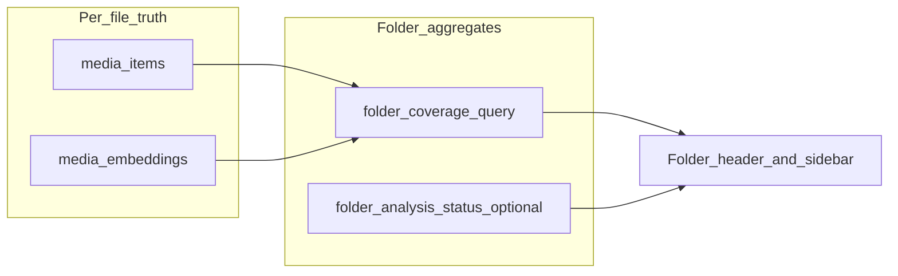

# Folder-level AI pipeline visibility and scan integration

## How mature DAM / photo tools handle this

Products like **Adobe Lightroom Classic**, **Capture One**, and **digiKam** converge on a few patterns worth copying:

- **Per-asset pipeline state** is the source of truth (imported, metadata extracted, keywords, AI, etc.); the UI aggregates that into folder/session summaries.
- **File change invalidates downstream work**: when the underlying file or extracted metadata changes, anything that assumed old bytes is marked stale or cleared (Lightroom’s “metadata was changed externally” style behavior).
- **Folder badges are rollups**, not a second truth: a folder is “green” only if all assets in scope pass the check; “yellow” = mixed / partial; “red” or “dot” = none or blocking errors; optional “out of date” when the catalog knows the filesystem drifted before a rescan.
- **Ingest vs enrichment are separate steps**: after a folder sync/scan, tools often prompt or queue “process” steps so users understand **new/changed files still need AI**.

Your app already has **per-file signals** for photo/face (`media_items.photo_analysis_processed_at`, `face_detection_processed_at`) and **per-file embeddings** (`[media_embeddings](apps/desktop-media/electron/db/client.ts)`). **Folder-level** today is only photo+face in `[folder_analysis_status](apps/desktop-media/electron/db/folder-analysis-status.ts)` and is **too coarse** for the three-pipeline + partial + stale story. Semantic indexing is **not** wired into that table.

**Important codebase gap to fix as part of “partly done / changed files”:** `[upsertMediaItemFromFilePath](apps/desktop-media/electron/db/media-item-metadata.ts)` updates rows on content/metadata refresh but **does not clear** `photo_analysis_processed_at`, `face_detection_processed_at`, or embedding rows when the file’s observed identity/content changes. Without invalidation, aggregates will show **done** when results are actually stale.

---

## Primary UI entry (MVP shipped)

- **Trigger:** In the left sidebar folder tree, open the row **popup menu** (right-click on a folder row, or the `...` button). Choose **“Folder AI analysis summary”** (`UI_TEXT.folderAiAnalysisSummary`).
- **Behavior:** The app selects that folder (same as a normal folder click, so thumbnails load in the background) and switches the **main pane** from the thumbnail grid to `**DesktopFolderAiSummaryView`** (`MainPaneViewMode === "folderAiSummary"`).
- **Content:**
  - **(a)** Summary row **“This folder (direct images)”** — face detection, AI photo analysis, and semantic search index columns with status labels (No images / Not done / Partial / Done) plus `done / total` image counts. Scope is **non-recursive** (images in that folder only).
  - **(b)** One row per **immediate sub-folder** (from `readFolderChildren`), same three columns, same non-recursive rule per child.
- **Navigation:** **Back to photos** returns to the thumbnail grid; **Refresh** re-invokes `getFolderAiSummaryReport`.
- **Files:** `[SidebarTree.tsx](apps/desktop-media/src/renderer/components/SidebarTree.tsx)`, `[App.tsx](apps/desktop-media/src/renderer/App.tsx)`, `[DesktopFolderAiSummaryView.tsx](apps/desktop-media/src/renderer/components/DesktopFolderAiSummaryView.tsx)`, `[folder-ai-coverage.ts](apps/desktop-media/electron/db/folder-ai-coverage.ts)`, `[folder-ai-summary-handlers.ts](apps/desktop-media/electron/ipc/folder-ai-summary-handlers.ts)`, `[ipc.ts](apps/desktop-media/src/shared/ipc.ts)` (types + channel), `[preload.ts](apps/desktop-media/electron/preload.ts)`, `[main.ts](apps/desktop-media/electron/main.ts)`.

---

## Target semantics (per pipeline, per scope)

**Scope:** `folderPath` + `recursive` (match existing jobs in `[photo-analysis-handlers.ts](apps/desktop-media/electron/ipc/photo-analysis-handlers.ts)`, face handlers, `[semantic-search-handlers.ts](apps/desktop-media/electron/ipc/semantic-search-handlers.ts)`).

For each pipeline **P** ∈ {photo, face, semantic}:

| State           | Meaning (aggregate over image `media_items` in scope, `deleted_at IS NULL`)                                                       |
| --------------- | --------------------------------------------------------------------------------------------------------------------------------- |
| **none**        | `total_images === 0` OR no item satisfies “done and fresh” for P                                                                  |
| **done**        | `total_images > 0` and every item is **done and fresh** for P                                                                     |
| **partial**     | `total_images > 0` and some items done/fresh and some not (includes cancelled jobs, mixed success/failure, or stale-after-rescan) |
| **in_progress** | Global or folder-scoped job running for P (from existing job refs + optional DB flags)                                            |

**Done and fresh (proposed definitions):**

- **Photo:** `photo_analysis_processed_at IS NOT NULL` AND `photo_analysis_processed_at >= metadata_extracted_at` (and same for content change if you add explicit invalidation timestamps—see below).
- **Face:** `face_detection_processed_at IS NOT NULL` AND `>= metadata_extracted_at` (plus invalidation rules).
- **Semantic:** exists `media_embeddings` row for `(library_id, media_item_id, embedding_type='image', model_version=MULTIMODAL_EMBED_MODEL)` with `embedding_status='ready'`, and **indexed_at** (or updated_at) `>= metadata_extracted_at` so a metadata rescan after indexing forces “needs re-index” unless you clear embeddings on content change.

**Staleness / “folder had changes”:** Prefer **explicit invalidation** on metadata upsert when `status === 'created' | 'updated'` (not `unchanged`): set `photo_analysis_processed_at` / `face_detection_processed_at` to `NULL`, and mark embeddings failed or delete the row for the active model (mirrors how serious DAMs treat “new bytes”). The `>= metadata_extracted_at` rule remains a **safety net** if invalidation is missed.

---

## Phase 1 — Selected folder: three-pipeline status strip

1. **DB query module** (new), e.g. `[apps/desktop-media/electron/db/folder-ai-coverage.ts](apps/desktop-media/electron/db/folder-ai-coverage.ts)`:
  - Normalize folder prefix the same way as `[semantic-search.ts](apps/desktop-media/electron/db/semantic-search.ts)` / `[media-item-reconciliation.ts](apps/desktop-media/electron/db/media-item-reconciliation.ts)` (`path.sep`, `LIKE` + `ESCAPE` if needed).
  - Single parameterized query (or 3 tight queries) returning for the scope:
    - `total_images`
    - Per pipeline: `done_count`, `stale_or_missing_count` (derive partial/done/none in TS or SQL `CASE`).
  - Filter to rows that are actually images (reuse the same mime/glob assumptions as `[listFolderImages](apps/desktop-media/electron/fs-media.ts)` / existing jobs).
2. **IPC:** e.g. `getFolderAiCoverage({ folderPath, recursive })` returning a typed DTO in `[apps/desktop-media/src/shared/ipc.ts](apps/desktop-media/src/shared/ipc.ts)`.
3. **Renderer:** small panel in the **folder content header** (near existing “More actions” from [FOLDER-ANALYTICS-MENU-UX.md](docs/PRODUCT-FEATURES/media-library/FOLDER-ANALYTICS-MENU-UX.md)) showing three rows or chips: Photo / Face / Search index — each with none | partial | done | in progress + optional counts (`12/40`). Refresh on:
  - folder selection change
  - job-completed for metadata / photo / face / semantic
  - debounced after metadata scan item updates if needed
4. **Invalidation hook** in `[upsertMediaItemFromFilePath](apps/desktop-media/electron/db/media-item-metadata.ts)` (or immediately after upsert in the scan loop): when result is `created` or `updated`, clear AI timestamps and reset embeddings for that `media_item_id` for the current semantic model. This makes “partial” and “needs scan” trustworthy.

---

## Phase 2 — Sub-folder table / breakdown

- Reuse the same query with `recursive: false` for **each child folder path** under the selected folder (batch API: `getFolderAiCoverageBatch(paths: string[])` to avoid N round-trips).
- UI: expandable section “Sub-folders” with a table (path, 3 statuses). Cap rows or virtualize for very large trees; optional “load more” for roots with thousands of direct children.

---

## Phase 3 — Sidebar icon as rollup (parent + descendants)

**Goal:** At a glance, especially for **library roots**, show whether **anything** under that node still needs work.

**Recommended approach (proven, scalable enough for desktop SQLite):**

- **Server-side rollup function** `getFolderRollup(folderPath, includeDescendants)`:
  - Use prefix `LIKE` on `media_items.source_path` under `folderPath` to compute the same three aggregates **once** for the whole subtree.
  - Map rollup to a **small enum** for the icon: e.g. `all_done`, `none`, `mixed`, `unknown` (no rows), `job_running` (OR any descendant folder has `*_in_progress` in extended `folder_analysis_status`—see below).
- **Caching (optional but important for large libraries):**
  - Invalidate cache keys when: metadata scan completes, any AI job completes, or media_items change for paths under prefix.
  - Simple MVP: no cache; add if profiling shows sidebar jank.
- **UI:** Replace or extend `[FolderStatusIcon](apps/desktop-media/src/renderer/components/SidebarTree.tsx)` to reflect **rollup** for `level === 0` (library roots) first; optionally use the same for all nodes if performance allows.

**Extend `[folder_analysis_status](apps/desktop-media/electron/db/folder-analysis-status.ts)`** with nullable columns, e.g. `semantic_in_progress`, `semantic_indexed_at` (or only in-progress + derive “indexed” purely from `media_embeddings`). This keeps **job spinners** accurate for semantic (today only photo/face update `[folderAnalysisByPath](apps/desktop-media/src/renderer/stores/desktop-slice.ts)` via `[ipc-progress-binders.ts](apps/desktop-media/src/renderer/hooks/ipc-progress-binders.ts)`).

---

## Phase 4 — “Scan tree for changes” → highlight folders + incremental AI prompt

Today `[runMetadataScanJob](apps/desktop-media/electron/ipc/metadata-scan-handlers.ts)` emits per-item updates with `currentFolderPath` and a `job-completed` summary with **counts only** (`[MetadataScanProgressEvent](apps/desktop-media/src/shared/ipc.ts)`).

1. **Augment completion payload** with `foldersTouched: Array<{ folderPath: string; created: number; updated: number }>` (aggregate in main process during the scan loop when emitting `item-updated` for non-unchanged items). Keep payload bounded (merge by folder).
2. **Renderer:** when `created + updated > 0`, show a **non-blocking banner or dialog**: “N files added or updated across M folders. Run AI on missing items?” with actions: **Run photo (missing)**, **Run face (missing)**, **Index search (missing)** — reusing existing IPC entry points with `recursive: true` scoped to the **scan root** or offering per-folder actions from the aggregated list.
3. **Sidebar / status strip:** mark folders in `foldersTouched` with a **“content changed since last AI”** badge until a successful AI pass clears invalidation (or until user dismisses—product choice).

---

## Testing and docs

- **Unit tests** for coverage SQL against a small fixture DB (counts, recursive vs non-recursive, stale when `metadata_extracted_at` moves).
- **E2E** (optional): select folder → run metadata scan on a fixture → assert status strip moves from done → partial after file touch.
- Short addition to [FOLDER-ANALYTICS-MENU-UX.md](docs/PRODUCT-FEATURES/media-library/FOLDER-ANALYTICS-MENU-UX.md) describing the three states and rollup icon.

---

## Risk / scope notes

- **Path normalization** on Windows must stay consistent across FS, DB `source_path`, and `LIKE` prefixes (reuse existing helpers).
- **Semantic “done”** must be tied to `**MULTIMODAL_EMBED_MODEL`** (`[semantic-search-handlers.ts](apps/desktop-media/electron/ipc/semantic-search-handlers.ts)`); if the model string changes, older embeddings should count as **not done** for the current model (already implied by the unique key on `model_version`).
- **Cancelled jobs:** partial is automatic if some files lack completion markers; optionally persist `last_job_cancelled_at` per folder per pipeline if you want copy like “cancelled last run” (nice-to-have).

