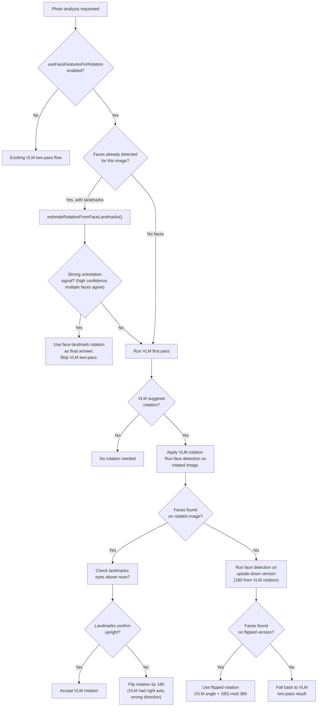

# Improve Rotation Detection with Face Landmarks

## Problem statement

The VLM (Qwen 3.5 9B) often correctly detects that an image needs rotation but suggests the **wrong direction** (90 vs 270, or resulting in upside-down). The two-pass VLM approach helps but is slow and still unreliable when the model is confidently wrong.

## Code review findings (unchanged)

- Production two-pass logic in [electron/main.ts](apps/desktop-media/electron/main.ts) (line 1605): **Correct**
- Jimp rotation direction, `mapObservedOrientationToAngle`, metadata persistence: **All correct**
- Test script [scripts/test-ai-rotation.ts](apps/desktop-media/scripts/test-ai-rotation.ts) `combineRotationAngles` (line 117): **Bug** -- returns `firstAngle` when total=0 instead of null. Does not affect production.

## Approach: Face-landmark-based rotation correction

### Key insight

RetinaFace already detects **5 landmarks** per face: left eye, right eye, nose, left mouth, right mouth. These are stored in `media_face_instances.landmarks_json`. The spatial relationship between eyes and nose is a strong, deterministic signal for image orientation -- eyes should be above the nose in an upright photo. RetinaFace is trained with roughly +/-45 degree augmentation, so it reliably detects faces that are upright or moderately tilted, but struggles with 90/180/270 rotations.

### Algorithm: `estimateRotationFromFaceLandmarks`

New file: [electron/rotation-heuristics.ts](apps/desktop-media/electron/rotation-heuristics.ts)

For each detected face with 5 landmarks `[[leftEyeX, leftEyeY], [rightEyeX, rightEyeY], [noseX, noseY], ...]`:

- Compute `eyeMidY = (leftEyeY + rightEyeY) / 2`, `eyeMidX = (leftEyeX + rightEyeX) / 2`
- `deltaY = noseY - eyeMidY`, `deltaX = noseX - eyeMidX`
- Determine dominant axis and direction:
  - `|deltaY| > |deltaX|` and `deltaY > 0` --> **upright** (eyes above nose, y-down)
  - `|deltaY| > |deltaX|` and `deltaY < 0` --> **upside-down (180)**
  - `|deltaX| > |deltaY|` and `deltaX > 0` --> **rotated 90 CW** (nose to the right of eyes)
  - `|deltaX| > |deltaY|` and `deltaX < 0` --> **rotated 270 CW** (nose to the left of eyes)
- Confidence: based on the ratio `max(|deltaY|, |deltaX|) / min(|deltaY|, |deltaX|)` and detection score
- When multiple faces are detected: majority vote weighted by confidence; unanimous agreement = highest confidence

### Helper: multi-orientation face detection

New function in [electron/rotation-heuristics.ts](apps/desktop-media/electron/rotation-heuristics.ts):

`detectFacesAtMultipleOrientations(imagePath, orientations: [0, 90, 180, 270])`:

- For each orientation: create a rotated temp image (reuse `createRotatedTempImage` from [electron/photo-analysis.ts](apps/desktop-media/electron/photo-analysis.ts)), run `detectFacesInPhoto`, record best face confidence + landmark orientation vote
- Return the orientation with the highest-confidence face detection where landmarks pass the geometry check
- This handles the case where RetinaFace cannot detect faces on a heavily rotated image

### 3-tier decision flow in production

Modify `analyzePhotoWithOptionalTwoPass` in [electron/main.ts](apps/desktop-media/electron/main.ts) (line 1547):

**Tier 1 -- Existing face landmarks as primary signal:**

- Query `media_face_instances` for the image's `landmarks_json`
- If faces exist with landmarks, run `estimateRotationFromFaceLandmarks()`
- If multiple faces unanimously agree on orientation with high confidence: use this as the final rotation answer, **skip VLM two-pass entirely** (much faster)

**Tier 2 -- VLM + face detection verification:**

- If no strong face signal (no prior faces, or low confidence / disagreement): run VLM first pass as today
- If VLM suggests rotation: apply the suggested rotation, then run `detectFacesInPhoto()` on the rotated image
  - If faces detected: check landmarks confirm "upright" (eyes above nose). If yes, accept VLM rotation. If no (upside-down), flip by 180 degrees.
  - If no faces detected on rotated image: run face detection on the upside-down version (VLM rotation + 180). If faces found there, use the flipped rotation.
  - If still no faces: fall back to VLM two-pass as today

**Tier 3 -- VLM two-pass fallback:**

- If face detection provides no signal at all (no people in image), use existing VLM two-pass logic unchanged.

### Settings toggle

In [src/shared/ipc.ts](apps/desktop-media/src/shared/ipc.ts), add to `PhotoAnalysisSettings`:

- `useFaceFeaturesForRotation: boolean` (default: `true`)

In [electron/storage.ts](apps/desktop-media/electron/storage.ts), add sanitization for the new field.

In [src/renderer/components/DesktopSettingsSection.tsx](apps/desktop-media/src/renderer/components/DesktopSettingsSection.tsx), add a toggle under the AI photo analysis section:

- Label: "Use face features to detect photo rotation suggestions"
- Default: enabled

### Test script fix

In [scripts/test-ai-rotation.ts](apps/desktop-media/scripts/test-ai-rotation.ts):

- Fix `combineRotationAngles` to return `null` (not `firstAngle`) when `total === 0`
- Optionally add a mode that exercises the face-landmark rotation path

---

## Future improvements (document only, not implemented now)

### Method B: YOLO Pose Estimation

YOLO pose models (e.g. `yolo26n-pose`) detect 17 body keypoints (eyes, ears, shoulders, hips, knees, ankles). Anatomical constraints (shoulders above hips, hips above knees) provide a robust rotation signal even for partial body views. Implementation would add a `/detect-pose` endpoint to the existing `retinaface-api` Python service at port 8010. Useful beyond rotation: general pose analysis for wider media library features.

### Method D: Pre-trained image orientation classifier (lightweight CNN)

A small CNN trained specifically for 0/90/180/270 classification. Works on any image content (not just people). Several open-source models exist. Good complement for photos without faces/people.

### Method C: Multi-orientation VLM voting -- Not recommended

Running VLM on all 4 orientations is 4x slower and still relies on VLM judgment, which is the root cause of errors. Not pursuing this approach.

---

## Key files to modify

- **New:** `electron/rotation-heuristics.ts` -- landmark geometry logic + multi-orientation face detection helper
- **Modify:** `electron/main.ts` -- wire 3-tier decision into `analyzePhotoWithOptionalTwoPass`
- **Modify:** `src/shared/ipc.ts` -- add `useFaceFeaturesForRotation` to `PhotoAnalysisSettings`
- **Modify:** `electron/storage.ts` -- sanitize new setting
- **Modify:** `src/renderer/components/DesktopSettingsSection.tsx` -- add toggle UI
- **Modify:** `scripts/test-ai-rotation.ts` -- fix `combineRotationAngles` bug
- **New (docs):** Document Methods B and D as future improvements

