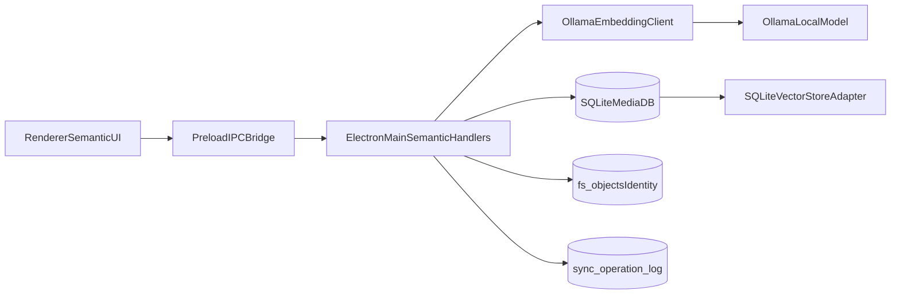

# Multimodal Semantic Search Plan (DC1LEX/nomic-embed-text-v1.5-multimodal)

## Goal

Add semantic image search in `desktop-media` using Ollama multimodal embeddings so users can search photos by natural language (and later by similar image), while keeping storage/sync architecture aligned with existing SaaS-first strategy.

## Current baseline

- Ollama chat-based photo analysis already exists in `[apps/desktop-media/electron/photo-analysis.ts](apps/desktop-media/electron/photo-analysis.ts)`.
- SQLite vector table + adapter already exist:
  - `[apps/desktop-media/electron/db/client.ts](apps/desktop-media/electron/db/client.ts)`
  - `[apps/desktop-media/electron/db/vector-store.ts](apps/desktop-media/electron/db/vector-store.ts)`
- Embedding generation/search is not wired into pipelines or UI:
  - `[apps/desktop-media/electron/main.ts](apps/desktop-media/electron/main.ts)`
  - `[apps/desktop-media/src/shared/ipc.ts](apps/desktop-media/src/shared/ipc.ts)`
  - `[apps/desktop-media/src/renderer/App.tsx](apps/desktop-media/src/renderer/App.tsx)`

## Implementation phases

### 1) Add Ollama embedding client (multimodal)

- Create `electron/semantic-embeddings.ts` with:
  - `embedText(query: string)`
  - `embedImage(imagePath: string)`
- Use Ollama embeddings endpoint with model `DC1LEX/nomic-embed-text-v1.5-multimodal`.
- Add robust parsing + retries + timeout + graceful "model unavailable" errors.
- Normalize vectors (L2) before persistence/search.

### 2) Embed ingestion pipeline for library photos

- On-demand indexing entrypoint in main process (folder-level and full-library mode).
- For each image:
  - ensure `media_items` row exists,
  - generate image embedding,
  - upsert into `media_embeddings` via `SQLiteVectorStoreAdapter`.
- Add resumable progress state in DB (indexed_at/error/retry_count) to support large libraries.

### 3) Semantic search API over IPC

- Extend `[apps/desktop-media/src/shared/ipc.ts](apps/desktop-media/src/shared/ipc.ts)` and preload:
  - `semanticSearchPhotos({ query, libraryId, limit, folderScope? })`
  - optional `indexFolderEmbeddings({ folderPath })`
- In `main.ts`, flow:
  1. text -> embedding
  2. nearest-neighbor via vector adapter
  3. hydrate media metadata (path/name/thumbnail)
  4. return ranked results with score

### 4) Renderer UI integration

- Add semantic search controls in `[apps/desktop-media/src/renderer/App.tsx](apps/desktop-media/src/renderer/App.tsx)`:
  - query input,
  - search button,
  - loading/error/empty states,
  - score-aware result display.
- Keep existing folder browser/grid intact; semantic results should open same viewer component.

### 5) Schema and model metadata hardening

- Extend `media_embeddings` usage conventions:
  - `embedding_type = 'image'` for indexed photos,
  - `model_version = 'DC1LEX/nomic-embed-text-v1.5-multimodal'`.
- Add migration for helpful indexes:
  - `(library_id, embedding_type, model_version)`
  - `(library_id, media_item_id)` unique already present by composite constraint.
- Store embedding provenance in sync-friendly payload metadata (model name/version, indexed_at).

### 6) Sync compatibility hooks

- Add sync operation record when embeddings are generated/refreshed:
  - e.g. `media.ai.annotate` payload includes `embedding_model`, `embedding_type`, `embedding_version`.
- Keep vectors as derived/local artifacts; sync canonical references + versions, not necessarily full vectors initially.

### 7) Performance and reliability for large libraries

- Batch embedding jobs with bounded concurrency.
- Skip unchanged files by checking `fs_objects` fingerprint/hash + embedding model version.
- Add cancel support and restart-safe checkpoints.
- Implement backoff when Ollama is unavailable.

## Proposed architecture

## Files to change (targeted)

- `[apps/desktop-media/electron/main.ts](apps/desktop-media/electron/main.ts)`
- `[apps/desktop-media/electron/preload.ts](apps/desktop-media/electron/preload.ts)`
- `[apps/desktop-media/src/shared/ipc.ts](apps/desktop-media/src/shared/ipc.ts)`
- `[apps/desktop-media/src/renderer/App.tsx](apps/desktop-media/src/renderer/App.tsx)`
- `[apps/desktop-media/electron/db/vector-store.ts](apps/desktop-media/electron/db/vector-store.ts)`
- `[apps/desktop-media/electron/db/client.ts](apps/desktop-media/electron/db/client.ts)`
- New: `apps/desktop-media/electron/semantic-embeddings.ts`
- Optional new repository helper: `apps/desktop-media/electron/db/semantic-search.ts`

## Acceptance criteria

- User can run text query and get ranked relevant photos from local library.
- Embeddings are persisted and reused between sessions.
- Search still works after app restart without re-indexing unchanged files.
- Pipeline handles tens of thousands of files with resumable progress.
- Typecheck/build stays green across monorepo.

