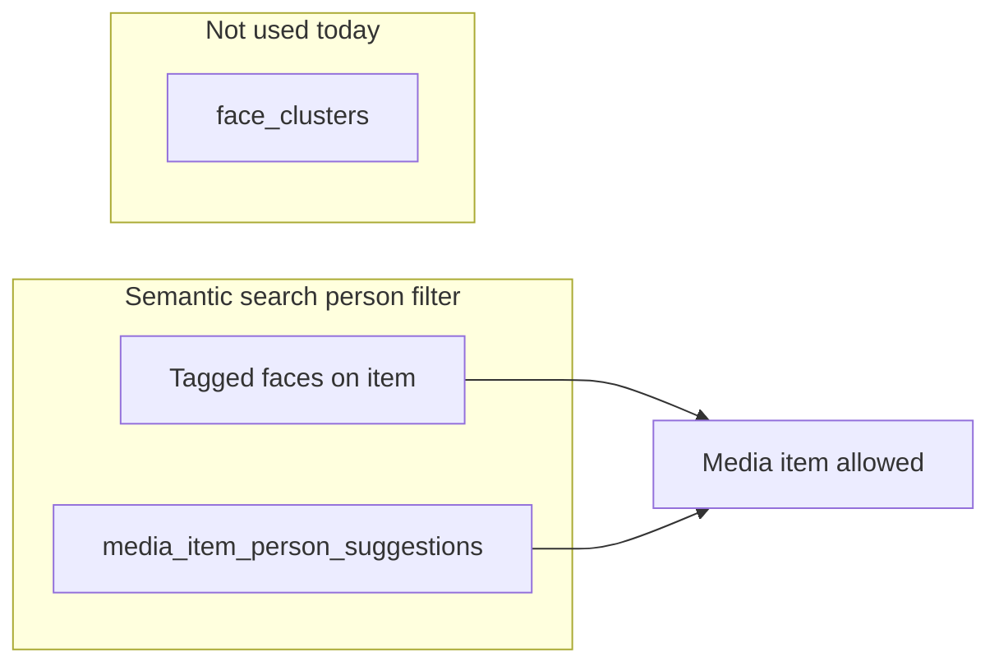

# People + Untagged faces UX improvements

## Understanding check (corrections)

- **Untagged cluster with a selected person:** Yes — you effectively have **cluster size** (`face_clusters.member_count`, unsupervised grouping) vs **subset matching the person centroid** (`getClusterPersonCentroidMatchStatsBatch` → `matchingCount`). Your intuition that a **richer centroid** (more diverse confirmed faces) can **increase** the fraction of a cluster that matches is **reasonable**; it is not a strict guarantee for every library.
- **AI / semantic search with person tags:** Today it is **not** “clusters + centroid live query.” It is:
  - **Confirmed:** media items with a **tagged** face for that person (`media_face_instances.tag_id`).
  - **Unconfirmed (optional):** media items with a row in `**media_item_person_suggestions`** (filled by `**refreshSuggestionsForTag`**, centroid-based, best face per media item), when `includeUnconfirmedFaces` is true — see `[apps/desktop-media/electron/db/semantic-search.ts](apps/desktop-media/electron/db/semantic-search.ts)` (person filter block ~~188–223) and `[apps/desktop-media/electron/ipc/semantic-search-handlers.ts](apps/desktop-media/electron/ipc/semantic-search-handlers.ts)` (~~264–283). `**face_clusters` are not used** in that path. Expanding search using **high-overlap clusters** is a valid **future** product idea, not current behavior.

---

## 1. People tab — live “Similar faces” + pagination

**Goal:** Stop relying on **stale** `person_centroids.similar_untagged_face_count` for what the user sees; align displayed number with `**findMatchesForPerson` / Tagged faces** (same threshold as settings).

**Backend**

- Add a **batch IPC** (e.g. `getSimilarUntaggedFaceCountsForTags`) in main: input `{ tagIds: string[], threshold?: number }`, output `Record<string, number>`. Implement by calling existing `[countSimilarUntaggedFacesForPerson](apps/desktop-media/electron/db/face-embeddings.ts)` (or `findMatchesForPerson` + `length`) per tag for the requested IDs only. Wire through `[ipc.ts](apps/desktop-media/src/shared/ipc.ts)`, `[face-tags-handlers.ts](apps/desktop-media/electron/ipc/face-tags-handlers.ts)` (or a small dedicated handler file), and `[preload.ts](apps/desktop-media/electron/preload.ts)`.

**Frontend** — `[DesktopPeopleTagsListTab.tsx](apps/desktop-media/src/renderer/components/DesktopPeopleTagsListTab.tsx)`

- Keep loading person rows via `listPersonTagsWithFaceCounts` for **name / tagged count / groups** (or split later if desired).
- **Pagination:** `PAGE_SIZE = 10`, local state `peoplePage`, slice `visibleRows` from sorted `rows`.
- After `rows` (and `peoplePage`) are set, call `**getSimilarUntaggedFaceCountsForTags`** for **only** `visibleRows.map(r => r.id)` with threshold from `**getSettings().faceDetection.faceRecognitionSimilarityThreshold`** (same source as Tagged tab).
- **Loading UX:** While counts are in flight, show a **spinner** in the **“Similar faces” column header** and/or per-cell placeholder (`—` + small spinner). Avoid blocking the whole table on counts if base list is already loaded.
- **Display:** Render similar count from the **live map**; ignore `row.similarFaceCount` for UI (or keep as optional fallback only if IPC fails).

**Documentation (for you / code comment)**

- **What updates `similar_untagged_face_count` today:** end of `[refreshSuggestionsForTag](apps/desktop-media/electron/db/person-suggestions.ts)` (writes DB after `findMatchesForPerson`).
- **What triggers `refreshSuggestionsForTag`:** e.g. `[finalizePersonTagAssignments](apps/desktop-media/electron/ipc/face-tags-handlers.ts)` when `taggedCount < 20`, `assignClusterToPerson` (`[face-embedding-handlers.ts](apps/desktop-media/electron/ipc/face-embedding-handlers.ts)` ~327), `clearPersonTagFromFace`, IPC `refreshPersonSuggestionsForTag`, full `refreshPersonSuggestions`, etc.
- **Where stored value is read:** effectively only `[listPersonTagsWithFaceCounts](apps/desktop-media/electron/db/face-tags.ts)` → People grid today (`[people-directory-row.tsx](apps/desktop-media/src/renderer/components/people-directory-row.tsx)`). Semantic search uses `**media_item_person_suggestions`**, not this column.

**Tests**

- Unit test the batch mapper (mock DB / mock `countSimilarUntaggedFacesForPerson`) or one integration-style test with existing Vitest patterns under `apps/desktop-media/electron/db/`.

---

## 1.2 People tab — cosmetics

- `[people-directory-row.tsx](apps/desktop-media/src/renderer/components/people-directory-row.tsx)`: wrap row content in `group` / `group/row`; **Edit** (pencil) and **Add group** (`PeopleDirectoryGroupCell` + button): `**opacity-0 group-hover:opacity-100`** (with `focus-within` so keyboard users still see controls when focusing inputs). Add `**rounded-md` or `rounded-full`** on icon buttons per design consistency.
- `[people-directory-group-cell.tsx](apps/desktop-media/src/renderer/components/people-directory-group-cell.tsx)`: fix chip remove control so the **X** is visible — e.g. explicit `**text-foreground`**, slightly larger icon, or `**strokeWidth`** on lucide `X`; ensure contrast on `bg-muted/40`.

---

## 2. Untagged faces tab — copy, filters, cosmetics

**File:** `[DesktopFaceClusterGrid.tsx](apps/desktop-media/src/renderer/components/DesktopFaceClusterGrid.tsx)`

**Collapsed row title (when person selected)**

- Replace the long paragraph with a single line, e.g. `**{memberCount} faces. {matchingCount} match {personLabel}`** (use existing `clusterPersonMatchStats` + `personTags` / suggestion label). Drop the extra “library-wide” sentence from this line (optional one short tooltip if you still want education).

**Filters (only if `effectiveTagId` is set — person assigned / suggested selection used for stats)**

- **Show:** segmented control **All | Matching | Other similar** (define precisely in UI copy):
  - **Matching:** `similarity >= matchThreshold` (use `clusterSimilarities` + store threshold; align with centroid rule).
  - **Other similar:** in-cluster faces on the **current loaded member page** that are **not** matching (`similarity < threshold` or missing score after load — document that “no score yet” behaves like **All** only until similarities load, or bucket as Other; pick one and keep consistent).
  - **All:** no filter.
- Apply filter when building `**rowFaceIds`** / grid rows inside the expanded section (filter **within the current 25-face page** first; if you need cluster-wide filter, that implies loading all member IDs — **out of scope** unless you explicitly want an extra IPC).

**Cosmetics**

- When `**selectedTargetTagId`** is non-empty (user chose assignee from dropdown), **hide** **“Name this person”** and **“Use: …”** for that cluster (keep assign dropdown / assign actions as today).

---

## 3. Tagged faces tab — no code change now; future reusability

- Keep `[DesktopPeopleWorkspace.tsx](apps/desktop-media/src/renderer/components/DesktopPeopleWorkspace.tsx)` / `[PeopleFaceWorkspace](packages/media-viewer/src/people-face-workspace.tsx)` ready for a second section or tabbed sub-mode later.
- **Future UX options** (pick when you implement):
  - **“Cluster-assisted suggestions”** — IPC returns union of `findPersonMatches` + faces from clusters where `matchingCount / memberCount` exceeds a threshold (with explicit user toggle).
  - **“Same group as confirmed”** — expand to other untagged faces in clusters that already contain **confirmed** tags for that person (different signal from pure centroid).
  - Always label results **Centroid match** vs **Cluster expansion** so numbers stay explainable.

---

## Risk / performance note

- Live counts for **10 tags** = up to **10** full `findMatchesForPerson(..., limit: 0)` runs per People page. Acceptable for many libraries; if slow, next step is a **single SQL** or **shared scan** optimization (out of scope unless profiling shows pain).

