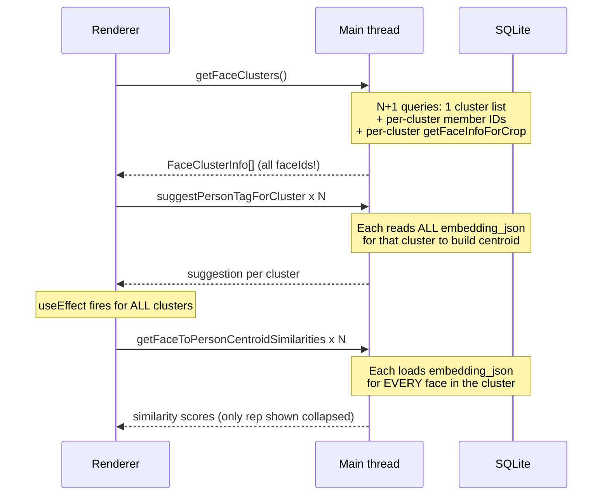

# People / Untagged faces -- performance and responsiveness (revised)

## Root cause analysis

### 1. "Loading" the Untagged faces tab

Clusters **are** stored in the DB (`face_clusters` + `media_face_instances.cluster_id`), but the load path chains four heavyweight operations sequentially:




**Bottleneck breakdown (estimated for 20K faces, ~10 clusters):**

- `getExistingClusters`: N+1 member queries + N individual `getFaceInfoForCrop` lookups. Moderate cost.
- `suggestPersonTagForCluster` x N: Each reads **all** `embedding_json` rows for the cluster, parses JSON, computes centroid. For a 5K-face cluster: ~5K rows x ~2KB JSON = ~10MB parsed per cluster. **Major cost.**
- Similarity `useEffect` (line 125-166 of [DesktopFaceClusterGrid.tsx](apps/desktop-media/src/renderer/components/DesktopFaceClusterGrid.tsx)): calls `getFaceToPersonCentroidSimilarities` for **every** cluster with **all** face IDs. Loads embedding_json + computes cosine for each. For 5K-face cluster: another ~10MB + 5K cosine ops -- **yet the collapsed UI only shows the representative's score**. **Biggest hidden cost; entirely deferrable.**

### 2. "Find groups" (5-10+ minutes)

`[clusterUntaggedFaces](apps/desktop-media/electron/face-clustering.ts)` runs `runAgglomerativeClustering` -- an O(N^2) pairwise cosine loop (line 353-360). At 20K faces: ~200M comparisons x 512-dim vectors = ~300 billion FLOPs. On a single JS thread this takes 2-5+ minutes of pure CPU. It runs synchronously inside `ipcMain.handle`, monopolizing the main thread.

### 3. Tab switching blocked during load/clustering

All three tabs share the same Electron main thread for IPC. When main is busy with synchronous DB scans or CPU clustering, `ipcMain.handle` calls from "People" or "Tagged faces" queue behind and appear hung.

---

## Plan

### Phase A -- Quick wins for load performance (no algorithm change)

**A1. Slim the cluster list API** ([face-clustering.ts](apps/desktop-media/electron/face-clustering.ts), [ipc.ts](apps/desktop-media/src/shared/ipc.ts))

- `getExistingClusters` should return **summary-only** data: `clusterId`, `representativeFace`, `memberCount`. **Omit `faceIds` array.**
- Batch the representative face lookups: replace N individual `getFaceInfoForCrop` calls with a single JOIN in the clusters query:

```sql
SELECT fc.id, fc.representative_face_id, fc.member_count,
       fi.bbox_x, fi.bbox_y, fi.bbox_width, fi.bbox_height,
       mi.source_path, ...image_width/height...
FROM face_clusters fc
LEFT JOIN media_face_instances fi ON fi.id = fc.representative_face_id
LEFT JOIN media_items mi ON mi.id = fi.media_item_id
WHERE fc.library_id = ? AND fc.merged_into_tag_id IS NULL
ORDER BY fc.member_count DESC
```

- Add a new IPC `listClusterMembers(clusterId, { offset, limit })` returning paginated face IDs + face info. Cap at ~100-200 per page.
- Update `FaceClusterInfo` in [ipc.ts](apps/desktop-media/src/shared/ipc.ts): make `faceIds` optional (or remove); UI uses `memberCount` for collapsed view.

**A2. Store cluster centroid at persist time** ([face-clustering.ts](apps/desktop-media/electron/face-clustering.ts), [client.ts](apps/desktop-media/electron/db/client.ts))

- Add `centroid_json TEXT` column to `face_clusters` table (migration).
- In `persistClusters`, compute and store the centroid for each cluster -- the vectors are already in memory so this is nearly free.
- In `suggestPersonTagForCluster`, read `centroid_json` directly from `face_clusters` instead of loading all member embeddings. One tiny SELECT replaces thousands of JSON parses.

**A3. Batch the suggestion calls** ([face-embedding-handlers.ts](apps/desktop-media/electron/ipc/face-embedding-handlers.ts), [DesktopFaceClusterGrid.tsx](apps/desktop-media/src/renderer/components/DesktopFaceClusterGrid.tsx))

- Add `suggestPersonTagsForClusters(clusterIds[])` batch IPC. The handler reads person centroids once and compares each cluster's stored centroid in a single pass.
- Replace the N parallel `suggestPersonTagForCluster` calls in `loadClusters` and `handleRunClustering` with a single batch call.

**A4. Defer per-face similarity to expand time** ([DesktopFaceClusterGrid.tsx](apps/desktop-media/src/renderer/components/DesktopFaceClusterGrid.tsx))

- The `useEffect` at line 125 currently calls `getFaceToPersonCentroidSimilarities` for **all** clusters with **all** face IDs. This is the single most expensive operation in the load path for large clusters -- and the collapsed UI only displays the representative face's similarity.
- Change: when collapsed, show only the representative's similarity score (can be derived from the suggestion's `score` field or a single-face similarity lookup). Only when the user **expands** a cluster, load per-face similarities for the visible page of faces.
- This alone eliminates the biggest cost (tens of MB of embedding reads + thousands of cosine computations that produce invisible data).

### Phase B -- "Find groups" responsiveness: worker, progress, cancel

**B1. Off-main-thread clustering** ([face-clustering.ts](apps/desktop-media/electron/face-clustering.ts), new worker file)

- **Preferred: `worker_threads`**. Main thread reads embeddings from DB (fast synchronous query), transfers the float arrays to the worker via structured clone or `SharedArrayBuffer`. Worker does the O(N^2) CPU work and posts back cluster assignments. Main thread persists results.
  - This keeps the DB singleton on the main thread (no need for a second connection) while unblocking IPC during the CPU phase.
- **Fallback**: if worker complexity is too high initially, chunk the inner loop with `setImmediate` yields every ~500 iterations so the event loop can process other IPC. Partial fix -- the main thread is still loaded but no longer completely blocked.
- Mirror the existing `[runningJobs` / cancel pattern](apps/desktop-media/electron/ipc/face-embedding-handlers.ts): `runFaceClustering` returns `{ jobId }` immediately. A `cancelled` flag (checked in the worker's inner loop or in the chunked loop) enables abort.

**B2. Progress card in Background operations** ([DesktopProgressDock.tsx](apps/desktop-media/src/renderer/components/DesktopProgressDock.tsx), [ipc-progress-binders.ts](apps/desktop-media/src/renderer/hooks/ipc-progress-binders.ts), `@emk/media-store`)

- New IPC channel `faceClusteringProgress` with event types:
  - `job-started { jobId, totalFaces }`
  - `progress { jobId, phase: "loading-embeddings" | "clustering" | "persisting", processed, total }`
  - `job-completed { jobId, clusterCount, totalFaces }` / `job-cancelled`
- New `FaceClusteringSlice` in media-store (parallel to existing `FaceDetectionSlice`).
- New card in `DesktopProgressDock` following [BOTTOM-APP-PANEL-UX.md](docs/PRODUCT-FEATURES/media-library/BOTTOM-APP-PANEL-UX.md) rules: `X` = cancel+hide while running, hide-only after completion.
- `DesktopFaceClusterGrid`'s "Find groups" button triggers the job and subscribes via the progress channel. On `job-completed`, auto-refresh cluster list.

**B3. Neighbor-graph clustering (strongly recommended for 20K+)**  ([face-clustering.ts](apps/desktop-media/electron/face-clustering.ts))

At 20K faces, even on a worker, O(N^2) still means 2-5 minutes of wall time. An approximate method makes this seconds:

- **When sqlite-vec is active** (env `EMK_DESKTOP_VECTOR_BACKEND=sqlite-vec`): for each face, use `vec_distance_cosine` + `LIMIT K` to find the K nearest neighbors above threshold. Build an edge list. Run union-find (same as current). Complexity: O(N x K) in SQL, K ~ 50-100. For 20K faces: ~1-2M comparisons vs 200M.
- **When sqlite-vec is not active**: use a JS-side VP-tree (vantage-point tree) for approximate nearest neighbor search. Build the tree from embedding vectors, then for each face query neighbors within the cosine threshold. Complexity: O(N x log(N) x K).
- Connected-component step (union-find) is identical to today and O(N) in practice.
- Both approaches preserve single-linkage semantics (same clusters as exact pairwise when K is large enough); differences only appear for barely-threshold transitive chains, which is acceptable.

---

## Priority order for implementation

1. **A4** (defer similarity effect) + **A2** (stored centroid) -- highest impact, moderate effort
2. **A1** (slim API) + **A3** (batch suggestions) -- high impact, moderate effort
3. **B1** (worker) + **B2** (progress card) -- unlocks cancel/progress UX, fixes tab blocking
4. **B3** (neighbor-graph) -- turns minutes into seconds

Phases A1-A4 together should reduce the "Loading" time from minutes to seconds even without algorithm changes. Phase B makes "Find groups" non-blocking and cancellable. Phase B3 makes it genuinely fast.

---

## Key files

- **DB / clustering core**: [face-clustering.ts](apps/desktop-media/electron/face-clustering.ts), [client.ts](apps/desktop-media/electron/db/client.ts) (migration), [face-embeddings.ts](apps/desktop-media/electron/db/face-embeddings.ts) (getFaceToPersonCentroidSimilarities)
- **IPC layer**: [face-embedding-handlers.ts](apps/desktop-media/electron/ipc/face-embedding-handlers.ts), [preload.ts](apps/desktop-media/electron/preload.ts), [ipc.ts](apps/desktop-media/src/shared/ipc.ts)
- **UI / renderer**: [DesktopFaceClusterGrid.tsx](apps/desktop-media/src/renderer/components/DesktopFaceClusterGrid.tsx), [DesktopProgressDock.tsx](apps/desktop-media/src/renderer/components/DesktopProgressDock.tsx), [ipc-progress-binders.ts](apps/desktop-media/src/renderer/hooks/ipc-progress-binders.ts)
- **Store**: `@emk/media-store` (new FaceClusteringSlice), [desktop-store.tsx](apps/desktop-media/src/renderer/stores/desktop-store.tsx)
- **Worker (new)**: e.g. `apps/desktop-media/electron/face-clustering-worker.ts`

---

## Success criteria

- Initial open of Untagged faces tab completes in seconds (not minutes) for 20K+ faces.
- "Find groups" shows a progress bar with percent/phase and can be cancelled mid-run.
- Switching to People or Tagged faces tabs during clustering or load remains responsive.
- DB stays consistent if clustering is cancelled (transaction-based persist, no partial state).

