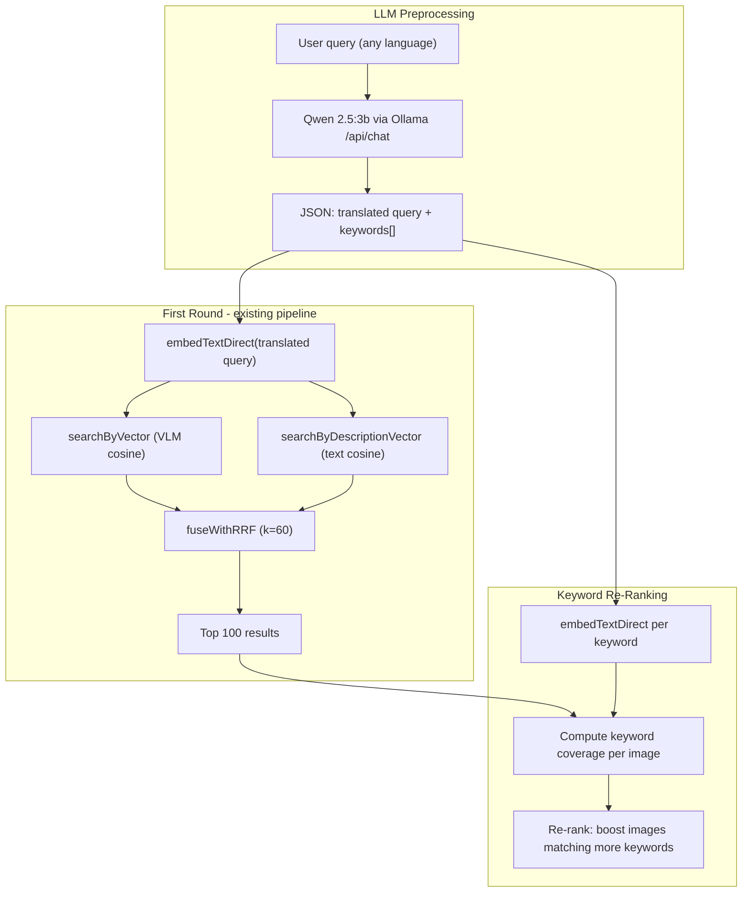

# Phase 3: Advanced Search -- LLM Query Understanding and Keyword Re-Ranking

## Current State (post Phase 2)

- RRF fuses **two signals only**: VLM (image embedding) cosine + AI description (text embedding) cosine
- BM25/FTS5 keyword search runs but is **excluded from RRF** (kept for diagnostics/logging)
- Ollama calls use raw `fetch` to `http://127.0.0.1:11434/api/chat` (no SDK)
- Default vision model: `qwen3.5:9b`; no text-only LLM currently used in the search pipeline
- Search handles 100 candidates per signal, fuses via `fuseWithRRF(lists, k=60, limit)`

## The Problem

Compositional queries like "small boy in a paper castle" return correct images mixed with irrelevant ones (e.g., just "castle" or just "boy" ranked above the image showing both). Both VLM and description embeddings encode holistically, so partial-match images can score similarly to full-match images.

## Alternative Approaches Considered

### Option A: Simple tokenization + description text matching (no LLM)

Split query into words, remove stopwords, check presence of each word (stemmed) in AI description text of top-100 results. Compute coverage = matched_words / total_words.

- **Pro:** Zero latency overhead, no Ollama dependency for search
- **Con:** Cannot identify compound concepts ("paper castle" is one concept, not "paper" + "castle"); no translation; exact/stemmed match only (misses synonyms); stopword removal is fragile

### Option B: LLM keyword decomposition + embedding re-rank (recommended, user's approach)

Use Qwen 2.5:3b to extract 1-5 key concepts (words or short phrases), embed each concept, compute cosine similarity against description embeddings of top-100 results, re-rank by keyword coverage.

- **Pro:** Handles compound concepts correctly ("paper castle" stays together); includes translation; semantic matching via embeddings (catches synonyms); graceful degradation if LLM unavailable
- **Con:** Adds ~0.3-1.5s latency for the LLM call; requires Ollama running

### Option C: Multi-query expansion

LLM generates 3-5 full rephrased search queries, each run as a separate search, merge all with RRF.

- **Pro:** More diverse retrieval
- **Con:** Multiplies search latency by 3-5x (~5-7s total); harder to debug; doesn't directly solve the "partial match" problem

**Recommendation:** Option B. The LLM call is a single round-trip (~0.3-1.5s for 3b model), keyword embedding is ~5ms each (ONNX), and re-ranking 100 images x 5 keywords = 500 cosine ops is sub-millisecond. Total overhead is dominated by the LLM call, which is acceptable behind an opt-in "Advanced search" toggle.

---

## Architecture




### When "Advanced search" is OFF (default)

The pipeline works exactly as today: embed query with `embedTextDirect`, run VLM + description vector searches, fuse with RRF, return. No LLM call, no keyword re-ranking, no latency change.

### When "Advanced search" is ON

1. **LLM preprocessing** (single Ollama call, ~0.3-1.5s):
  - Detect language, translate to English if needed
  - Extract 1-5 key search concepts (words or short phrases)
  - Return structured JSON
2. **First round search** uses the translated English query (if translation happened) for embedding; otherwise original query
3. **Keyword re-ranking** of top-100 results:
  - Embed each extracted keyword with `embedTextDirect`
  - For each top-100 result, look up its cached description vector
  - Compute cosine similarity of each keyword embedding vs each image's description embedding
  - A keyword "hits" if cosine > threshold (configurable, start with ~0.55)
  - Coverage score = sum of hit cosine similarities / number of keywords
  - Re-rank: multiply original RRF score by `(1 + alpha * coverage_score)` where `alpha` controls boost strength (start with 2.0)
  - Images without description embeddings keep their original RRF score (no penalty)

---

## LLM Prompt Design

Single `/api/chat` call with `format: "json"`:

```
Analyze this image search query. If it is not in English, translate it. Extract 1-5 key visual concepts that should ALL be present in a matching image.

Query: "{user_query}"

Return JSON:
{
  "original_language": "en" or ISO 639-1 code,
  "translated": true/false,
  "english_query": "the query in English (same as input if already English)",
  "keywords": ["keyword1", "keyword or phrase 2", ...]
}

Rules:
- keywords are the most important visual concepts for finding the right image
- keep compound concepts together (e.g. "paper castle" not "paper","castle")
- 1-5 keywords, ordered by importance
- if the query is already in English and clear, english_query = original query
```

**Model selection:** Try `qwen2.5:3b` first. If unavailable (Ollama returns 404 or model not found), fall back to `qwen3.5:9b`. Cache model availability per session.

---

## Files to Modify/Create

### New file: [query-understanding.ts](apps/desktop-media/electron/query-understanding.ts)

Core module for LLM-based query preprocessing.

- `analyzeSearchQuery(query: string, signal?: AbortSignal): Promise<QueryAnalysis>`
  - Calls Ollama `/api/chat` with Qwen 2.5:3b (fallback Qwen 3.5:9b)
  - Returns `{ originalLanguage, translated, englishQuery, keywords }` 
  - On failure (Ollama down, timeout, bad JSON): returns `null` (caller falls back to raw query)
  - Timeout: 5 seconds (generous for a 3b model on a short prompt)
- `interface QueryAnalysis { originalLanguage: string; translated: boolean; englishQuery: string; keywords: string[] }`
- Uses the same `getOllamaBaseUrl()` pattern from [photo-analysis.ts](apps/desktop-media/electron/photo-analysis.ts)
- Model name constant `QUERY_UNDERSTANDING_MODEL = "qwen2.5:3b"` with fallback `QUERY_UNDERSTANDING_FALLBACK_MODEL = "qwen3.5:9b"`
- Internal model availability cache (reset each app launch)

### New file: [keyword-reranker.ts](apps/desktop-media/electron/db/keyword-reranker.ts)

Re-ranking logic using keyword decomposition.

- `reRankByKeywordCoverage(results: SemanticSearchRow[], keywords: string[], descriptionVectorCache: Map, options?: { threshold?, alpha? }): Promise<SemanticSearchRow[]>`
  - Embeds each keyword via `embedTextDirect`
  - For each result, looks up description vector from cache
  - Computes per-keyword cosine similarity
  - Calculates coverage score
  - Returns results re-sorted by boosted score
- Keep this module separate from `search-fusion.ts` for clarity

### Modify: [semantic-search-handlers.ts](apps/desktop-media/electron/ipc/semantic-search-handlers.ts)

In the `semanticSearchPhotos` handler:

- Accept new `advancedSearch?: boolean` in request
- When `advancedSearch === true`:
  1. Call `analyzeSearchQuery(query)` before embedding
  2. If analysis succeeds: use `analysis.englishQuery` for `embedTextDirect` instead of raw query
  3. After RRF fusion produces top-100, call `reRankByKeywordCoverage` with `analysis.keywords`
  4. Log analysis results (language, translation, keywords) alongside existing search diagnostics
- When `advancedSearch === false` or analysis fails: existing pipeline unchanged
- Add `queryAnalysis` metadata to the response (translation info, keywords used)

### Modify: [ipc.ts](apps/desktop-media/src/shared/ipc.ts)

Update `semanticSearchPhotos` request type:

```typescript
semanticSearchPhotos: (request: {
  query: string;
  limit?: number;
  folderPath?: string;
  recursive?: boolean;
  personTagIds?: string[];
  includeUnconfirmedFaces?: boolean;
  advancedSearch?: boolean;  // NEW
}) => Promise<
  Array<{
    // ...existing fields...
    queryAnalysis?: {              // NEW
      originalLanguage: string;
      translated: boolean;
      englishQuery: string;
      keywords: string[];
    };
  }>
>;
```

Note: `queryAnalysis` is the same for all results in a single search -- it's a per-search metadata, not per-result. We can either return it on every result row (simplest) or add a wrapper. Simplest: return on the first result or as a separate field. Since the current return type is a flat array, the cleanest backward-compatible approach is to include it on every row (duplicated but harmless) or add a response wrapper.

**Recommendation:** Add a response wrapper type:

```typescript
semanticSearchPhotos: (request: { ... }) => Promise<{
  results: Array<{ ...existing fields... }>;
  queryAnalysis?: QueryAnalysisResult;
}>;
```

This changes the return shape, requiring updates in App.tsx where results are consumed. This is a clean approach since it avoids duplicating metadata across 100 rows.

### Modify: [SemanticSearchPanel.tsx](apps/desktop-media/src/renderer/components/SemanticSearchPanel.tsx)

Add "Advanced search" checkbox after the search button row, before the scope fieldset. Always visible (not conditional).

```tsx
<label className="semantic-advanced-toggle">
  <input
    type="checkbox"
    checked={semanticAdvancedSearch}
    onChange={(e) =>
      store.getState().setSemanticAdvancedSearch(e.target.checked)
    }
  />
  <span>Advanced search</span>
</label>
```

When advanced search is on and a translation happened, display a brief note in the status area: e.g., "Translated from ru: ..." 

### Modify: [semantic-search.ts (store slice)](packages/media-store/src/slices/semantic-search.ts)

Add to `SemanticSearchSlice`:

- `semanticAdvancedSearch: boolean` (default `false`)
- `setSemanticAdvancedSearch: (on: boolean) => void`

### Modify: [App.tsx](apps/desktop-media/src/renderer/App.tsx)

In `handleSemanticSearch`:

- Read `semanticAdvancedSearch` from store
- Pass `advancedSearch: currentState.semanticAdvancedSearch` to the IPC call
- Handle the updated response shape (wrapper with `results` + `queryAnalysis`)
- Optionally display translation/keyword info in status

### Modify: [semantic-search.ts (DB)](apps/desktop-media/electron/db/semantic-search.ts)

Expose the `descriptionVectorCache` (or a getter) so the keyword re-ranker can access cached vectors without re-fetching. Currently the cache is module-private. Options:

- Export a `getDescriptionVector(mediaItemId: string): Float32Array | undefined` function
- Or pass the cache to the re-ranker from the handler (since `searchByDescriptionVector` already populated it)

Cleanest: export a `getDescriptionVectorsForIds(ids: string[]): Map<string, Float32Array>` that reads from the existing cache.

---

## Re-Ranking Algorithm Detail

```typescript
async function reRankByKeywordCoverage(
  results: FusedResultWithMeta[],
  keywords: string[],
  getDescVector: (id: string) => Float32Array | undefined,
  options: { threshold?: number; alpha?: number } = {},
): Promise<FusedResultWithMeta[]> {
  const { threshold = 0.55, alpha = 2.0 } = options;
  
  const keywordVectors = await Promise.all(
    keywords.map((kw) => embedTextDirect(kw))
  );
  
  return results
    .map((r) => {
      const descVec = getDescVector(r.mediaItemId);
      if (!descVec) return { ...r }; // no description embedding, keep original score
      
      let coverageSum = 0;
      let hits = 0;
      for (const kwVec of keywordVectors) {
        const sim = cosineSimilarity(kwVec, descVec);
        if (sim >= threshold) {
          coverageSum += sim;
          hits++;
        }
      }
      const coverage = keywords.length > 0 ? coverageSum / keywords.length : 0;
      const boostedScore = r.rrfScore * (1 + alpha * coverage);
      return { ...r, score: boostedScore, keywordCoverage: coverage, keywordHits: hits };
    })
    .sort((a, b) => b.score - a.score);
}
```

**Why multiplicative boost:** An image that ranked high in RRF (appears in both VLM and description lists) AND matches all keywords should be ranked highest. A multiplicative boost `(1 + alpha * coverage)` achieves this. Images with zero keyword matches keep their original score (`coverage = 0` -> multiplier = 1.0).

**Tuning parameters** (adjustable later):

- `threshold = 0.55`: minimum cosine similarity for a keyword to "match" an image's description embedding. Lower = more permissive, higher = stricter.
- `alpha = 2.0`: strength of the keyword coverage boost. Higher = more aggressive re-ranking by keyword match.

---

## Logging and Diagnostics

Extend the existing `logSemanticSearchTopScoreBreakdown` pattern:

- Log the LLM analysis result: `[semantic-search][main] query analysis: { language: "ru", translated: true, english: "...", keywords: [...] }`
- Log per-result keyword hits in the score breakdown: add a "Keywords" column showing `hits/total` (e.g., `3/4`)
- Log re-ranking effect: how many positions each result moved after keyword re-ranking
- Log LLM call duration: `[semantic-search][main][+Xms] query analysis done (model: qwen2.5:3b)`

---

## Error Handling and Graceful Degradation

- **Ollama not running:** `analyzeSearchQuery` catches connection errors, returns `null`. Search proceeds with raw query (standard pipeline). No error shown to user.
- **Model not available:** If `qwen2.5:3b` returns model-not-found, try `qwen3.5:9b`. If both fail, return `null`. Cache which model works per session.
- **LLM returns bad JSON:** Parse with try/catch. If unparseable, return `null`.
- **LLM timeout (>5s):** AbortController with 5s timeout. Return `null` on timeout.
- **Empty keywords array:** Skip re-ranking, return results as-is.
- **No description embeddings for any results:** Re-ranking has no effect (all images keep original scores). This is safe.

---

## Phase 3 Scope Exclusions (deferred)

Per user direction, the following are **not** in this phase:

- Structured filter extraction (location, people count, age range, category)
- Separation of semantic intent from filterable attributes
- Person name detection
- BM25/FTS5 as a filtering or ranking signal (may be added later)

