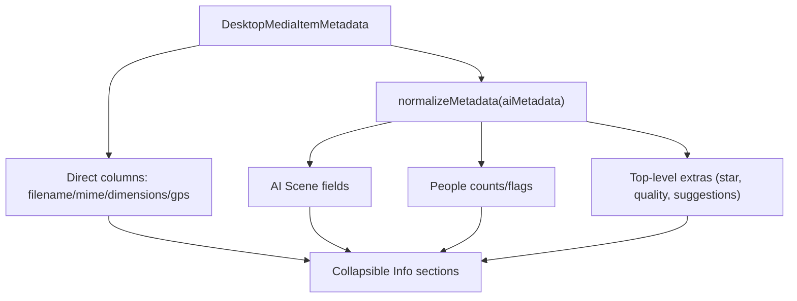

# Reorganize Desktop Photo Info Tab

## Confirmed constraints and assumptions

- `media_items` already tracks both independent markers: `photo_analysis_processed_at` and `face_detection_processed_at` in [apps/desktop-media/electron/db/client.ts](apps/desktop-media/electron/db/client.ts).
- "Do not override existing" (`mode: "missing"`) is already handled independently for AI analysis vs face detection in [apps/desktop-media/electron/main.ts](apps/desktop-media/electron/main.ts) and [apps/desktop-media/electron/db/media-analysis.ts](apps/desktop-media/electron/db/media-analysis.ts).
- Recent AI-photo-analysis additions (e.g. `photo_star_rating_1_5`, `is_low_quality`, `quality_issues`, `edit_suggestions`) are currently surfaced via `getAdditionalTopLevelFields(...)` in [apps/desktop-media/src/renderer/App.tsx](apps/desktop-media/src/renderer/App.tsx); plan preserves this behavior.

## Implementation approach

- Keep tab structure unchanged (`Info`, `Face tags`, `Metadata`) in [apps/desktop-media/src/renderer/App.tsx](apps/desktop-media/src/renderer/App.tsx).
- Replace flat `infoFields` rendering with grouped, collapsible sections in the Info tab content.
- Introduce a small desktop-local reusable section component (native `
/
`) and map data into 4 sections:
  - Image File Data (non-AI)
  - Image Capture Data (EXIF, non-AI)
  - AI Image Analysis
  - AI Quality & Improvement Suggestions
- Keep existing metadata normalization/accessors (`normalizeMetadata`, `getAdditionalTopLevelFields`) to avoid regressions with v2 + extra keys.

## File-level plan

- Update [apps/desktop-media/src/renderer/App.tsx](apps/desktop-media/src/renderer/App.tsx)
  - Refactor current `infoFields` array into sectioned arrays.
  - Split current data extraction into clear groups (file/exif/ai/quality).
  - Render grouped sections instead of a single `PhotoInfoTabContent` field list.
- Add `apps/desktop-media/src/renderer/components/DesktopInfoSection.tsx`
  - Generic collapsible section wrapper with title, optional badge count, and children.
  - Desktop styling-compatible class names only.
- Add/adjust styles in [apps/desktop-media/src/renderer/styles.css](apps/desktop-media/src/renderer/styles.css)
  - Spacing/typography for section headers and row layout.
  - Expanded/collapsed affordance consistent with existing desktop UI.

## UX behavior defaults

- Expand by default: **Image File Data**.
- Auto-expand **AI Quality & Improvement Suggestions** only when low quality/issues/suggestions exist.
- Collapse other sections by default; hide empty rows; show concise empty text per section when section has no values.
- Preserve the Metadata tab raw JSON as the full diagnostic source of truth.

## Data-flow sketch

## Verification plan

- Manual desktop QA in PhotoViewer:
  - Item with only file metadata (no AI)
  - Item with AI scene data only
  - Item with quality issues/suggestions
  - Item with missing EXIF/capture data
- Ensure previous key fields are still visible in one of the new sections.
- Ensure no changes to AI/face processing markers or `missing` mode logic paths.

