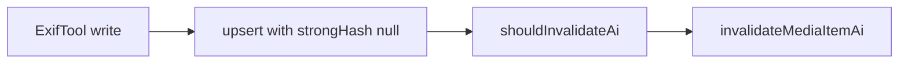

# Avoid AI invalidation when embedded star rating updates mtime

## Root cause

1. With `**writeEmbeddedMetadataOnUserEdit**`, `[media-item-mutation-handlers.ts](apps/desktop-media/electron/ipc/media-item-mutation-handlers.ts)` calls `[upsertMediaItemFromFilePath](apps/desktop-media/electron/db/media-item-metadata.ts)` after `writeStarRatingToImageFile`, **without** `observedState`.
2. That falls back to `[getObservedStateFromFs](apps/desktop-media/electron/db/media-item-metadata.ts)`, which **always** sets `strongHash: null` (see ~451–466).
3. In `upsertMediaItemFromFilePath`, the **invalidation** snapshot uses `observedState?.strongHash` for `**next.content_hash`** ([~262–284](apps/desktop-media/electron/db/media-item-metadata.ts)), while `**prior.content_hash`** often comes from `media_items` (populated on a real scan via `[getObservedFileStateByPaths](apps/desktop-media/electron/db/file-identity.ts)`).
4. `[shouldInvalidateAiAfterCatalogUpdate](apps/desktop-media/electron/db/media-ai-invalidation-guards.ts)` then treats **prior hash set, next `null`** as **invalidate** (lines 52–57). There is also the **both-null + mtime change** branch (lines 79–82) for items without a stored hash.

So the bug is not primarily “scan timestamp vs file mtime”; it is **post-write upsert using a synthetic observed state that omits `strongHash`**, which breaks the invalidation guard even when geometry is unchanged.

**Do not** call `[observeFiles](apps/desktop-media/electron/db/file-identity.ts)` with only the rated file: its end-of-run `[markFolderFilesDeleted(folderPath, activeSeenPaths)](apps/desktop-media/electron/db/file-identity.ts)` would treat every other path in that folder as missing and corrupt `fs_objects`.

## Recommended fix (better than “pre-scan + bump timestamp”)

### 1. Single-file observed-state refresh (no folder tombstoning)

In `[file-identity.ts](apps/desktop-media/electron/db/file-identity.ts)`, add an async helper, e.g. `**refreshObservedStateForPaths`**, that for each path:

- `stat` the file (same fields as `observeFiles`).
- Compute `**strongHash`** via the same logic as `**maybeComputeStrongHash`** (today internal ~429–438: full-file SHA-256 up to 128MB, else `null`).
- Reuse the **same `fs_objects` upsert/update paths** as the main loop in `observeFiles` (by OS id / by path / insert), so `fs_objects` stays aligned with disk for the next full scan.
- **Do not** call `markFolderFilesDeleted`.
- After updates, if any non-null hashes were written, call `**refreshDuplicateGrouping`** for those hashes (same as `observeFiles` tail) so duplicate grouping stays correct.

Return `Record<string, ObservedFileState>` (or a single state for one path).

### 2. Wire star-rating embed path

In `[media-item-mutation-handlers.ts](apps/desktop-media/electron/ipc/media-item-mutation-handlers.ts)`, after a **successful** `writeStarRatingToImageFile`:

- `await refreshObservedStateForPaths([sourcePath], libraryId)` (or equivalent).
- Pass the resulting `observedState` into `upsertMediaItemFromFilePath({ filePath, libraryId, observedState, overrideStarRating })`.

This makes `**next.content_hash`** reflect the new bytes when hashing succeeds, so **hash changes + unchanged width/height/orientation** correctly yields **no** invalidation (already covered by tests in `[media-ai-invalidation-guards.test.ts](apps/desktop-media/electron/db/media-ai-invalidation-guards.test.ts)`).

### 3. Files over 128MB (hash always `null`)

`maybeComputeStrongHash` returns `null` for large files, so the **both-null + mtime change** path can still invalidate.

Pick one (document the choice):

- **Option A (minimal):** Add an optional, narrowly scoped flag on `upsertMediaItemFromFilePath`, e.g. `**trustedEmbeddedMetadataWrite?: boolean`**, used **only** from this mutation handler. When `true`, **skip** `invalidateMediaItemAiAfterMetadataRefresh` if **width/height/orientation/byte_size** are unchanged vs prior (still run normal catalog/FTS updates). This is a small, explicit escape hatch for “we just wrote XMP/EXIF with ExifTool, geometry unchanged.”
- **Option B:** Accept that very large files may still invalidate until a dedicated policy exists.

Recommendation: **Option A** with a clear comment and a single call site (star rating embed) to avoid broad misuse.

### 4. Documentation

- Short note in `[docs/PRODUCT-FEATURES/media-library/DESKTOP-MEDIA-STAR-RATING.md](docs/PRODUCT-FEATURES/media-library/DESKTOP-MEDIA-STAR-RATING.md)` (or `[FILE-STAR-RATING.md](docs/PRODUCT-FEATURES/media-library/FILE-STAR-RATING.md)`) that embedded writes refresh `fs_objects` + catalog in a way that **does not** clear AI pipelines when decode geometry is unchanged.

### 5. Tests

- **Unit:** Prefer testing `**shouldInvalidateAiAfterCatalogUpdate`** / upsert behavior with **synthetic prior/next** if you add `trustedEmbeddedMetadataWrite`; or extract “build next catalog for invalidation” into a tiny pure helper and test that.
- **Optional integration:** Temp dir + small image + `upsert` with refreshed observed state and assert AI columns / `media_embeddings` unchanged (heavier).

## Out of scope (unless you add title/description embed writes soon)

When title/description get the same ExifTool + upsert pattern, reuse `**refreshObservedStateForPaths`** + the same trusted-write rule for hash-null large files so behavior stays consistent.