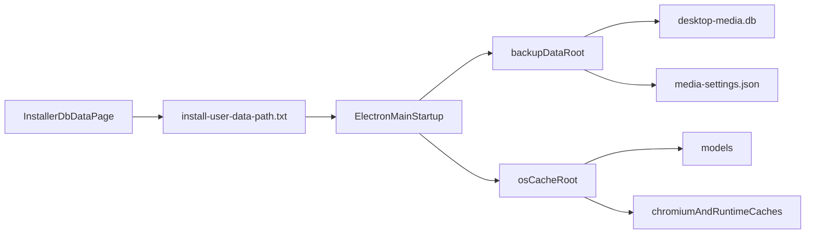

# Desktop-media Data/Cache Separation Plan

## Goals

- Keep **backup-critical user data** together and easy to back up (DB + app config).
- Move **disposable cache/runtime artifacts** to OS cache locations (Windows best practice).
- Keep AI models outside backup data root (redownloadable) and track/show their path separately.
- Replace forced install-time DB folder picker popup with a **wizard page** that shows defaults and allows `Next` without changing anything.

## Current Baseline (from code)

- DB path is fixed to `<userData>/desktop-media.db` in [`apps/desktop-media/electron/db/client.ts`](apps/desktop-media/electron/db/client.ts).
- Settings file is `<userData>/media-settings.json` in [`apps/desktop-media/electron/storage.ts`](apps/desktop-media/electron/storage.ts).
- Models path is `<userData>/models` in [`apps/desktop-media/electron/main.ts`](apps/desktop-media/electron/main.ts).
- Installer stores selected userData path in `%APPDATA%\EMK Desktop Media\install-user-data-path.txt` via [`apps/desktop-media/build-resources/installer-user-data.nsh`](apps/desktop-media/build-resources/installer-user-data.nsh), consumed by [`apps/desktop-media/electron/install-config.ts`](apps/desktop-media/electron/install-config.ts).
- `Database location` is shown via IPC (`getDatabaseLocation`) implemented in [`apps/desktop-media/electron/ipc/fs-handlers.ts`](apps/desktop-media/electron/ipc/fs-handlers.ts), surfaced in [`apps/desktop-media/src/renderer/components/DesktopSettingsSection.tsx`](apps/desktop-media/src/renderer/components/DesktopSettingsSection.tsx).

## Implementation Plan

### 1) Introduce explicit path model in main process

- Add a small path-resolution module (single source of truth) to compute:
  - `backupDataRoot` (selected userData root)
  - `dbPath` (`<backupDataRoot>/desktop-media.db`)
  - `settingsPath` (`<backupDataRoot>/media-settings.json`)
  - `modelsPath` (outside backupDataRoot, under cache-root app namespace)
  - `cacheRoot` (OS cache path, e.g. `app.getPath("cache")/EMK Desktop Media`)
- Keep env override priority unchanged (`EMK_DESKTOP_USER_DATA_PATH` > installer config > default).

### 2) Route disposable artifacts to cache root

- Keep DB/settings under backupDataRoot.
- Keep models under non-backup path (cache-root app namespace).
- Move Chromium/Electron disposable caches to OS cache path using Electron path overrides early in startup (`app.setPath("cache", ...)`, plus session/cache-related paths where applicable and safe).
- Ensure no backup-critical files are written to cache root.

### 3) Improve installer UX to default + Next/Browse page

- Replace forced `SelectFolderDialog` behavior in `customInstall` with a proper NSIS wizard page in include script:
  - prefilled default DB/data folder
  - editable text field + Browse
  - Next accepts default without extra modal
- Keep `customInstall` for final persistence only (write chosen path to `install-user-data-path.txt`).
- Preserve current app install directory page behavior from NSIS/electron-builder.

### 4) Expand settings visibility section

- Keep section at the bottom as requested.
- Rename title to **Application data files**.
- Extend IPC payload and UI display fields:
  - backup data folder
  - DB file/path
  - models folder
  - cache folder (disposable)
- Keep section read-only in this phase.

### 5) Docs updates (UX + business logic)

- Update/install docs under [`docs/PRODUCT-FEATURES/installer/`](docs/PRODUCT-FEATURES/installer/) to document:
  - installer flow with default + Next/Browse DB folder page
  - what is backup-critical vs disposable cache
  - recommended backup set (DB + settings, optional models)
- Update [`docs/PRODUCT-FEATURES/media-library/APP-SETTINGS-UX.md`](docs/PRODUCT-FEATURES/media-library/APP-SETTINGS-UX.md) section naming/fields accordingly.

### 6) Validation and migration safety

- Validate on Windows installer run:
  - defaults shown, Next works unchanged
  - custom DB folder persists correctly
- Verify runtime writes:
  - DB/settings/models in backup root
  - cache artifacts in cache root
- Verify uninstall behavior remains data-preserving (`deleteAppDataOnUninstall: false`).

