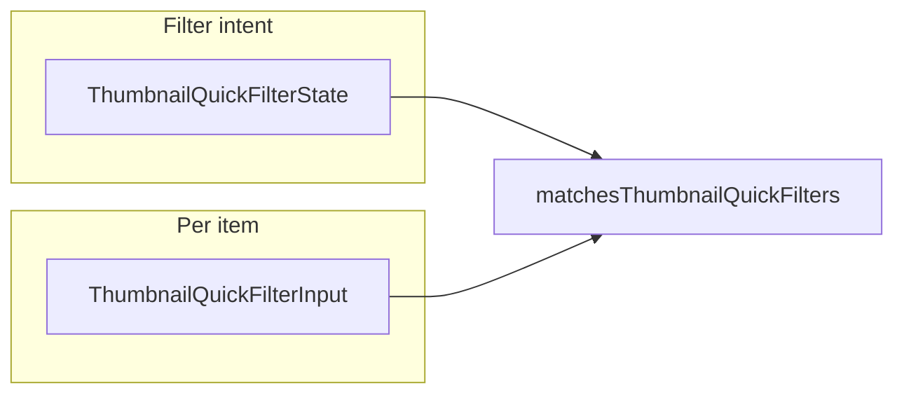

# Quick filters improvements (desktop + shared lib)

_Archived from Cursor plan `desktop_quick_filters_564c7aa2.plan.md`._

## Scope note

Core behavior lives in `[lib/media-filters/thumbnail-quick-filters.ts](lib/media-filters/thumbnail-quick-filters.ts)`, consumed by `[apps/desktop-media/src/renderer/components/QuickFiltersMenu.tsx](apps/desktop-media/src/renderer/components/QuickFiltersMenu.tsx)` and by web `[app/[locale]/media/MediaAlbumItems.tsx](app/[locale]/media/MediaAlbumItems.tsx)` / `[MediaAlbumNameAndControls.tsx](app/[locale]/media/components/album-content/MediaAlbumNameAndControls.tsx)`. Any change to `ThumbnailQuickFilterState` or matchers must keep **both** apps compiling and tests green.

## 1. People — options and order

- **Extend** `ThumbnailPeopleQuickFilter` to support pairs **≥ N** and **= N** for N = 1..5 (replace the old `5_plus` with **≥ 5** / **= 5**; **≥ 5** already matches 6+ people).
- **UI order / labels** (first option still **None** = exactly 0 people, matching current semantics):
`None` → `≥ 1` (default) → `= 1` → `≥ 2` → `= 2` → … through `≥ 5` → `= 5`.
- Update `[THUMBNAIL_PEOPLE_OPTIONS](lib/media-filters/thumbnail-quick-filters.ts)` labels to match your copy (e.g. `= 1` instead of “1 person”).
- Implement `matchesPeopleFilter` branches for every new enum value (`gte_2`, `eq_2`, …).

**Default state:** keep `peopleEnabled: false`, `people: 'gte_1'` (unchanged idea: when the user turns People on, **≥ 1** is preselected).

## 2. Documents — “All” means “any document type”

Today `[matchesDocumentsFilter](lib/media-filters/thumbnail-quick-filters.ts)` returns early when `selected === "all"`, so with Documents enabled, **All** does not restrict to documents (bug).

- When `documentsEnabled && documents === 'all'`, require `getAiCategory(metadata)` to be in the **union** of all categories listed across `[THUMBNAIL_DOCUMENT_OPTIONS](lib/media-filters/thumbnail-quick-filters.ts)` (invoices/receipts, IDs, and the expanded “other documents” set).
- **Active count:** treat `documentsEnabled` as active even when `documents === 'all'` (badge should reflect “documents-only” mode). Update `[countActiveQuickFilters](lib/media-filters/thumbnail-quick-filters.ts)` accordingly.
- Adjust or replace test `[documents all keeps document filter disabled behavior](tests/media-filters/thumbnail-quick-filters.test.ts)` so it asserts **only** document categories match when enabled with **All**.

## 3. Rating (user) — new dimension

- Add `userRatingEnabled: boolean` and `userRating: ThumbnailRatingBandQuickFilter` to `ThumbnailQuickFilterState`.
- **Band type** (shared with AI Rating): values  
`unrated | eq_5 | gte_4 | eq_4 | gte_3 | eq_3 | gte_2 | eq_2 | gte_1 | eq_1`
with **UI order / labels:** None (`unrated`), `= 5`, `>=4`, `4`, `>=3`, `3`, `>=2`, `2`, `>=1`, `1` (using consistent Unicode `≥` where the app already does for People).
- **Semantics (original plan):** implement `deriveUserRatingStars(metadata, fileStarRating)` using **only** embedded/user star signals (file arg + `photo_star_rating_1_5` via `getAdditionalTopLevelFields`) — **no** `photo_estetic_quality` fallback. Matching:
  - `unrated`: no valid 1–5 user rating
  - `eq_n`: rating === n
  - `gte_n`: rating !== null && rating >= n
- **Default:** `userRatingEnabled: false`, `userRating: 'gte_4'`.
- **countActiveQuickFilters:** increment when `userRatingEnabled`.

Desktop already passes `fileStarRating` in `[use-filtered-media-items.ts](apps/desktop-media/src/renderer/hooks/use-filtered-media-items.ts)`. Web `[MediaAlbumItems.tsx](app/[locale]/media/MediaAlbumItems.tsx)` can keep passing only `metadata` today (rating may still appear inside the blob); optional small follow-up: pass DB star if the web type gains it later.

## 4. “Photo aesthetic” → AI Rating (same bands as Rating)

- Rename UI strings (`[QuickFiltersMenu.tsx](apps/desktop-media/src/renderer/components/QuickFiltersMenu.tsx)`, `[ui-text.ts](apps/desktop-media/src/renderer/lib/ui-text.ts)`, web controls).
- Replace `ThumbnailAestheticQuickFilter` / `matchesAestheticFilter` with **AI-only** stars: add `deriveAiQualityStars(metadata)` from `**photo_estetic_quality` only** (current `normalizeQuality` / ceil-to-1–5 mapping in `[thumbnail-quick-filters.ts](lib/media-filters/thumbnail-quick-filters.ts)`), **no** user star inputs.
- Add `aiRatingEnabled` + `aiRating: ThumbnailRatingBandQuickFilter` **or** rename `aesthetic*` → `aiRating*` everywhere (recommended for clarity: `aiRating`, `aiRatingEnabled`) while updating all references (desktop menu, `MediaAlbumItems` handlers, tests).
- Reuse the **same** `THUMBNAIL_RATING_BAND_OPTIONS` array for both rows (labels identical).
- **Default:** `aiRatingEnabled: false`, `aiRating: 'gte_4'` (parallel to user Rating default; no more `"all"` sentinel).
- Remove the old combined `[deriveAiStars](lib/media-filters/thumbnail-quick-filters.ts)` from the matcher path; replace tests with separate unit tests for `deriveUserRatingStars` and `deriveAiQualityStars`.

## 5. Categories — remove “All”, default Nature

- Change `category` type from `ThumbnailCategoryFilterSelect` (`'all' | …`) to `**ThumbnailCategoryQuickFilter` only**.
- **Defaults:** `categoriesEnabled: false`, `category: 'nature'`.
- Update `[matchesCategoryDimensionFilter](lib/media-filters/thumbnail-quick-filters.ts)` and `[countActiveQuickFilters](lib/media-filters/thumbnail-quick-filters.ts)` (drop `category === 'all'` branches).
- Desktop `[QuickFiltersMenu.tsx](apps/desktop-media/src/renderer/components/QuickFiltersMenu.tsx)`: drop “All” from `CATEGORY_SELECT_OPTIONS`; fix `handleCategorySelectChange` (no `'all'`).
- Web `[MediaAlbumNameAndControls.tsx](app/[locale]/media/components/album-content/MediaAlbumNameAndControls.tsx)`: remove the “All” radio item; update `[onQuickFilterCategoryChange](app/[locale]/media/MediaAlbumItems.tsx)` so it always enables categories when a concrete key is chosen.

### Your question: Categories vs tags

**Your understanding is not quite right for the current implementation.** The Categories quick filter uses **one AI field per image**: `normalizeMetadata(metadata).ai?.image_category`, exposed as `[getAiCategory](lib/media-metadata/accessors.ts)`. It is **not** driven by a multi-tag list on `media_items`; it is a **single** `MediaImageCategory` value from analysis (the dropdown keys in `[THUMBNAIL_CATEGORY_OPTIONS](lib/media-filters/thumbnail-quick-filters.ts)` map subsets of that enum). So today the filter is “**one primary AI category**,” not “pick one of many tags when an item could have several.”

## 6. Tests and automation

- Update `[tests/media-filters/thumbnail-quick-filters.test.ts](tests/media-filters/thumbnail-quick-filters.test.ts)`: people variants, documents-`all`, split star derivation tests, category default/active count, active count including new dimensions.
- Update `[apps/desktop-media/tests/e2e/quick-filters.spec.ts](apps/desktop-media/tests/e2e/quick-filters.spec.ts)` for new people labels/regexes, documents-**All** behavior if covered, and category flow without **All**.

## 7. Future: “universal” filters for AI image search

Keep **one** canonical contract:

- `**ThumbnailQuickFilterState`** — serializable filter intent.
- `**ThumbnailQuickFilterInput`** — per-item facts (`metadata`, `detectedFaceCount`, `semanticPeopleDetected`, `fileStarRating`, …).
- `**matchesThumbnailQuickFilters(input, state)**` — pure predicate.

Today `[useFilteredMediaItems](apps/desktop-media/src/renderer/hooks/use-filtered-media-items.ts)`already builds `ThumbnailQuickFilterInput` for folder items and semantic hits; later, AI image search can **reuse the same state object** and the same matcher **before** similarity ranking by constructing the same `ThumbnailQuickFilterInput` for each candidate. Optional later refactor: extract a tiny `buildThumbnailQuickFilterInputForItemId(...)` helper next to the hook so the search panel does not duplicate field wiring — **not required for this change**.

---

## As implemented (delta vs sections above)

- **§3 Rating:** `deriveUserRatingStars` takes **only** `fileStarRating` (catalog / embedded XMP path); it does **not** read `photo_star_rating_1_5` from metadata. Band labels use **`= N`** / **`≥ N`** for parity with People.
- **§5 Categories:** `MediaImageCategory` no longer includes `document` or `travel` (prompts updated). **Categories** quick filter lists **non-document** classes only: `architecture`, `food`, `humor`, `nature`, `other`, `pet`, `sports` — document-like values use **Documents**; `person_or_people` / `invoice_or_receipt` use **People** / **Documents** respectively.
- **Docs:** [`docs/PRODUCT-FEATURES/AI/AI-SEARCH-DESKTOP.md`](../PRODUCT-FEATURES/AI/AI-SEARCH-DESKTOP.md) §1.2.1; taxonomy roadmap [`docs/ROADMAP/media-item-tags.md`](../ROADMAP/media-item-tags.md).
