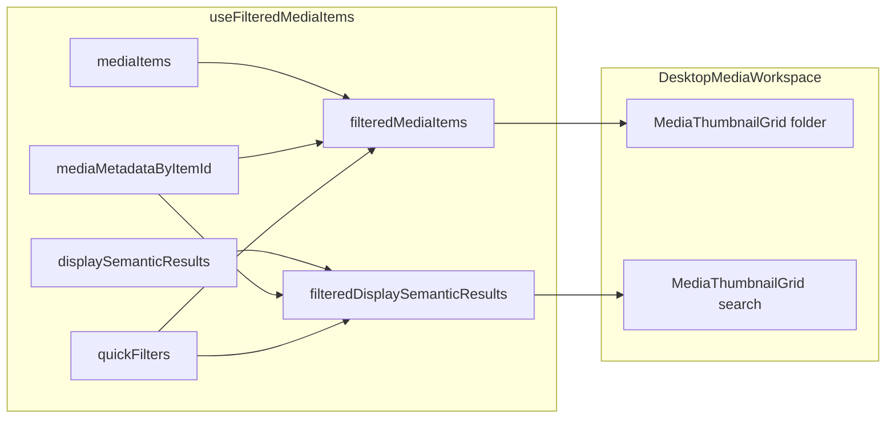

# Desktop-media quick filters: bugfix, Categories UX, tests

## Root cause (why filters “do nothing” today)

1. **AI image search grid ignores quick filters**
  In `[DesktopMediaWorkspace.tsx](apps/desktop-media/src/renderer/components/DesktopMediaWorkspace.tsx)`, folder thumbs use `filteredMediaItems`, but search results always render `displaySemanticResults` directly (second `MediaThumbnailGrid`). While `semanticResults.length > 0`, `semanticModeActive` hides the folder grid, so the toolbar filters have no visible effect on what the user sees.
2. **Hook only filters folder `mediaItems`**
  `[use-filtered-media-items.ts](apps/desktop-media/src/renderer/hooks/use-filtered-media-items.ts)` applies `matchesThumbnailQuickFilters` to `mediaItems` only. It exposes `displaySemanticResults` (similarity gate only), not a quick-filtered search list. `viewerItems` uses `displaySemanticResults` when `viewerSource === "search"`, so the viewer would also stay out of sync if the grid were filtered without updating this list.
3. **Optional UX pitfall (folder mode)**
  In `[QuickFiltersMenu.tsx](apps/desktop-media/src/renderer/components/QuickFiltersMenu.tsx)`, `handlePeopleChange` does not auto-enable the People row when the selected value is `"gte_1"` (same pattern as web in `[MediaAlbumItems.tsx](app/[locale]/media/MediaAlbumItems.tsx)`). Users can open the select, leave “≥ 1”, and never turn the filter on. Worth aligning with Documents behavior: changing the select should activate that row (recommended: set `peopleEnabled: true` on any people select change).

**Path/metadata alignment** looks correct: folder stream uses `id: img.path` (`[use-folder-images-stream.ts](apps/desktop-media/src/renderer/hooks/use-folder-images-stream.ts)`) and DB metadata is keyed by `source_path` (`[media-item-metadata.ts](apps/desktop-media/electron/db/media-item-metadata.ts)`). If Windows-specific issues appear, normalize/compare paths when merging metadata (secondary diagnostic only).

---

## Implementation plan

### A. Filter search results + keep viewer consistent

- In `[use-filtered-media-items.ts](apps/desktop-media/src/renderer/hooks/use-filtered-media-items.ts)`:
  - After computing `displaySemanticResults` (similarity gate), compute `**filteredDisplaySemanticResults`** (name can vary) by filtering each result with the same inputs as folder items: `metadata` from `mediaMetadataByItemId[result.id]`, `detectedFaceCount` derived like today from `faceConfidences` + `getFaceDetectionMethod(aiMetadata)`.
  - When `viewerSource === "search"` and `viewerItemsOverride` is unset, build `viewerItems` from **filtered** search results (not raw `displaySemanticResults`) so indices from `openViewer(index, "search")` match the grid.
- In `[DesktopMediaWorkspace.tsx](apps/desktop-media/src/renderer/components/DesktopMediaWorkspace.tsx)` (and `[DesktopAppMain.tsx](apps/desktop-media/src/renderer/components/DesktopAppMain.tsx)` props if needed): pass/use the filtered search list for the search `MediaThumbnailGrid` and empty-state logic (no results after filters vs no results after similarity gate).
- In `[DesktopMainToolbar.tsx](apps/desktop-media/src/renderer/components/DesktopMainToolbar.tsx)`: when search mode is active, show `**Filtered: x/y`** using **search result counts** (`filteredSearchCount` / `displaySemanticResults.length` or pre-gate total—pick one consistent definition and document in code; prefer counts relative to what the user sees after the similarity gate).

### B. Clear quick filters when switching folder view ↔ search results

- In `[App.tsx](apps/desktop-media/src/renderer/App.tsx)`, add a `useEffect` keyed on `**semanticModeActive`** (i.e. `semanticResults.length > 0`): when it **changes**, call `setQuickFilters(DEFAULT_THUMBNAIL_QUICK_FILTERS)`.  
Note: `[use-folder-tree-handlers.ts](apps/desktop-media/src/renderer/hooks/use-folder-tree-handlers.ts)` already clears `semanticResults` when selecting a folder; toggling only needs to handle entering/leaving search result display while staying on the same folder.

### C. Categories: checkbox + select (shared lib + desktop + web)

- **Extend** `[MediaImageCategory](app/types/media-metadata.ts)` to include prompt-backed values missing from the union today (at minimum: `architecture`, `sports`, `food`, `pet`; `travel` exists in the prompt but is **not** in your select list—omit unless you want parity with all prompt categories).
- Refactor `[lib/media-filters/thumbnail-quick-filters.ts](lib/media-filters/thumbnail-quick-filters.ts)`:
  - Replace `categories: ThumbnailCategoryQuickFilter[]` with the same pattern as Documents: e.g. `**categoriesEnabled`** + `**category: "all" | ThumbnailCategoryQuickFilter`** where `ThumbnailCategoryQuickFilter` is the subset **architecture, food, humor, nature, pet, sports** (alphabetical labels in UI).
  - Update `THUMBNAIL_CATEGORY_OPTIONS` to map each key to `MediaImageCategory[]` (usually a single-element array, same as today’s nature mapping).
  - Update `matchesCategoryFilter`, `countActiveQuickFilters`, `DEFAULT_THUMBNAIL_QUICK_FILTERS`, and any consumers.
- **Desktop UI**: `[QuickFiltersMenu.tsx](apps/desktop-media/src/renderer/components/QuickFiltersMenu.tsx)` — one `FilterCheckboxRow` labeled Categories with `CustomSelect` options in alphabetical order.
- **Web parity** (shared state shape): `[MediaAlbumNameAndControls.tsx](app/[locale]/media/components/album-content/MediaAlbumNameAndControls.tsx)` + `[MediaAlbumItems.tsx](app/[locale]/media/MediaAlbumItems.tsx)` — replace multi-toggle category chips with checkbox + select; remove `onQuickFilterCategoryToggle` in favor of document-style handlers.
- **Tests**: update `[tests/media-filters/thumbnail-quick-filters.test.ts](tests/media-filters/thumbnail-quick-filters.test.ts)` (node:test) for the new category shape and add explicit cases:
  - **People**: e.g. `peopleEnabled` + exact count vs `gte_1` vs document-ID exclusion (already partially covered; add cases if gaps appear).
  - **Documents**: `invoice_or_receipt` and `document_id_or_passport` with metadata matching your named fixtures’ *expected* AI categories (synthetic metadata objects; filenames only in comments).

### D. E2E tests (`test-assets-local/e2e-photos`)

- Assets path is already used in `[semantic-search.spec.ts](apps/desktop-media/tests/e2e/semantic-search.spec.ts)` (`../../test-assets-local/e2e-photos` or `EMK_E2E_PHOTOS_DIR`). The folder may be gitignored locally; tests should `skip` when missing (existing pattern).
- **Challenge**: Playwright cannot assert invoice/sports/nature without **analysis metadata** in SQLite. The current `[mock-ollama.ts](apps/desktop-media/tests/e2e/fixtures/mock-ollama.ts)` returns a fixed `image_category: "test"` and the chat body does not include the file path, so mocks cannot distinguish files.
- **Recommended approach** (pick one in implementation):
  1. **Strengthen mock Ollama**: parse `POST /api/chat` JSON, inspect `messages[0].content` (and/or add a **test-only** optional line to the analysis prompt with basename behind an env flag) to return deterministic `image_category`, `number_of_people`, etc. per filename—then run a **small** “Analyze photos” E2E on `e2e-photos` and drive the filter UI via stable `**data-testid`** attributes on the filter button, checkboxes, and selects.
  2. **Documented local E2E**: gate file-specific assertions behind `EMK_E2E_REAL_AI=1` (or similar) when a real Ollama run has populated the DB—keeps CI green with mock/smoke-only paths.
- Add `**quick-filters.spec.ts**` (or extend an existing spec) that:
  - Opens `e2e-photos`, applies **Documents → Invoices** and asserts visible thumbnails include `20210701_163111.jpg` / `20210730_085853.jpg` and exclude others as appropriate (depending on dataset size).
  - Applies **Documents → IDs** for `20210702_134329.jpg`.
  - Applies **Categories → sports** for `20191013_142053.jpg`; **nature** for `20200910_151932.jpg` and `20200821_101037.jpg`.
  - Covers **search mode**: run a query (reuse helpers from `[semantic-search.spec.ts](apps/desktop-media/tests/e2e/semantic-search.spec.ts)`), then apply a filter and assert the **search** grid count/filenames change; navigate **back** to folder-only view and assert filters were cleared.

---

## Architecture sketch

---

## Files likely touched (summary)

| Area               | Files                                                                                                                                                                                                                                                                                                                                                                                                                                               |
| ------------------ | --------------------------------------------------------------------------------------------------------------------------------------------------------------------------------------------------------------------------------------------------------------------------------------------------------------------------------------------------------------------------------------------------------------------------------------------------- |
| Filter logic       | `[use-filtered-media-items.ts](apps/desktop-media/src/renderer/hooks/use-filtered-media-items.ts)`, `[DesktopMediaWorkspace.tsx](apps/desktop-media/src/renderer/components/DesktopMediaWorkspace.tsx)`, `[DesktopAppMain.tsx](apps/desktop-media/src/renderer/components/DesktopAppMain.tsx)`, `[App.tsx](apps/desktop-media/src/renderer/App.tsx)`, `[DesktopMainToolbar.tsx](apps/desktop-media/src/renderer/components/DesktopMainToolbar.tsx)` |
| Categories + types | `[thumbnail-quick-filters.ts](lib/media-filters/thumbnail-quick-filters.ts)`, `[media-metadata.ts](app/types/media-metadata.ts)`, `[QuickFiltersMenu.tsx](apps/desktop-media/src/renderer/components/QuickFiltersMenu.tsx)`, `[MediaAlbumNameAndControls.tsx](app/[locale]/media/components/album-content/MediaAlbumNameAndControls.tsx)`, `[MediaAlbumItems.tsx](app/[locale]/media/MediaAlbumItems.tsx)`                                          |
| Tests              | `[thumbnail-quick-filters.test.ts](tests/media-filters/thumbnail-quick-filters.test.ts)`, new/updated Playwright under `[apps/desktop-media/tests/e2e/](apps/desktop-media/tests/e2e/)`, possibly `[mock-ollama.ts](apps/desktop-media/tests/e2e/fixtures/mock-ollama.ts)` or prompt/env hook                                                                                                                                                       |

---

## Out of scope (unless you want it next)

- **Viewer/swiper navigation** while filters are active still uses **full** `mediaItems` for folder source (`[use-desktop-viewer-bridge.ts](apps/desktop-media/src/renderer/hooks/use-desktop-viewer-bridge.ts)` resolves index by `id` into unfiltered list). Grid filtering works; swiper may show items outside the filter when paging—address separately if it bothers users.

