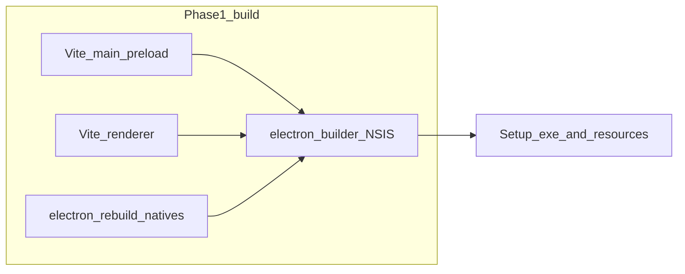
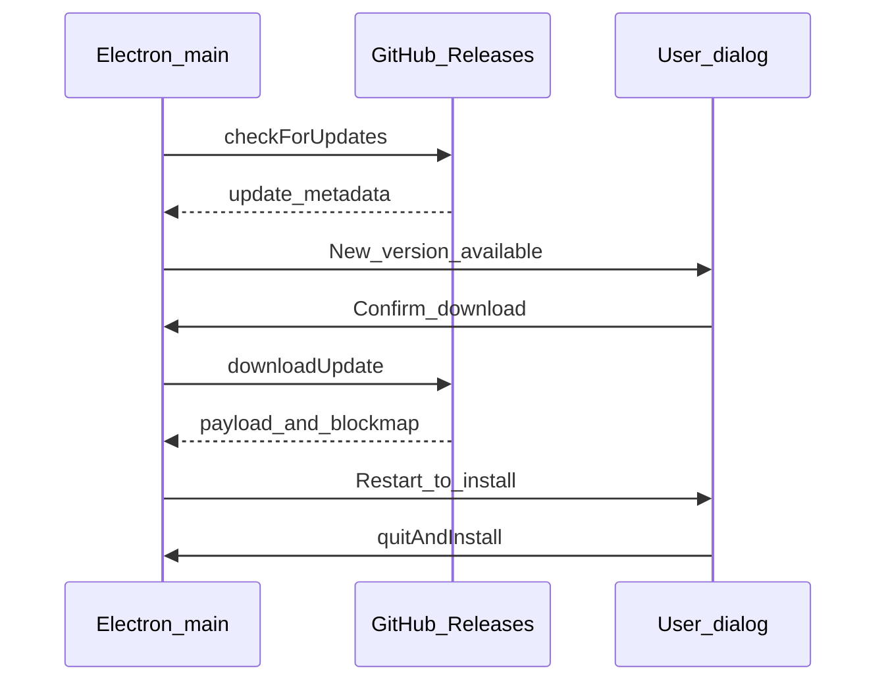

# Desktop-media: Windows executable and installer plan

## Current baseline (repo facts)

- Build today is **Vite-only**: main/preload → [`apps/desktop-media/dist-electron/`](apps/desktop-media/vite.main.config.ts), renderer → [`apps/desktop-media/dist-renderer/`](apps/desktop-media/vite.renderer.config.ts); [`pnpm start`](apps/desktop-media/package.json) runs `electron dist-electron/main.js`.
- **No `electron-builder` / Forge** in [`apps/desktop-media/package.json`](apps/desktop-media/package.json); **no `main` field** yet (packager will need an explicit entry, e.g. `dist-electron/main.js`).
- **SQLite DB** path is derived from Electron `userData`: [`initDesktopDatabase(app.getPath("userData"))`](apps/desktop-media/electron/main.ts) → [`desktop-media.db`](apps/desktop-media/electron/db/client.ts) in that folder. Tests override via `EMK_DESKTOP_USER_DATA_PATH` (same file).
- **ONNX face models** are **not shipped in-repo**: [`setModelsDirectory(path.join(app.getPath("userData"), "models"))`](apps/desktop-media/electron/main.ts) + [`ensureModelsDownloaded`](apps/desktop-media/electron/native-face/model-manager.ts) pulls `retinaface_mv2.onnx` and `w600k_r50.onnx` from HTTP mirrors on startup (progress already emitted to the renderer via `IPC_CHANNELS.faceModelDownloadProgress`).
- **Native Node addons**: at minimum [`better-sqlite3`](apps/desktop-media/scripts/rebuild-native.mjs) is rebuilt for the **Electron** ABI via `@electron/rebuild`. Other runtime externals from [`vite.main.config.ts`](apps/desktop-media/vite.main.config.ts) (`onnxruntime-node`, `exiftool-vendored`, etc.) must be **verified on packaged Windows**; extend rebuild scope if any load native `.node` binaries that target the wrong ABI.

**Your choices (locked in for this plan):** update artifacts on **public GitHub Releases**; **unsigned** builds acceptable for **internal/dev Phase 1**, with signing before broad public rollout.

---

## Packaging stack: primary recommendation vs alternative

### Recommended: **electron-builder** + **NSIS** (Windows)

- **Why:** One mature toolchain for **Windows installer**, **auto-update** ([`electron-updater`](https://www.electron.build/auto-update)), **artifact layout** (`latest.yml` for generic/GitHub provider), **code signing hooks**, and later **macOS/Linux** with the same config surface.
- **Windows target:** `win.target: [{ target: "nsis", arch: ["x64"] }]` — NSIS supports **custom install pages** later (for DB folder) and per-user vs machine-wide installs.
- **Minimum OS:** Set `nsis` / `win` metadata to **Windows 10 1809+** where practical; true **Windows 11-only** enforcement is unusual (most vendors still support Win10). If you truly require Win11, document it in the installer UI and optionally add a **launch-time check** (OS build number) with a clear error dialog rather than relying on the installer alone.

### Alternative: **Electron Forge** (e.g. Squirrel.Windows or MSI maker)

- **Why consider:** First-party Electron project, good plugin model.
- **Tradeoff:** Auto-update and Windows installer customization paths differ; more wiring for **Cursor-like** “download then apply on confirm” compared to the well-trodden **electron-builder + electron-updater** combo.

**Decision for Phase 1:** adopt **electron-builder** unless you have a strong preference for Forge’s workflow.

---

## Phase 1 — Windows x64 build + NSIS installer (no auto-update yet)

**Goals:** reproducible `pnpm` script from repo root or app package, CI artifact, installable app that runs AI stack.

1. **Add builder config** under [`apps/desktop-media/`](apps/desktop-media/) (e.g. `electron-builder.yml` or `build` key in `package.json`):
   - `appId`, `productName`, `copyright`, `directories.output` (e.g. `release/`).
   - `files`: include `dist-electron/**`, `dist-renderer/**`, `package.json`, and dependency tree; exclude dev-only assets.
   - **`asar` + `asarUnpack`**: unpack native/tooling that breaks inside asar (`better-sqlite3`, `onnxruntime-node`, anything that `dlopen`s adjacent binaries, **`exiftool-vendored` binaries**).
   - **Extra resources** (if any): Python sidecars or large static assets **not** imported as Node modules — today face detection is **native ONNX** ([`electron/native-face/`](apps/desktop-media/electron/native-face/)), so likely none beyond vendored tools.
2. **Scripts** in [`apps/desktop-media/package.json`](apps/desktop-media/package.json):
   - `build` (existing) → add `dist:win` = `pnpm build && electron-builder --win --x64` (exact flags in config).
   - Optionally `postinstall` **only if** you want local dev convenience; CI should call **explicit** rebuild.
3. **Electron-rebuild coverage:** extend [`scripts/rebuild-native.mjs`](apps/desktop-media/scripts/rebuild-native.mjs) (or a sibling script) to rebuild **all** native modules required at runtime for Electron, not only `better-sqlite3` — validate with a **smoke test** on a clean Windows VM after install.
4. **Monorepo / Turbo:** today [`turbo.json`](turbo.json) `build.outputs` does not list `dist-electron` / `dist-renderer`. When adding a `dist:win` pipeline, either add those globs to the desktop package’s turbo outputs or keep packaging **outside** Turbo’s `build` task with a dedicated `package` task to avoid cache misses.
5. **CI (GitHub Actions):** `windows-latest`, `pnpm install`, `pnpm --filter @emk/desktop-media run dist:win`, upload `release/*.exe` (+ `latest.yml` when Phase 2 lands) as workflow artifacts; on tag push, attach to **GitHub Release** (matches your hosting choice).
6. **Signing (Phase 1 internal):** leave `forceCodeSigning: false` / unsigned; document that **SmartScreen** will warn until you sign with a **standard or EV** Authenticode cert and use **timestamping** before public distribution.

---

## Models and large downloads (installer vs first run)

**Today’s best fit:** keep **first-run / first-use download** for ONNX models in `userData/models` (already implemented). It keeps the installer small and avoids duplicating HTTP logic in NSIS.

| Approach | Pros | Cons |
|----------|------|------|
| **A. First-run download (current)** | Small installer; simple updates to model URLs; resumable in app | Needs network on first launch; mirrors must stay available |
| **B. Bundle models in `extraResources`** | Offline install | Larger installer; slower CI uploads; model updates require app release |
| **C. NSIS custom page + download script** | “Feels” like install-time | Complex; error handling UX harder than in Electron |

**Recommendation:** **A** for Phase 1; add **B** only if you have a hard **offline-first** requirement. **Ollama** remains an **external dependency** (document in installer/README); bundling Ollama is usually impractical.

Also account for **other lazy downloads** (e.g. geocoder dumps under `userData/geonames` per [`initGeocoder`](apps/desktop-media/electron/geocoder/reverse-geocoder.ts)) — same tradeoffs as models.

---

## Phase 2 — “Cursor-like” update notification + confirm to update

**Stack:** `electron-updater` + **GitHub provider** (matches “public GitHub Releases”).

**Flow (typical):**

1. On startup or manual “Check for updates”, `autoUpdater.checkForUpdates()` (background).
2. When `update-available`, show **in-app** dialog: release notes, version, **Download** / **Later**.
3. On confirm, `downloadUpdate()` with progress; on `update-downloaded`, prompt **“Restart to install”**; `quitAndInstall()` after graceful shutdown (flush DB, stop jobs — you may need hooks in [`main.ts`](apps/desktop-media/electron/main.ts) / window lifecycle).

**Alternatives:**

- **Fully silent auto-update** (no confirm): worse for large downloads and corporate networks.
- **Microsoft Store / MSIX** updates: different pipeline; only choose if Store distribution is a goal.

**CI/release discipline:** semver tags, `latest.yml` + blockmap on GitHub Releases, optional **beta channel** via `prerelease` tags or separate channel URL.

---

## Phase 3 — Installer + in-app: custom DB / `userData` root

**Constraint:** `app.setPath("userData", …)` must run **before** Electron uses `userData` (your [`main.ts`](apps/desktop-media/electron/main.ts) already sets path when `EMK_DESKTOP_USER_DATA_PATH` is set — same idea for production).

**Pattern:**

1. **Installer (NSIS)** optional directory page: user picks folder `D:\EMKData` (or default `%APPDATA%\…`).
2. Write a small **machine or user config file** in a **fixed** location the app can always read first, e.g. `install-config.json` next to the executable (portable-friendly) or `%PROGRAMDATA%\EMK\desktop-media\paths.json` for per-machine defaults.
3. At the **top of `main.ts`**, synchronously read that file and call `app.setPath("userData", resolved)` when valid, **before** `app.whenReady()` and before [`initDesktopDatabase`](apps/desktop-media/electron/db/client.ts) / [`setModelsDirectory`](apps/desktop-media/electron/native-face/model-manager.ts).
4. **In-app relocate (later):** separate feature — copy/move `desktop-media.db` (+ `-wal`/`-shm`), `models/`, `geonames/`, `media-settings.json`, face crops if under old root — then update config and restart. Requires careful **migration** and **file lock** handling.

---

## Industry practices to bake in (cross-cutting)

- **Separation of concerns:** **Program files** (app) vs **user data** (DB, models, caches) — you already lean user-data-heavy; keep it that way.
- **Code signing + timestamping** before public release; EV cert reduces SmartScreen friction fastest.
- **Crash and error telemetry** (opt-in): e.g. Sentry for Electron — separate from updates but valuable for packaged builds.
- **Staged rollout:** GitHub prereleases or % rollout if you add a custom update server later.
- **Support bundle:** menu action to export logs + versions + paths (no secrets).
- **Security:** avoid auto-elevating to admin unless required; document firewall rules if you add local servers; keep **update channel over HTTPS only**; validate signatures (`electron-updater` does when configured).
- **Legal:** third-party licenses (ONNX models, Hugging Face, geodata) in installer or About dialog.

---

## Suggested clarification (non-blocking)

- **Windows 10 vs 11:** confirm whether “Windows 11 minimum” is a **product** decision (support matrix) or **technical** (e.g. specific APIs). Technically, Win10 1903+ is still widely targeted unless you intentionally drop it.
