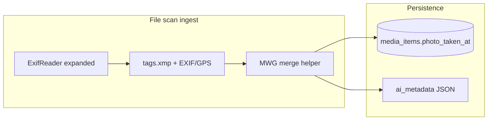

# Desktop-media: XMP capture + MWG precedence + date storage

## Current behavior (verification)

- **Desktop scan excludes XMP entirely.** `[apps/desktop-media/electron/db/media-item-metadata.ts](apps/desktop-media/electron/db/media-item-metadata.ts)` passes `excludeTags: { xmp: true }` to `ExifReader.load`, so no XMP tags are available to the parser.
- **Shared parsing is EXIF/IFD0/GPS-only.** `[lib/storage/media-metadata-shared.ts](lib/storage/media-metadata-shared.ts)` `parseExifMetadataFromExpandedTags` reads `DateTimeOriginal` / `DateTime Digitized` / IFD0 `ModifyDate` and GPS, but never reads `tags.xmp` (or IPTC).
- **Web upload path** (`[lib/storage/utils.ts](lib/storage/utils.ts)`) does not exclude XMP, but still uses the same `parseExifMetadataFromExpandedTags`, so **XMP is effectively ignored there too** until the parser is extended.
- **Title / description / location today:** First-class title and description live under `**ai_metadata` → `ai.***` and FTS (`[apps/desktop-media/electron/db/keyword-search.ts](apps/desktop-media/electron/db/keyword-search.ts)`, migration in `[apps/desktop-media/electron/db/client.ts](apps/desktop-media/electron/db/client.ts)`) index `**json_extract(..., '$.ai.title')`** etc., plus `location_name` from **vision analysis** (`[apps/desktop-media/electron/db/media-analysis.ts](apps/desktop-media/electron/db/media-analysis.ts)`). **Embedded IPTC/XMP title/description/location are not extracted** on file scan.
- **Star rating today:** **Not extracted.** Desktop excludes XMP (no `xmp:Rating`); the shared parser does not read IFD0 `**Rating`** (`0x4746`) or `**RatingPercent`** (`0x4749`) used by Windows Photo / Explorer in some files.

## “Date taken” in the database

- **Column:** `[media_items.photo_taken_at](apps/desktop-media/electron/db/client.ts)` is `**TEXT`**, no index dedicated to it in the base schema.
- **What is stored now:** `[parseExifDate](lib/storage/media-metadata-shared.ts)` normalizes EXIF-style `YYYY:MM:DD ...` and then `**new Date(...).toISOString()`** — i.e. a **full UTC instant** when parsing succeeds; otherwise `**NULL`**.
- **Partial dates (year-only, year-month):** **Not supported end-to-end today.** Even if you stored `"1998"` or `"1998-06"`, `[formatPhotoTakenListLabel](apps/desktop-media/src/renderer/lib/photo-date-format.ts)` uses `new Date(raw)`, which yields **invalid/empty display** for many partial strings. There is **no** `photo_year` / precision column and **no** date-range filter in `[lib/media-filters](lib/media-filters)` — only display via `photoTakenDisplay`.

To support **storing and filtering** partially known dates reliably, a follow-up should introduce an explicit representation, for example:

- **Option A (lighter):** Keep a single `photo_taken_at` TEXT but **standardize** on ISO 8601 **calendar** forms (`YYYY`, `YYYY-MM`, `YYYY-MM-DD`, optional time + offset) and add `**photo_taken_precision`** (`year` | `month` | `day` | `instant`) **or** derive precision from string shape; update formatters and any future SQL to use `SUBSTR` / dedicated `photo_year` index — see Option B.
- **Option B (clearer queries):** Add nullable `photo_year`, `photo_month`, `photo_day` (and maybe `photo_local_time` or offset) populated at ingest; keep `photo_taken_at` as a sortable normalized string or computed from those fields.

## Proposed implementation (MWG-oriented)

**Guiding rule:** When both EXIF and XMP provide a value for the same semantic “capture / creation” time and they disagree, **prefer the XMP-derived value** (MWG-style synchronization practice: XMP is treated as the authoritative edited metadata in typical workflows).

### 1) Enable XMP in ExifReader (desktop)

- Remove `excludeTags: { xmp: true }` in `[extractPhotoMetadata](apps/desktop-media/electron/db/media-item-metadata.ts)` (optionally keep other excludes for size if needed later).
- **Note:** ExifReader still parses full XMP blocks internally; excluding only filtered output. Enabling XMP **increases work and memory** per file — acceptable for correctness unless profiling says otherwise.

### 2) Centralize parsing and MWG merge in shared lib

Extend `[lib/storage/media-metadata-shared.ts](lib/storage/media-metadata-shared.ts)` (and consume from desktop + `[lib/storage/utils.ts](lib/storage/utils.ts)` for parity):

- **Read XMP group** via existing `getExpandedTagValue(tags, 'xmp', ...)` (keys as ExifReader exposes them, e.g. `photoshop:DateCreated`, `xmp:CreateDate`, `xmp:ModifyDate`, `dc:title`, `dc:description`; location may appear as `Iptc4xmpCore:Location` or related — **verify on real files** and ExifReader output).
- **Primary “date taken” (`photoTakenAt`):** Implement an ordered merge, for example:
  - Prefer **XMP** `photoshop:DateCreated` or `xmp:CreateDate` (pick one documented order; both are “creation” semantics — **document the final precedence in code comments**).
  - Else fall back to current EXIF chain (`DateTimeOriginal` → `DateTime Digitized` → IFD0 `ModifyDate`).
  - **Conflict rule:** If XMP create-type date parses and EXIF `DateTimeOriginal` parses and they differ, **keep XMP** for `photoTakenAt`.
- `**xmp:ModifyDate`:** Persist as **secondary** (not `photo_taken_at`): e.g. `technical.capture.metadata_modified_at` / `embedded.modify_date` in `[MediaMetadataV2](app/types/media-metadata.ts)` (extend `TechnicalCaptureMetadata` or add a small `embedded` / `file` subtree) and merge in `[buildDesktopAiMetadata](apps/desktop-media/electron/db/media-item-metadata.ts)`.
- **Title / description / location:** Parse from XMP (and optionally **IPTC** group if you enable it — many files still use IPTC-only). Store under a **distinct namespace** in `ai_metadata` (e.g. `embedded: { title, description, location }` with `source: "xmp"`) so `**ai.title` remains vision output** and does not get overwritten on metadata refresh. Decide product rule: **display precedence** (e.g. show embedded if present, else AI) can be a separate UI follow-up.
- **Star rating:** Extract `**xmp:Rating`** from `tags.xmp`. **Windows compatibility fallback:** read IFD0 `**Rating`** (ExifReader expanded: `ifd0` / `image` group, tag `0x4746` — common when Explorer / Windows Photo wrote stars without XMP). **Precedence:** if both XMP and EXIF ratings parse, **prefer XMP**. Normalize to a **small integer** (typically **0–5**; clamp invalid values; note some tools use 1–5 or 0–99 percent via `**RatingPercent`** (`0x4749`) — optionally map percent → stars). Persist with other embedded fields (`embedded.star_rating` or under `technical.capture`) and wire `[getMediaItemMetadataByPaths](apps/desktop-media/electron/db/media-item-metadata.ts)` / `[ipc.ts](apps/desktop-media/src/shared/ipc.ts)` if the UI or filters need it. **Unit tests:** XMP-only, EXIF-only (Windows-style), both with conflict, and edge numeric values.

### 3) Schema / ingest / FTS

- **DB columns:** Optional: add `embedded_title TEXT`, `embedded_description TEXT`, `embedded_location TEXT`, `star_rating INTEGER` **or** rely on JSON only for descriptive fields and rating. JSON-only avoids migration but requires **FTS sync** if you want keyword search over embedded text — extend `[upsertFtsEntry](apps/desktop-media/electron/db/keyword-search.ts)` / migration 013-style backfill to **COALESCE** embedded vs AI fields for title/description/location.
- **Bump** `METADATA_VERSION` in `[media-item-metadata.ts](apps/desktop-media/electron/db/media-item-metadata.ts)` (`desktop-photo-metadata-v1` → `v2`) so existing rows **re-scan** and pick up XMP.

### 4) Partial XMP dates (if in scope now vs later)

- Extend date parsing to accept **XMP date** grammar (year-only, year-month, date, datetime + optional `Z`/offset).
- If storing partials in `photo_taken_at`, **update** `[formatPhotoTakenListLabel](apps/desktop-media/src/renderer/lib/photo-date-format.ts)` (and tests in `[photo-date-format.test.ts](apps/desktop-media/src/renderer/lib/photo-date-format.test.ts)`) to **not** depend solely on `new Date` for those shapes.
- Add **unit tests** in `[media-metadata-shared](lib/storage/media-metadata-shared.ts)` for MWG merge and XMP date edge cases (per project testing rules: co-located `*.test.ts`).

### 5) Reference

- Use [Metadata Working Group (MWG) guidance](https://www.metadataworkinggroup.com/specs/) as the **conceptual** basis for **XMP-over-EXIF** when values conflict; exact field mapping tables should be mirrored in code comments where precedence is non-obvious.

