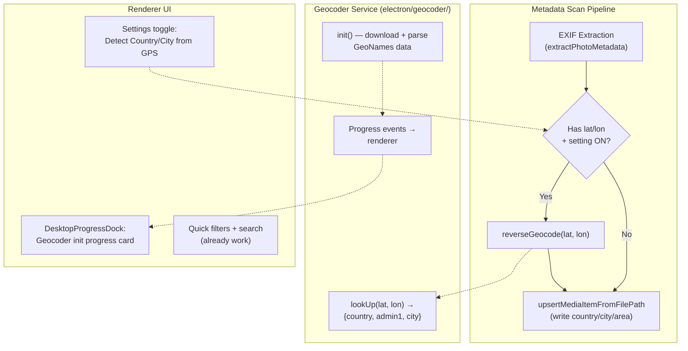

# GPS Reverse Geocoding Integration

## Library Comparison

### 1. `local-reverse-geocoder` (recommended)

- **License**: Apache-2.0 (commercial OK)
- **Data**: GeoNames cities1000 + admin1/admin2 codes, k-d tree in memory
- **Output**: city name, countryCode, admin1 (state/province), admin2 (county), distance
- **Init**: Downloads ~~2GB raw data on first run, caches to disk (~~1.3GB unzipped). Subsequent starts parse cached files into k-d tree.
- **Memory**: ~1-2GB heap (can reduce by disabling admin3/4, alternate names, or limiting to specific countries)
- **Speed**: Sub-millisecond lookups after init
- **Maintenance**: 4.5K weekly downloads, last release Jan 2024, 216 GitHub stars
- **Data freshness**: By default re-downloads daily (can be disabled by renaming date-stamped files)

### 2. `@treblefm/offline-geocoder` / `lucaspiller/offline-geocoder`

- **License**: MIT
- **Data**: GeoNames cities1000 imported into SQLite (~12MB DB)
- **Output**: city, country `{id, name}`, admin1 `{id, name}`, formatted string
- **Init**: Requires running a script to generate the SQLite DB (not included in package)
- **Memory**: Minimal (SQLite on disk)
- **Speed**: ~300 lookups/sec
- **Maintenance**: Last commit 2021, 39 stars, effectively abandoned

### 3. `offline-geocode-city`

- **License**: MIT
- **Data**: S2 cell data embedded in package (217KB gzipped)
- **Output**: city name, countryIso2, countryName -- **NO state/province (admin1)** -- eliminated

### 4. `geo-intel-offline`

- **License**: MIT
- **Output**: Country only, no city or admin1 -- eliminated

### Recommendation: `local-reverse-geocoder`

It is the only actively maintained option that returns **all three levels** (country, state/province, city). The 2GB download and memory concerns are manageable for a desktop Electron app:

- Download happens only once (first use), shown with progress UI
- Daily refresh can be disabled
- Can disable unused data (admin3, admin4, alternate names) to reduce footprint
- Init can be deferred until first scan with GPS data
- Could be run in a worker thread to avoid blocking the main process

The unmaintained `offline-geocoder` is tempting for its 12MB footprint, but the abandoned state and need to generate the DB make it a fragile dependency. The data it returns is also less rich.

---

## Existing Infrastructure (already in codebase)

The codebase is well-prepared for this feature:

- **DB columns**: `country`, `city`, `location_area`, `location_place`, `location_source` already exist in `media_items` table (migration 015), with index `idx_media_items_location`
- **Types**: `DesktopMediaItemMetadata` already has `country`, `city`, `locationArea`, `locationPlace` fields (`[ipc.ts:319-323](apps/desktop-media/src/shared/ipc.ts)`)
- **Location resolver**: `[location-resolver.ts](apps/desktop-media/electron/path-extraction/location-resolver.ts)` already has `"gps"` as the highest-priority source
- **Filter infrastructure**: `matchesLocationQuickFilter` and SQL `appendEventAndLocationPredicates` already filter on these columns
- `**SourcedLocation` type**: Already defines `LocationSource = "gps" | "embedded_xmp" | "path_llm" | "path_script" | "ai_vision"`

---

## Integration Architecture

## Implementation Plan

### 1. Geocoder Service Module

Create `apps/desktop-media/electron/geocoder/reverse-geocoder.ts`:

- Wraps `local-reverse-geocoder` with a typed async API
- `initGeocoder(options)`: Async init with progress callback. Configure to load only `cities1000` + `admin1` + `admin2` (disable admin3, admin4, alternate names to reduce memory). Disable daily data refresh (rename files to strip date).
- `reverseGeocode(lat, lon)`: Returns `{ country, countryCode, admin1Name, admin2Name, cityName }` or null
- `isGeocoderReady()`: Returns boolean
- `shutdownGeocoder()`: Cleanup if needed
- Store data in `app.getPath("userData")/geonames/` (user data dir, not temp)

### 2. Settings

Add to `[AppSettings](apps/desktop-media/src/shared/ipc.ts)`:

- New field in `FolderScanningSettings` or a new `GeocodingSettings` interface:
  - `detectLocationFromGps: boolean` (default: `true`)
- Add default in `DEFAULT_FOLDER_SCANNING_SETTINGS`

Add a checkbox in `[DesktopSettingsSection.tsx](apps/desktop-media/src/renderer/components/DesktopSettingsSection.tsx)` under "File metadata management":

- "Detect Country / City from GPS coordinates"
- Description: explains that first use downloads ~2GB GeoNames data, subsequent uses are fast

### 3. Geocoder Initialization and Progress

- **When to init**: Lazily on first metadata scan that has the setting enabled. Not at app startup (avoid the 2GB download on every cold start for users who don't use GPS features).
- **Progress reporting**: New IPC progress event type for geocoder init. Emit phases: "downloading" (with bytes/total if possible), "parsing" (loading k-d tree).
- **Background Operations panel**: Add a new card in `[DesktopProgressDock.tsx](apps/desktop-media/src/renderer/components/DesktopProgressDock.tsx)` for geocoder initialization, similar to existing metadata scan card. Shows "Preparing location database..." with progress bar.
- **Store**: Add geocoder state fields to the metadata-scan slice or a new mini-slice: `geocoderStatus: "idle" | "downloading" | "parsing" | "ready" | "error"`, `geocoderProgress: number`.

### 4. Metadata Scan Pipeline Integration

In `[metadata-scan-handlers.ts](apps/desktop-media/electron/ipc/metadata-scan-handlers.ts)`, after `upsertMediaItemFromFilePath`:

- If `detectLocationFromGps` is enabled, the item has `latitude`/`longitude`, and current `country`/`city` are null or `location_source !== "gps"`:
  - Call `reverseGeocode(lat, lon)`
  - Build a `SourcedLocation` with `source: "gps"`
  - Call `resolveLocation()` (existing) to merge with other sources
  - Persist to DB: update `country`, `city`, `location_area`, `location_place`, `location_source`

**Alternative approach (batch)**: Accumulate all items with GPS coords during the scan, then batch-geocode after the scan loop. `local-reverse-geocoder` supports batch lookups natively. This is more efficient and avoids interleaving geocoder calls with DB writes.

### 5. DB Update Logic

Create a new function in `[media-item-path-extraction.ts](apps/desktop-media/electron/db/media-item-path-extraction.ts)` or a new `media-item-geocoding.ts`:

- `updateMediaItemLocationFromGps(mediaItemId, geocodeResult)`: Updates `country`, `city`, `location_area`, `location_place`, `location_source` in DB
- Only writes if current `location_source` is lower priority than `"gps"` (use existing `resolveLocation` logic)

### 6. Backfill Command (optional, recommended)

Add a menu action or button: "Detect locations for existing photos with GPS"

- Queries all `media_items` with `latitude IS NOT NULL AND longitude IS NOT NULL AND (location_source IS NULL OR location_source != 'gps')`
- Batch geocodes and updates
- Shows progress in Background Operations panel

### 7. Files to Create/Modify

**New files:**

- `apps/desktop-media/electron/geocoder/reverse-geocoder.ts` — geocoder service wrapper
- `apps/desktop-media/electron/geocoder/geocoder-types.ts` — types for geocode results
- `apps/desktop-media/electron/db/media-item-geocoding.ts` — DB update functions for GPS location

**Modified files:**

- `[apps/desktop-media/src/shared/ipc.ts](apps/desktop-media/src/shared/ipc.ts)` — Add setting field, progress event types, IPC channel
- `[apps/desktop-media/electron/ipc/metadata-scan-handlers.ts](apps/desktop-media/electron/ipc/metadata-scan-handlers.ts)` — Integrate geocoding after scan phase
- `[apps/desktop-media/src/renderer/components/DesktopSettingsSection.tsx](apps/desktop-media/src/renderer/components/DesktopSettingsSection.tsx)` — Add GPS detection toggle
- `[apps/desktop-media/src/renderer/components/DesktopProgressDock.tsx](apps/desktop-media/src/renderer/components/DesktopProgressDock.tsx)` — Add geocoder init progress card
- `[apps/desktop-media/src/renderer/hooks/ipc-progress-binders.ts](apps/desktop-media/src/renderer/hooks/ipc-progress-binders.ts)` — Bind geocoder progress events
- `[apps/desktop-media/electron/ipc/register-all.ts](apps/desktop-media/electron/ipc/register-all.ts)` — Register geocoder IPC handlers if needed
- `[apps/desktop-media/electron/storage.ts](apps/desktop-media/electron/storage.ts)` — Add default for new setting

### 8. What Already Works (no changes needed)

- Location-based quick filters (client-side substring match on country/city/area/place)
- Location-based SQL search predicates (`appendEventAndLocationPredicates`)
- Semantic search with `locationQuery`
- `location-resolver.ts` priority: `"gps"` is already highest
- DB schema (columns + index exist)
- `DesktopMediaItemMetadata` type (fields exist)
