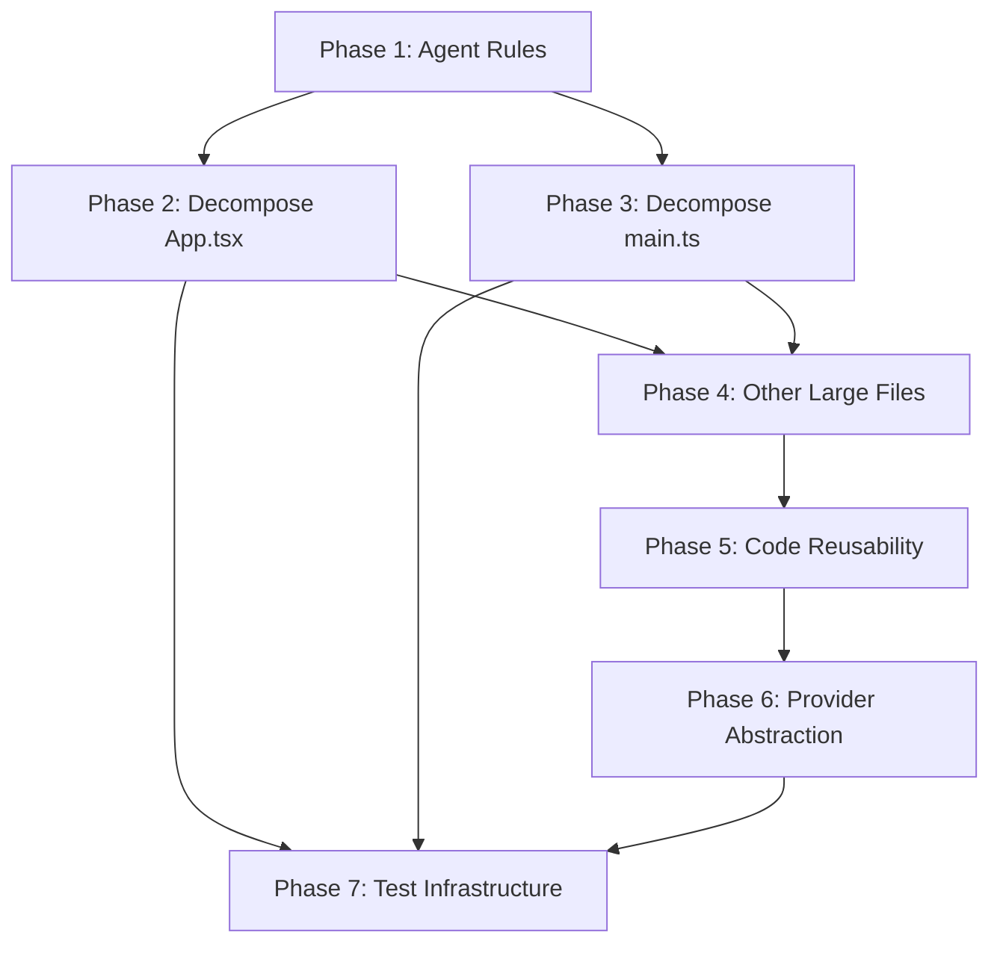

# Code Refactoring and Simplification Plan

## Current State Assessment

**Monorepo structure:** 3 apps (`desktop-media`, `web-media`, `web-website`), 7 packages (`media-store`, `media-viewer`, `shared-contracts`, `sdk-media-api`, `ui`, `config-eslint`, `config-typescript`), shared root `app/`, `lib/`, `components/`.

**Key problems identified:**

- **Oversized files:** `App.tsx` (2155 lines), `electron/main.ts` (~2346 lines), plus 5 more files over 400 lines
- **Agent rules:** Only `.cursor/rules/` exists (4 files). No `CLAUDE.md`, `AGENTS.md`, or universal rule structure
- **Minimal test coverage:** 2 unit tests, 1 Playwright E2E suite. No tests for packages, store slices, or most lib modules
- **No database abstraction layer:** Web uses Supabase directly, desktop uses SQLite directly -- no shared DB interface
- **Coupled concerns in large components:** `App.tsx` mixes orchestration, IPC handlers, state wiring, computed values, ETA logic, and 1000+ lines of JSX

---

## Phase 1: Universal Agent Rules Infrastructure

**Goal:** Establish a rule structure that works for both Cursor (`.cursor/rules/`) and Claude Code (`CLAUDE.md`, `AGENTS.md`), with proper hierarchy per app and package.

### 1.1 Create root `CLAUDE.md`

Root-level file containing project-wide rules -- architecture principles, TypeScript standards, component patterns, DRY enforcement. This mirrors the content from `emk-website-project-rules.mdc` but in Claude Code format.

```
CLAUDE.md                          # Root: project-wide rules (tech stack, architecture, TS, DRY)
```

### 1.2 Create `AGENTS.md` hierarchy

Place `AGENTS.md` at each significant boundary for scoped guidance:

```
AGENTS.md                                      # Root: monorepo overview, workspace commands, test commands
apps/desktop-media/AGENTS.md                   # Electron + Vite + SQLite specifics, IPC patterns
apps/web-media/AGENTS.md                       # Next.js web-media specifics, Supabase patterns
apps/web-website/AGENTS.md                     # Next.js web-website specifics
packages/media-store/AGENTS.md                 # Zustand slice conventions, immer patterns
packages/media-viewer/AGENTS.md                # No web-only deps, inline SVGs, prop-driven behavior
packages/shared-contracts/AGENTS.md            # Domain types, adapter interfaces, versioning policy
```

### 1.3 Restructure `.cursor/rules/`

Refine existing rules and add new ones:

- **Keep:** `emk-website-project-rules.mdc` (updated with decomposition/testing rules)
- **Keep:** `supabase-data-storage.mdc`, `i18n-translation.mdc`
- **Update:** `media-shared-components.mdc` (expand with cross-app reusability rules)
- **Add:** `desktop-media.mdc` (glob: `apps/desktop-media/`**) -- Electron/IPC/SQLite conventions
- **Add:** `code-decomposition.mdc` (always-apply) -- file size limits, extraction patterns, hook/utility separation
- **Add:** `testing-standards.mdc` (always-apply) -- test patterns, coverage expectations

### 1.4 Content synchronization strategy

Rules content is maintained in `.cursor/rules/*.mdc` as the source of truth. `CLAUDE.md` and `AGENTS.md` files reference the same principles but in Claude Code format. A brief note in each explains the dual-tool setup.

**Tests (Phase 1):**

- Manual: Verify Cursor loads rules correctly (check rule activation in chat)
- Manual: Verify Claude Code reads `CLAUDE.md` and `AGENTS.md` hierarchy
- Automated: Add a CI lint step that checks all `AGENTS.md` files exist at expected paths

---

## Phase 2: Decompose `App.tsx` (Desktop Renderer)

**Goal:** Break the 2155-line [App.tsx](apps/desktop-media/src/renderer/App.tsx) into focused modules. Target: no file over ~300 lines.

### 2.1 Extract utilities

Move inline utilities to `apps/desktop-media/src/renderer/lib/`:


| Function                                                | Target File               |
| ------------------------------------------------------- | ------------------------- |
| `getCategoryLabel`, `getGenderLabel`, `toHeadlineLabel` | `lib/label-formatters.ts` |
| `formatTimeLeftCompact`                                 | `lib/eta-formatting.ts`   |
| `parseOptionalNumber`                                   | `lib/parse-utils.ts`      |
| `UI_TEXT` constant object                               | `lib/ui-text.ts`          |
| `ETA_RECENT_WINDOW_SIZE`, `ETA_MIN_RECENT_SAMPLES`      | `lib/eta-formatting.ts`   |


### 2.2 Extract types

Move types to `apps/desktop-media/src/renderer/types/`:


| Type                                               | Target File             |
| -------------------------------------------------- | ----------------------- |
| `SidebarSectionId`, `MainPaneViewMode`             | `types/app-types.ts`    |
| `DesktopViewerItem`, `DesktopViewerInfoPanelProps` | `types/viewer-types.ts` |


### 2.3 Extract custom hooks

Create focused hooks in `apps/desktop-media/src/renderer/hooks/`:


| Hook                       | Responsibility                                                                                                    | Approximate Source Lines |
| -------------------------- | ----------------------------------------------------------------------------------------------------------------- | ------------------------ |
| `useDesktopStoreSelectors` | All store selector subscriptions (lines 449-531)                                                                  | New file                 |
| `useFilteredMediaItems`    | `filteredMediaItems`, `viewerItems`, derived counts (lines 533-756)                                               | New file                 |
| `useEtaTracking`           | ETA calculation, tick effects, averages (lines 758-830)                                                           | New file                 |
| `useFolderActions`         | `handleAddLibrary`, `handleToggleExpand`, `handleSelectFolder`, folder stream effect (lines 832-960)              | New file                 |
| `useAnalysisActions`       | `handleAnalyzePhotos`, `handleCancelAnalysis`, `handleDetectFaces`, `handleCancelFaceDetection` (lines 960-1050)  | New file                 |
| `useSemanticSearch`        | `handleSemanticSearch`, `handleIndexSemanticForFolder`, `handleCancelSemanticIndex`, form state (lines 1050-1130) | New file                 |
| `useMetadataActions`       | `mergeMetadataForPaths`, `refreshMetadataByPath`, `handleCancelMetadataScan` (lines 832-900)                      | New file                 |


### 2.4 Extract sub-components

Move to `apps/desktop-media/src/renderer/components/`:


| Component                | Responsibility                                                                       |
| ------------------------ | ------------------------------------------------------------------------------------ |
| `ToolbarIconButton`      | Already defined inline; move to `components/ui/ToolbarIconButton.tsx`                |
| `DesktopViewerInfoPanel` | Already defined inline (~200 lines); move to `components/DesktopViewerInfoPanel.tsx` |
| `DesktopMainHeader`      | Extract header + toolbar JSX (~120 lines)                                            |
| `DesktopActionsMenu`     | Extract actions dropdown menu (~90 lines)                                            |
| `SemanticSearchPanel`    | Extract semantic search form panel (~80 lines)                                       |
| `DesktopProgressDock`    | Extract progress cards dock (~130 lines)                                             |
| `DesktopMainContent`     | Extract main content area (grid/list/empty states)                                   |


### 2.5 Resulting `App.tsx`

After extraction, `App.tsx` becomes a thin orchestrator (~150-200 lines):

- Imports and composes hooks
- Renders layout shell with extracted components
- Passes props down from hooks

**Tests (Phase 2):**

- Automated: Unit tests for each extracted utility (`label-formatters.test.ts`, `eta-formatting.test.ts`, `parse-utils.test.ts`)
- Automated: Unit tests for `useFilteredMediaItems` and `useEtaTracking` hooks (test with mock store)
- Manual: Verify desktop app renders identically before/after refactor
- Manual: Test all user flows: folder selection, analysis, face detection, semantic search, viewer

---

## Phase 3: Decompose `electron/main.ts`

**Goal:** Break the ~2346-line [electron/main.ts](apps/desktop-media/electron/main.ts) into focused modules.

### 3.1 Extract IPC handler groups

Create `apps/desktop-media/electron/ipc/` directory:


| File                       | Responsibility                                                                     |
| -------------------------- | ---------------------------------------------------------------------------------- |
| `ipc/folder-handlers.ts`   | `select-folder`, `folder-images`, `folder-children`, `add-library`                 |
| `ipc/analysis-handlers.ts` | `analyze-photos`, `cancel-analysis`, photo analysis pipeline invocation            |
| `ipc/face-handlers.ts`     | `detect-faces`, `cancel-face-detection`, face embedding, clustering, face tag CRUD |
| `ipc/metadata-handlers.ts` | Metadata scan, `cancel-metadata-scan`, EXIF reading                                |
| `ipc/semantic-handlers.ts` | Semantic indexing, search, embedding                                               |
| `ipc/settings-handlers.ts` | Read/write settings, service status checks                                         |
| `ipc/register-all.ts`      | Central registration point that calls all handler groups                           |


### 3.2 Extract window management

- `electron/window.ts` -- `createWindow()`, window state persistence, dev tools setup

### 3.3 Extract sidecar management

- `electron/sidecar.ts` -- Python sidecar spawn/kill, health checks, port management

### 3.4 Resulting `main.ts`

Thin entry point (~80-100 lines): app lifecycle (`ready`, `activate`, `window-all-closed`), calls `registerAllIpcHandlers()`, calls `createWindow()`.

**Tests (Phase 3):**

- Automated: Unit tests for individual IPC handler logic (mock `ipcMain`, mock DB)
- Automated: Unit tests for sidecar management (mock `spawn`)
- Manual: Full desktop app smoke test -- all IPC channels working
- Manual: Test sidecar lifecycle (start, health check, kill)

---

## Phase 4: Refactor Other Large Files

**Goal:** Bring remaining files over 400 lines under control, ordered by impact.

### 4.1 `packages/media-viewer/src/swiper-viewer.tsx` (~738 lines)

Extract:

- `SwiperControls` component (play/pause, fullscreen, info toggle, navigation)
- `useSwiperKeyboard` hook (keyboard navigation logic)
- `useSwiperSlideshow` hook (autoplay timing logic)
- `ThumbnailRail` component (vertical thumbnail strip)

### 4.2 `packages/media-viewer/src/image-edit-suggestions-view.tsx` (~606 lines)

Extract:

- `SuggestionCard` component
- `SuggestionFilters` component
- `useSuggestionGrouping` hook

### 4.3 `apps/desktop-media/electron/photo-analysis.ts` (~778 lines)

Extract:

- `prompt-builder.ts` -- Prompt construction logic
- `result-parser.ts` -- VLM output parsing and validation
- Keep `photo-analysis.ts` as the orchestrator

### 4.4 `apps/desktop-media/electron/photo-analysis-pipeline.ts` (~529 lines)

Extract:

- `rotation-pipeline.ts` -- Rotation detection sub-pipeline
- Keep pipeline orchestration in main file

### 4.5 `apps/desktop-media/electron/face-clustering.ts` (~491 lines)

Extract:

- `clustering-algorithm.ts` -- Pure agglomerative clustering math (no DB dependency)
- `cluster-persistence.ts` -- DB operations for storing cluster results

### 4.6 `apps/desktop-media/src/renderer/hooks/useDesktopIpcBindings.ts` (~473 lines)

Extract into separate binding files per domain:

- `bindings/analysis-bindings.ts`
- `bindings/face-bindings.ts`
- `bindings/metadata-bindings.ts`

**Tests (Phase 4):**

- Automated: Unit test `clustering-algorithm.ts` (pure function, no DB)
- Automated: Unit test `prompt-builder.ts` and `result-parser.ts`
- Automated: Unit test `useSwiperKeyboard` and `useSwiperSlideshow` hooks
- Manual: Verify swiper viewer works identically in both web and desktop
- Manual: Verify photo analysis pipeline produces same results

---

## Phase 5: Enforce Code Reusability

**Goal:** Identify and extract duplicated patterns into shared packages/components.

### 5.1 Audit cross-app UI duplication

Scan for components that exist in both `apps/desktop-media/src/renderer/components/` and `app/[locale]/media/components/` that should be in `@emk/media-viewer`:

- Progress indicators / progress dock cards
- Settings controls (already partially in `media-viewer`)
- Face tag display components
- Toolbar button patterns

### 5.2 Extract common hooks to `@emk/media-store`

Hooks that operate purely on store state (no platform IPC) should live in the store package:

- `useFilteredMediaItems` (if filtering logic is identical web/desktop)
- `useMediaItemCounts` (derived counts from store)

### 5.3 Add `@emk/media-viewer` guidelines

Update `media-shared-components.mdc` with:

- Component extraction checklist (when to promote from app to package)
- Props-over-platform-checks rule
- Shared hook patterns

### 5.4 Create shared utility package or consolidate in `shared-contracts`

Move label formatters, ETA formatting, and other pure utilities that are app-agnostic into `packages/shared-contracts/src/utils/`.

**Tests (Phase 5):**

- Automated: Shared hooks get unit tests in their package
- Automated: Import graph lint -- ensure no circular dependencies between packages
- Manual: Verify web-media and desktop-media render identical shared components

---

## Phase 6: Provider Abstraction Hardening

**Goal:** Validate and strengthen the adapter/strategy patterns for swappable providers.

### 6.1 Database abstraction layer

Currently missing. Create a minimal `MediaRepository` interface in `packages/shared-contracts/src/data/`:

```typescript
interface MediaRepository {
  getMediaItems(filter: MediaFilter): Promise<MediaRecord[]>;
  upsertMediaItem(item: MediaRecord): Promise<void>;
  searchSemantic(query: string, filters?: SemanticFilters): Promise<MediaRecord[]>;
  // ... other operations
}
```

- `SupabaseMediaRepository` implementation in `lib/db/media/`
- `SQLiteMediaRepository` implementation in `apps/desktop-media/electron/db/`
- This enables future migration from SQLite to other local DBs or from Supabase to another cloud DB

### 6.2 AI provider abstraction validation

`AiProviderAdapter` in `shared-contracts` is well-designed. Validate:

- Desktop can swap between Ollama and OpenAI via settings
- Web can use different models independently
- Add a `ProviderRegistry` pattern (similar to face detection) if not present

### 6.3 Face detection provider validation

Already has `FaceDetectionProvider` interface + registry. Validate:

- Desktop can use local sidecar (RetinaFace) or cloud (Azure/Google)
- Web can use cloud providers
- Migration path from sidecar to Node.js native (e.g., ONNX runtime)

### 6.4 Storage provider validation

`StorageProviderInterface` exists with Supabase implementation. Verify GCS/S3 stubs are functional and the interface covers all operations.

**Tests (Phase 6):**

- Automated: Unit tests for `MediaRepository` interface with mock implementations
- Automated: Integration test for `SQLiteMediaRepository` (in-memory SQLite)
- Automated: Integration test for AI provider registry (mock providers)
- Manual: Swap AI provider in desktop settings, verify analysis works
- Manual: Verify face detection fallback chain works

---

## Phase 7: Test Infrastructure and Coverage

**Goal:** Establish proper test infrastructure and baseline coverage.

### 7.1 Set up Vitest for packages and desktop

- Add `vitest` to root dev dependencies
- Configure per-package test scripts in `turbo.json`
- Add `vitest.config.ts` to each package and to `apps/desktop-media`

### 7.2 Priority test targets


| Priority | Module                             | Test Type                         | Rationale                           |
| -------- | ---------------------------------- | --------------------------------- | ----------------------------------- |
| P0       | `packages/shared-contracts`        | Unit                              | Foundation types and pure functions |
| P0       | `packages/media-store` slices      | Unit                              | Core state logic shared by all apps |
| P0       | Extracted utility functions        | Unit                              | Pure functions, easy to test        |
| P1       | `packages/media-viewer` components | Component (React Testing Library) | Shared UI correctness               |
| P1       | IPC handlers (after Phase 3)       | Unit with mocks                   | Desktop reliability                 |
| P1       | `lib/face-detection/orchestrator`  | Unit (existing, expand)           | Critical AI pipeline                |
| P2       | `lib/storage/` factory             | Integration                       | Provider switching                  |
| P2       | `lib/permissions/check.ts`         | Unit                              | Security-critical                   |
| P3       | E2E: desktop app                   | Playwright/Spectron               | Full desktop flow                   |


### 7.3 CI integration

- Add `test` step to `.github/workflows/ci.yml`
- Configure Turbo to run `test` task with proper dependencies

**Tests (Phase 7):**

- Automated: All tests listed above
- CI: Green pipeline with test step
- Manual: Verify test runner works locally with `pnpm test`

---

## Phase Execution Order and Dependencies




- **Phase 1** can be done independently and first (sets the rules for all subsequent work)
- **Phases 2 and 3** can run in parallel (different files, no overlap)
- **Phase 4** depends on Phases 2-3 (patterns established there guide these extractions)
- **Phase 5** builds on the decomposed code from Phases 2-4
- **Phase 6** can partially overlap with Phase 5
- **Phase 7** should start alongside Phase 2-3 (set up infrastructure early, add tests as code is extracted)

---

## File Size Guidelines (New Rule)

After refactoring, enforce these limits in agent rules:


| Category              | Max Lines | Action                          |
| --------------------- | --------- | ------------------------------- |
| React component file  | 300       | Extract sub-components or hooks |
| Custom hook file      | 200       | Split into focused hooks        |
| Utility/helper file   | 150       | Split by domain                 |
| Type definitions file | 200       | Split by domain                 |
| IPC handler file      | 200       | Split by feature group          |
| Electron main process | 100       | Delegate to modules             |


These are soft guidelines -- the agent rules should flag violations and suggest extraction patterns.