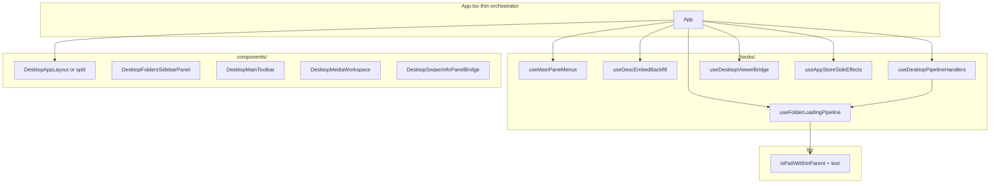

# Refactor `desktop-media` `App.tsx`

## Current state

- Single `[App.tsx](apps/desktop-media/src/renderer/App.tsx)` (~~1,350 lines): granular `useDesktopStore` selectors (~~35), local UI state, 6+ `useEffect`s, folder streaming listener (~~130 lines), folder/tree handlers (~~180 lines), analysis/face/semantic handlers (~330 lines), viewer bridge helpers, and a large JSX tree (sidebar config, header/toolbar, main pane, progress dock, swiper).
- Violates [.cursor/rules/desktop-media.mdc](.cursor/rules/desktop-media.mdc) and [.cursor/rules/code-decomposition.mdc](.cursor/rules/code-decomposition.mdc) (React component max **300** lines; hooks max **200**).
- `[apps/desktop-media/src/renderer/actions/](apps/desktop-media/src/renderer/actions/)` is empty today; AGENTS.md already calls for action registries.

## Target architecture

## Extraction order (dependencies first)

1. **Pure helper + test (P0 per testing rules)**
  - Move `isPathWithinParent` to e.g. `[lib/is-path-within-parent.ts](apps/desktop-media/src/renderer/lib/is-path-within-parent.ts)` with `[is-path-within-parent.test.ts](apps/desktop-media/src/renderer/lib/is-path-within-parent.test.ts)`.  
  - Keeps path logic testable and reusable; removes nesting from handlers.
2. **Small effects/state bundles (hooks ≤200 lines each)**
  - `**useMainPaneMenus`**: `actionsMenuOpen` / `quickFiltersMenuOpen`, refs, mousedown click-outside effect.  
  - `**useDescEmbedBackfill**`: temporary `descEmbedBackfill` state + `onDescEmbedBackfillProgress` listener (isolates “remove after migration” block).  
  - `**useAppStoreSideEffects**`: store/UI sync that is not domain logic—e.g. expand progress panel when metadata panel visible; collapse sidebar sections when sidebar collapsed; sync `photoAnalysisSettings.model` → `setAiSelectedModel`; disable thinking when model unsupported. Pass `store` + minimal flags/setters as needed.
3. **Folder loading domain (split across two hooks to stay under 200 lines)**
  - `**useFolderMetadataMerge`**: `mergeMetadataForPaths`, `refreshMetadataByPath` (depends on `store` + `activeFolderRequestIdRef` from next hook, or return merge fns that accept `requestId` from caller—pick one clear ownership for the ref).  
  - `**useFolderImagesStream**`: `activeFolderRequestIdRef`, `folderLoadProgress` / setter, the large `onFolderImagesProgress` `useEffect`, and **exports** the ref + progress state for folder selection handlers.  
  - `**useFolderTreeHandlers`**: `handleAddLibrary`, `handleRemoveLibrary`, `handleToggleExpand`, `handleSelectFolder`, `handleOpenFolderAiSummary` using `window.desktopApi`, `store`, shared ref/progress from `useFolderImagesStream`, and `isPathWithinParent` from lib.
4. **Pipeline handlers (split to respect hook size)**
  - `**usePhotoAnalysisHandlers`**: `handleAnalyzePhotos`, `handleCancelAnalysis`, `pendingAiCancelRef`, debug logging—depends on `selectedFolder`, `photoAnalysisSettings`, `aiSelectedModel`, `aiThinkingEnabled`, `store`, `setProgressPanelCollapsed`.  
  - `**useFaceAndScanHandlers**`: face detect/cancel, clustering cancel, similar-untagged cancel, `handleScanForFileChanges`, `handleCancelMetadataScan`.  
  - `**useSemanticHandlers**`: `handleSemanticSearch`, `handleIndexSemantic`, `handleCancelSemanticIndex`, desc-embed backfill trigger/cancel if you keep those next to semantic indexing; semantic search version refs + optional `_logToMain` timing `useEffect`.  
  - **DRY:** build a single object (e.g. `pipelineHandlers`) returned from a thin `**useDesktopPipelineHandlers`** that only composes the three hooks above, so `App` and JSX pass one bundle into `[SidebarTree](apps/desktop-media/src/renderer/components/SidebarTree.tsx)` and `[DesktopActionsMenu](apps/desktop-media/src/renderer/components/DesktopActionsMenu.tsx)` instead of repeating the same prop lists twice.
5. **Viewer bridge**
  - `**useDesktopViewerBridge`**: `openFolderViewerById`, `openFacePhotoInViewer` (same deps: `mediaItems`, `store`, `refreshMetadataByPath`).  
  - Replace inline `renderViewerInfoPanel` with a tiny component e.g. `**DesktopSwiperInfoPanel.tsx**` that takes `item`, `metadata`, `onRefreshMetadata` and wraps `[DesktopViewerInfoPanel](apps/desktop-media/src/renderer/components/DesktopViewerInfoPanel.tsx)` + `getPeopleBoundingBoxes`—keeps `App` free of render helpers.
6. **Presentational components (JSX chunks ≤300 lines)**
  - `**DesktopMainToolbar`**: header row (folder label, `DesktopFolderAiPipelineStrip`, search / filters / grid / list / overflow menu wiring).  
  - `**DesktopMediaWorkspace**`: banners, `SemanticSearchPanel` gate, scroll area with empty states, loading row, grid/list/semantic grid, image-edit and folder-AI-summary branches—**extract repeated dashed-border empty-state styling** into a small local component or shared `className` constant to apply DRY.  
  - `**DesktopFoldersSidebarPanel`** (or inline section component): “Add library” button + `SidebarTree` with props forwarded from parent—shrinks the `MainAppSidebar` `sections` config.  
  - Optional outer `**DesktopAppShell**`: grid `aside` + `main` structure if `App` still feels long after the above.
7. **Optional follow-up (automatable actions)**
  - If time allows after the split, move IPC-heavy functions from hooks into `[actions/](apps/desktop-media/src/renderer/actions/)` as `createXxxActions(deps)` factories (store + `desktopApi` + setters), with **minimal Vitest tests** mocking `desktopApi`—aligns with CLAUDE/AGENTS. Hooks then become thin wrappers; not required for the first pass if hook files stay within limits.

## Acceptance criteria

- `[App.tsx](apps/desktop-media/src/renderer/App.tsx)` acts as orchestrator only: **well under 300 lines** (target ~150–220), imports sub-hooks/components, returns composed layout.
- No new **large** blocks in `[styles.css](apps/desktop-media/src/renderer/styles.css)`; keep Tailwind + existing tokens.
- New/changed pure utility has a **co-located `.test.ts`**.
- `**pnpm lint` / `pnpm test**` (at least `apps/desktop-media` scope) pass.

## Risks / notes

- **Zustand subscriptions:** keep existing fine-grained `useDesktopStore(selector)` pattern in leaf hooks; avoid returning a fresh object from one giant selector without `useShallow` (not used in this app today).  
- **Behavior parity:** refactor is move-only first; avoid drive-by behavior changes.  
- **Temp backfill code:** isolate in `useDescEmbedBackfill` so deleting it later is one file removal.

